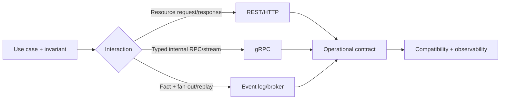

## Contract quan trọng hơn transport

Một API không chỉ là URL hoặc file `.proto`. Contract gồm ý nghĩa nghiệp vụ, dữ liệu, thứ tự tương tác, failure semantics, quyền truy cập và cam kết tiến hóa. Hai service dùng JSON qua HTTP vẫn coupling chặt nếu consumer phụ thuộc field nội bộ, timing ngầm hoặc chuỗi gọi đồng bộ dài. Ngược lại, một schema rõ owner, compatibility rule và timeout có thể giữ coupling có kiểm soát dù dùng gRPC.

Hãy bắt đầu từ interaction cần thiết:

- **Request/response:** caller cần kết quả ngay để quyết định bước tiếp theo.
- **Command bất đồng bộ:** caller cần biết yêu cầu đã được chấp nhận, còn xử lý có thể hoàn tất sau.
- **Event notification:** producer công bố một fact quá khứ; không ra lệnh một consumer cụ thể.
- **Streaming:** hai phía trao đổi chuỗi message dài, cần flow control, cancellation và lifecycle rõ.

## REST: semantics của resource và HTTP

REST phù hợp cho public/web API, resource-oriented interaction và hệ sinh thái proxy/cache/tooling rộng. RFC 9110 định nghĩa `GET`, `PUT`, `DELETE`, status code, conditional request và tính chất safe/idempotent. Idempotent ở đây nói về intended effect của nhiều request giống nhau, không có nghĩa response, log hay thời gian luôn giống hệt.

Thiết kế endpoint từ business resource và state transition. `POST /orders/{id}/approve` đôi khi rõ hơn ép mọi action thành CRUD mơ hồ. Với create có retry, nhận `Idempotency-Key`, lưu fingerprint của request cùng kết quả trong một boundary đủ atomic; cùng key nhưng payload khác phải bị từ chối. Với concurrent update, version/ETag và precondition giúp phát hiện lost update thay vì silently last-write-wins.

Lỗi không nên chỉ là chuỗi. RFC 9457 đưa ra Problem Details với type, title, status, detail và instance; ứng dụng có thể thêm stable error code/correlation ID nhưng không lộ stack trace hoặc dữ liệu nhạy cảm. Phân biệt validation 4xx, conflict, rate limit và dependency 5xx để client quyết định retry đúng.

## gRPC: typed RPC và streaming

gRPC dùng service/method contract và Protocol Buffers phổ biến, hỗ trợ unary, server/client streaming và bidirectional streaming. Nó hữu ích cho service-to-service typed API, polyglot code generation và streaming có flow control. Nhưng “binary nên luôn nhanh hơn REST” là kết luận thiếu workload: serialization chỉ là một phần; network hop, handler, database, TLS, queue và payload shape mới quyết định latency.

Contract gRPC cần deadline truyền từ caller; server nên dừng công việc không còn giá trị khi request bị cancel. Retry chỉ áp dụng method thực sự idempotent và phải có budget/backoff. Status code gRPC không thay domain error model; metadata/trailer phải được chuẩn hóa. Field number trong Protobuf là identity lâu dài: không tái sử dụng số đã xóa, reserve field cũ, thêm field theo compatibility policy và rollout consumer trước khi producer phát semantics mới.

Browser thường không nói native gRPC trực tiếp như backend; gRPC-Web hoặc gateway tạo thêm translation boundary. Public API cần cân nhắc debugability, CDN, cache, client support và governance trước khi chọn.

## Event: fact, không phải RPC bị che giấu

Event phù hợp khi nhiều consumer độc lập cần phản ứng, replay có giá trị hoặc producer không cần câu trả lời đồng bộ. `OrderApproved` là fact; `SendOrderEmail` là command. Nếu producer chờ một event reply để tiếp tục critical path, hệ thống vẫn là request/response nhưng khó quan sát hơn.

Envelope nên có `eventId`, `eventType`, `schemaVersion`, `occurredAt`, aggregate/key, producer và trace context. Payload là integration contract tối thiểu, không serialize nguyên entity ORM. Ordering thường chỉ cam kết theo partition/key; duplicate là bình thường với at-least-once, do đó consumer lưu idempotency/checkpoint gần side effect. Exactly-once của broker phải được mô tả theo boundary; nó không tự bao phủ email, payment gateway hay database ngoài transaction đó.

Schema evolution ưu tiên additive field và tolerant reader. Đổi nghĩa một field dưới cùng tên nguy hiểm hơn thêm version. Event cũ có thể tồn tại đến hết retention hoặc trong archive, vì vậy migration/replay phải test trên corpus lịch sử. Dead-letter topic chỉ hữu ích khi có owner, alert, triage và công cụ replay có kiểm soát.

## Decision matrix

| Tiêu chí | REST/HTTP | gRPC | Event |
|---|---|---|---|
| Caller cần kết quả ngay | Tự nhiên | Tự nhiên | Không phải lựa chọn mặc định |
| Public/browser clients | Hỗ trợ rộng | Cần kiểm tra client/gateway | Thường qua backend |
| Typed streaming | Có thể nhưng tự thiết kế nhiều | First-class | Stream bền vững theo broker |
| Fan-out/replay | Phải tự xây | Không phải mục tiêu chính | Điểm mạnh |
| Coupling thời gian | Caller và server cùng sống | Caller và server cùng sống | Có thể tách thời gian |
| Failure chính | timeout/status/retry | deadline/status/cancel | lag/duplicate/rebalance/schema |

Không chọn một transport cho toàn tổ chức. Một flow có thể dùng REST nhận command, commit state + outbox, rồi phát event; nội bộ một service chuyên tính toán có thể dùng gRPC. Điều cần tránh là ba contract khác nhau diễn tả cùng một authority mà không có owner.

## Versioning và rollout

Compatibility tốt bắt đầu từ consumer inventory. Contract test chỉ chứng minh sample; telemetry mới cho biết field/version cũ còn được dùng. Với HTTP, additive response field thường tương thích nếu client bỏ qua field lạ, nhưng đổi enum có thể phá exhaustive switch. Thay đổi required input, meaning, auth scope hoặc pagination semantics là breaking dù URL giữ nguyên.

Rollout an toàn thường là expand → migrate → contract: server chấp nhận cả cũ/mới, client chuyển dần, đo adoption, sau đó mới bỏ cũ. Dual write/publish phải có thời hạn và reconciliation. Không duy trì vô hạn `/v1`, `/v2` nếu có thể tiến hóa tương thích; nhưng version explicit tốt hơn silently đổi meaning.

## Security và trust boundary

TLS bảo vệ kênh nhưng không thay authentication/authorization. Mỗi hop phải xác minh identity/audience và quyền trên resource, không tin header do client tự đặt. Gateway có thể authenticate nhưng service vẫn cần enforcement cho object/tenant boundary. Rate limit theo identity + operation cost; body size, recursion depth và stream duration đều cần limit.

Event topic cũng là data boundary: ACL producer/consumer, schema classification, retention, encryption và audit. PII không nên được fan-out rộng chỉ vì broker cho phép. Trace/log không được ghi token hoặc toàn payload nhạy cảm.

## Failure scenarios và troubleshooting

- **Timeout không rõ kết quả:** caller không biết server đã commit chưa. Dùng idempotency key và status lookup; không retry mù.
- **Retry storm:** dependency chậm làm nhiều tầng retry. Dùng deadline budget, backoff + jitter, giới hạn attempt và overload control.
- **Schema rollout phá client:** kiểm compatibility tự động, canary, consumer inventory và rollback/dual-read có hạn.
- **Event lag:** theo dõi oldest-event age, per-partition lag, error/quarantine; scale không giúp nếu một hot key giữ một partition.
- **gRPC stream rò tài nguyên:** áp deadline, cancellation, message/stream limit và metric active streams.
- **Gateway translation sai:** trace cả original protocol lẫn upstream status, test mapping error/headers/deadline.

Dashboard nên có request rate, error theo stable code, latency p50/p95/p99, deadline exceeded/cancel, retry count, payload size; với event thêm publish failure, lag age, duplicate và poison-message count. Trace context phải qua HTTP/gRPC/event nhưng không dùng trace ID làm business idempotency key.

## Góc phỏng vấn

:::interview REST, gRPC hay Kafka?
Tôi bắt đầu từ interaction và consistency: nếu caller cần kết quả/resource public, REST thường đơn giản; nếu internal typed RPC hoặc streaming là trọng tâm, cân nhắc gRPC; nếu cần fan-out, replay và tách thời gian, dùng event. Sau đó tôi so failure model: HTTP/gRPC cần deadline, idempotency và retry budget; event cần ordering key, duplicate handling, lag, schema evolution và replay. Có thể phối hợp cả ba, nhưng mỗi contract phải có source of truth, owner và observability rõ.
:::

Senior follow-up: POST retry thế nào; Protobuf xóa field ra sao; event schema sống lâu hơn code thế nào; deadline truyền qua chuỗi service; public browser client ảnh hưởng lựa chọn gì; exactly-once dừng ở boundary nào.

## Key Takeaways

- Chọn interaction model trước transport.
- REST, gRPC và event có failure/coupling khác nhau; không có lựa chọn thắng mọi workload.
- Idempotency, deadline, compatibility và error semantics là phần của contract.
- Event là fact có thể duplicate/replay, không phải RPC được đổi tên.
- Rollout contract cần expand–migrate–contract, telemetry và owner.
