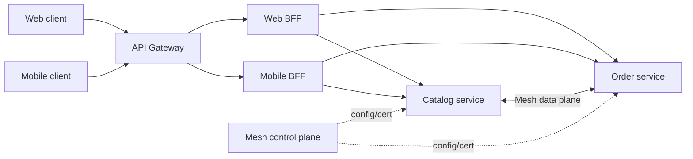

## Ba pattern, ba loại ownership

API Gateway, Backend for Frontend (BFF) và Service Mesh đều có thể route, áp policy và tạo telemetry. Vì chức năng trùng nhau, hãy hỏi: traffic đến từ đâu, policy thuộc ai, contract phục vụ ai và failure ảnh hưởng phạm vi nào?

| Lớp | Traffic chính | Owner điển hình | Trách nhiệm tốt |
|---|---|---|---|
| API Gateway | North-south, client ngoài → hệ thống | Platform/API team | Public endpoint, authentication, coarse rate/size limit, routing, protocol adaptation |
| BFF | Một client/channel → domain APIs | Team sở hữu client hoặc bounded context | Payload/UI composition, aggregation, client-specific workflow |
| Service Mesh | East-west giữa workload | Platform/SRE | Workload identity, mTLS, discovery, traffic policy và uniform telemetry |

Reverse proxy/load balancer là primitive chuyển traffic và phân phối endpoint. Một deployment có thể kiêm vai trò, nhưng ownership vẫn phải tách; proxy chứa public auth, mobile composition và mọi east-west policy sẽ có blast radius toàn hệ thống.

## API Gateway: edge policy, không phải domain monolith

Gateway tạo controlled entry point cho routing, TLS, token validation, size/rate policy, WAF, access log và protocol mapping. Nó che topology và hỗ trợ canary ở edge. “Single entry point” không có nghĩa single instance; data plane vẫn cần scale/failure isolation.

Gateway có thể **authenticate** signature, issuer, audience và expiry, nhưng không nên là nơi duy nhất **authorize** nghiệp vụ. Quyền sửa một order trong tenant cần dữ liệu của Order service. Gateway enforce coarse scope/route; service vẫn kiểm object/tenant và không tin identity header từ client. Gateway phải thay header đó hoặc truyền token đúng audience.

Đừng đưa pricing, state machine hay transaction choreography vào gateway script. “God gateway” nối mọi release và biến policy config thành application runtime. Mapping riêng cho UI thường thuộc BFF; invariant thuộc domain service.

## BFF: contract theo trải nghiệm người dùng

BFF giảm chattiness và giấu topology khỏi browser/mobile. Nó có thể gọi service song song, biến domain DTO thành view model và điều chỉnh pagination. AWS mô tả BFF gắn với micro-frontend/bounded context, đồng thời lưu ý không phải frontend nào cũng cần nó.

BFF tốt có owner cùng nhịp release với client. Web/mobile chỉ tách BFF khi nhu cầu khác; nhân bản vô điều kiện tạo duplicate logic. Tránh chuỗi gọi tuần tự dài: đặt overall deadline, chạy song song khi độc lập, chỉ trả partial response khi contract mô tả, và cache theo freshness/security requirement.

Không dùng BFF khi client gọi một API ổn định, payload đã phù hợp và latency thêm một hop không mang giá trị. GraphQL cũng không tự loại bỏ BFF: nó có thể là contract/composition mechanism bên trong BFF, nhưng vẫn cần ownership, authorization, cost limit và N+1 control.

## Service Mesh: policy east-west trong data plane

Istio tách control plane phân phối configuration/certificate khỏi data plane proxy xử lý traffic. Traffic management cung cấp routing, subset, timeout, retry, circuit breaking và fault injection; gateway resource quản lý ingress/egress, còn virtual service/destination rule mô tả routing và policy. Security cung cấp workload identity, authentication policy và authorization policy; observability sinh metrics, trace và access log từ proxy.

Mesh hữu ích khi nhiều service/polyglot cần mTLS và policy đồng nhất mà không muốn mỗi SDK tự triển khai. Nhưng mTLS chỉ xác thực workload hai đầu; nó không chứng minh end user được phép xem resource. Mesh cũng không sửa business idempotency, database consistency hay bad API contract.

Sidecar/ambient data plane thêm hop, resource, certificate lifecycle và cấu hình. Control plane hỏng không nhất thiết dừng traffic đã có config, nhưng endpoint/policy/certificate mới có thể không hội tụ; phải thử theo mode/version. Topology nhỏ có thể dễ vận hành hơn với ingress và library chuẩn. Đừng thêm mesh chỉ để có dashboard.

## Retry, timeout và circuit breaker: tránh policy nhân nhau

Một request có thể đi qua client SDK → gateway → BFF → mesh proxy → service. Nếu mọi lớp tự retry, một failure downstream tạo fan-out ngoài dự kiến. Chọn **một retry owner cho mỗi hop/operation**. Retry chỉ với lỗi transient đã phân loại, operation idempotent hoặc có idempotency key, có backoff/jitter, attempt cap và nằm trong end-to-end deadline.

Gateway phải truyền deadline/cancellation; BFF chia remaining budget cho các call con; mesh timeout không được dài hơn budget còn lại. Circuit breaker/outlier detection bảo vệ resource và ngắt backend lỗi, không bảo đảm business fallback đúng. Một fallback trả dữ liệu stale cần contract, freshness marker và product acceptance, không nên được proxy tự nghĩ ra.

Rate limit cũng phải theo cost. Limit theo IP dễ phạt user sau NAT; limit theo token có thể bị một tenant lớn chiếm dependency chung. Edge limit bảo vệ public surface, còn service cần admission/concurrency control cho resource cục bộ. Queue bound và load shedding phải phối hợp để không biến overload thành hàng đợi timeout.

## Observability xuyên lớp

Mỗi proxy chỉ có một góc nhìn: gateway biết client/route, BFF biết use case, mesh biết workload, service biết domain outcome. Truyền trace context xuyên hop, dùng tên/cardinality ổn định và không đưa user ID, URL tùy ý hay token vào label.

Dashboard cần phân biệt:

- Gateway: request rate, auth rejection, rate-limit, route/upstream error, latency và connection/TLS.
- BFF: end-to-end use-case latency, fan-out count, partial result, dependency budget và domain error mapping.
- Mesh: source/destination/version, response flag, retry, connection, mTLS/policy denial và config convergence.
- Service: business success/failure, queue/saturation, database và external dependency.

Trace sampling không thay metrics; proxy access log không thay application audit. Correlation ID hỗ trợ điều tra nhưng không phải idempotency key. Log identity/header phải redact theo classification.

## Failure modes và troubleshooting

:::production Runbook theo boundary
1. Xác định lỗi ở DNS/TLS/edge, gateway route/auth, BFF composition, mesh policy/discovery hay application bằng direct synthetic probe an toàn cho từng hop.
2. So sánh config mong muốn với config data plane thực nhận; kiểm selector, namespace, host, port, subset và certificate.
3. Dùng trace để tìm hop tiêu tốn deadline; đối chiếu proxy access log với application log bằng request/trace ID.
4. Kiểm retry count ở từng lớp trước khi tăng timeout hoặc replica.
5. Rollback policy/config theo canary; tránh sửa đồng thời gateway, BFF và mesh vì mất khả năng quy nguyên nhân.
:::

Các lỗi điển hình:

- **Gateway 401/403 hàng loạt:** key rotation, issuer/audience, clock, policy rollout hoặc identity header; không vô hiệu auth để “khôi phục”.
- **BFF 5xx dù service khỏe:** một optional dependency bị coi là bắt buộc, connection pool cạn hoặc deadline chia sai.
- **Mesh 503:** endpoint/subset rỗng, protocol/port nhận diện sai, mTLS mode lệch hoặc outlier ejection; scale app không sửa config lỗi.
- **Latency tăng sau thêm proxy:** tách DNS/connect/TLS/queue/upstream time; kiểm double encryption, connection reuse và telemetry exporter blocking.
- **Control-plane incident:** giữ data plane ổn định, đóng băng rollout phụ thuộc config mới, theo dõi certificate expiry và dùng documented break-glass.

Policy-as-code cần schema validation, static analysis, review theo owner và staged rollout. Một wildcard host, selector quá rộng hoặc global retry có thể có blast radius lớn hơn một code release.

## Góc phỏng vấn

:::interview Khi nào cần cả API Gateway, BFF và Service Mesh?
Chỉ khi mỗi lớp giải quyết một boundary độc lập. Gateway quản lý north-south/public contract và coarse edge policy; BFF do client team sở hữu để compose API theo trải nghiệm; mesh chuẩn hóa east-west identity, traffic policy và telemetry ở quy mô đủ lớn. Tôi giữ business authorization/invariant trong service, chỉ định retry owner và deadline xuyên chuỗi, rồi đánh giá latency, resource, control-plane risk và năng lực vận hành. Với hệ nhỏ, tôi bắt đầu từ ít lớp hơn và chỉ thêm khi pain đo được vượt chi phí.
:::

Senior follow-up: mTLS có thay OAuth không; BFF khác shared aggregation service thế nào; control plane down ảnh hưởng gì; ai retry; authorization đặt ở đâu; làm sao canary một policy; vì sao 503 từ mesh chưa chắc app hỏng.

## Key Takeaways

- Gateway là edge boundary; BFF là client-specific contract; mesh là east-west platform layer.
- Authentication có thể tập trung một phần, nhưng domain authorization vẫn thuộc service có dữ liệu.
- Một retry owner và end-to-end deadline ngăn retry amplification.
- Proxy telemetry phải ghép với domain telemetry; không dùng label cardinality cao hoặc log secret.
- Không phải hệ thống nào cũng cần cả ba; complexity và blast radius là chi phí production thực.
