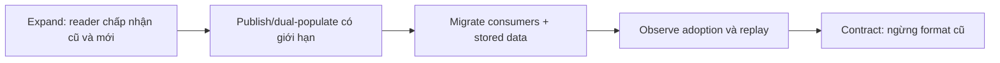

## Contract không chỉ là schema hợp lệ

Schema mô tả hình dạng; contract còn gồm semantics, error, ordering, authorization và lifecycle. JSON qua OpenAPI validation vẫn có thể phá client nếu đổi đơn vị `amount`; Protobuf parse được dù nghĩa enum đã đổi; event đủ field vẫn có thể phát sai thời điểm. Contract testing phải nói rõ **cái gì tương thích**, **với ai** và **trong transport nào**.

Tránh nói “backward compatible” mà không định nghĩa chiều. Hãy viết cụ thể:

- Client cũ có gọi được server mới không?
- Client mới có gọi được server cũ trong rolling deployment không?
- Consumer mới có đọc record do producer cũ tạo không?
- Consumer cũ có bỏ qua record/field mới an toàn không?
- Dữ liệu lưu hoặc event lịch sử có replay qua code mới không?

Compatibility thuộc cặp phiên bản và hành vi reader/writer, không chỉ diff file.

## REST/OpenAPI: request và response đi hai chiều khác nhau

OpenAPI 3.2.0 là specification hiện hành khi rà soát. Nó mô tả paths, operations, request/response, schema và security để lint, document, generate và diff. Specification không buộc runtime thực thi đúng; provider test vẫn phải chứng minh status/header/body.

Với **request**, server mới phải nhận payload client cũ gửi; thêm required input, siết range, bỏ enum hoặc đổi auth thường gây lỗi. Với **response**, client cũ phải đọc output server mới. Optional field chỉ an toàn khi client bỏ unknown field; deserializer strict hoặc chữ ký trên canonical payload có thể biến nó thành breaking.

| Thay đổi HTTP | Rủi ro cần kiểm tra |
|---|---|
| Thêm optional response field | Client có bỏ qua unknown field không |
| Thêm enum value | Exhaustive switch có crash hoặc map sai không |
| Bỏ response field | Consumer nào vẫn đọc field đó |
| Thêm required request field | Client cũ không thể gửi |
| Đổi status/error code | Retry, UI và alert có đổi hành vi không |
| Đổi pagination/sort/default | Hình dạng hợp lệ nhưng semantics khác |

Path `/v2` chỉ là namespace, không thay migration plan. Hai implementation vô hạn gây drift; đổi âm thầm nghĩa dưới `/v1` còn nguy hiểm hơn. Version mới cần sunset, adoption telemetry và owner.

## Protobuf/gRPC: field number là identity lâu dài

Trong binary wire format, field number nhận diện field. Protocol Buffers yêu cầu không đổi hoặc tái sử dụng number đã phát hành; khi xóa field, reserve cả number và nên reserve name để giảm rủi ro với JSON/TextFormat. Đổi number tương đương xóa field cũ rồi thêm field mới. “Cùng type nên reuse được” là sai và có thể gây parse ambiguity hoặc data corruption.

Unknown fields giúp binary message mới đi qua code cũ, nhưng chuyển sang JSON hoặc thao tác field-by-field có thể mất chúng. ProtoJSON dùng field name và có compatibility khác binary; rename có thể phá JSON consumer. CI phải kiểm đúng encoding, không lấy binary checker đại diện REST transcoding.

Một số đổi type chỉ conditionally compatible và reader cũ có thể truncate. An toàn hơn là thêm field number, dual-populate, migrate rồi reserve field cũ. Khi cần phân biệt “không gửi” với zero, dùng field presence/`optional`. Enum nên có zero unspecified; consumer phải xử lý giá trị chưa biết.

gRPC service contract còn có method, deadline, status/trailer và streaming lifecycle. Đổi unary thành stream, đổi retryability của error hoặc bỏ cancellation support là breaking behavior dù message schema không đổi.

## Event/AsyncAPI: dữ liệu sống lâu hơn deployment

AsyncAPI 3.1.0 mô tả message-driven API bằng servers, channels, messages, operations và bindings. Nó không tự cấu hình compatibility hay enforce schema trên broker; serializer, registry, ACL và consumer tests vẫn cần.

Event khó evolution vì consumer deploy độc lập và record cũ còn để replay. Envelope nên giữ `eventId`, type, schema version, occurred time, aggregate/key và trace context. Không đổi nghĩa field. Field mới cần consumer cũ bỏ qua và consumer mới có default cho event cũ. Đổi key/partition, timestamp hoặc fact thành command có thể phá behavior ngoài tầm schema checker.

Inventory gồm batch, analytics, partner và replay tool. Registry policy phải ghi backward/forward/full và “transitive” kiểm toàn lịch sử hay bản gần nhất. Vì tên mode tùy sản phẩm, governance phải diễn giải reader/writer cụ thể.

## Contract test chứng minh gì?

Spring Cloud Contract hỗ trợ consumer-driven và producer-driven contract tests cho HTTP/messaging. Consumer-driven contract ghi những interaction consumer thực sự cần; provider build chạy generated verification để ngăn release không đáp ứng ví dụ đó; consumer dùng stub để phát triển độc lập. Provider-driven contract phù hợp public API hoặc quá nhiều consumer để cộng tác trực tiếp.

Một suite nên có nhiều lớp:

1. **Syntax/spec validation:** OpenAPI/AsyncAPI/`.proto` parse được, reference resolve và naming rule đúng.
2. **Compatibility diff:** so published baseline theo đúng direction/encoding; chặn rule breaking đã thống nhất.
3. **Provider verification:** code thật tạo response/message khớp interaction.
4. **Consumer test:** client deserialize, xử lý unknown/default/error như kỳ vọng.
5. **Replay corpus:** code mới đọc payload/event lịch sử đã sanitize.
6. **End-to-end chọn lọc:** chứng minh auth, network, registry/broker và deployment wiring.

Contract test không chứng minh toàn bộ business, performance, authorization hay resilience. Spring cũng nói contract không phải nơi viết business feature. Stub vẫn xanh khi production sai TLS, timeout hoặc database state.

## Rollout expand–migrate–contract

**Expand:** reader/server hiểu cả hai format trước. **Migrate:** producer phát field mới hoặc dual-publish; consumer chuyển dần; replay có rate limit/idempotency. **Observe:** dùng client/schema telemetry, inventory và retention, không tin ticket “đã deploy”. **Contract:** ngừng format cũ, xóa field và reserve identifier. Mỗi phase cần rollback; không xóa cũ trước khi rollback window đóng.

Dual-write không tự atomic và cần hạn chót. Hai transaction cần source of truth, reconciliation và divergence metric. Event dùng cùng topic hay topic mới tùy isolation, ordering, retention và ACL.

## Governance và production troubleshooting

:::production Compatibility gate đáng tin
- Contract có owner, consumer inventory, classification dữ liệu và support window.
- CI lấy baseline immutable đã phát hành, không so tùy tiện với nhánh chính.
- Breaking waiver ghi consumer bị ảnh hưởng, rollout order, expiry và approver.
- Artifact ký/version hóa; external `$ref` được pin và allowlist để tránh supply-chain drift.
- Example/test fixture đã loại secret và PII; generated client được test trong ngôn ngữ thực.
:::

Khi rollout lỗi: xác định artifact/schema version thật ở producer và consumer; lấy payload gây lỗi đã redact; kiểm encoding và registry subject; so diff semantics chứ không chỉ field; xác định record mới hay replay cũ; rollback writer trước nếu reader cũ đang crash. Với HTTP, nhìn cả status/header/content type; với Protobuf, kiểm binary hay ProtoJSON; với event, kiểm key, headers, serializer và DLQ reason. Không “sửa” bằng tắt validation toàn cục hoặc skip poison message mà không lưu evidence.

## Góc phỏng vấn

:::interview Thêm field có luôn backward compatible không?
Không. Tôi định nghĩa reader/writer và transport trước. Optional response JSON chỉ an toàn nếu client bỏ unknown field; enum mới có thể phá exhaustive switch. Protobuf binary giữ unknown field tốt hơn nhưng ProtoJSON có rule khác; event mới còn phải đọc được bởi consumer cũ và replay cùng dữ liệu lịch sử. Tôi dùng schema diff + provider/consumer tests, rollout expand–migrate–contract, telemetry adoption và chỉ xóa contract cũ khi inventory/retention chứng minh an toàn.
:::

## Key Takeaways

- Compatibility luôn có direction, version pair và encoding cụ thể.
- OpenAPI, Protobuf và AsyncAPI mô tả contract nhưng không tự bảo đảm runtime semantics.
- Không tái sử dụng Protobuf field number; reserve field đã xóa và kiểm riêng ProtoJSON.
- Contract tests giảm integration drift, không thay business, security, load hay resilience tests.
- Expand–migrate–contract cần consumer inventory, telemetry, rollback và deadline loại bỏ format cũ.
