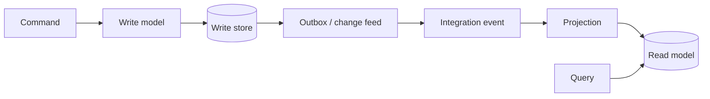

## Ba khái niệm thường bị trộn
CQRS (Command Query Responsibility Segregation) tách operation thay đổi state khỏi operation chỉ đọc. Mức nhẹ nhất là command handler và query handler khác nhau nhưng dùng chung database. Mức nặng hơn có write model và read model riêng, được đồng bộ bất đồng bộ. CQRS không mặc định yêu cầu microservices, message broker hay hai database.

Event-driven architecture dùng event để thông báo một fact đã xảy ra và cho consumer phản ứng độc lập. Event sourcing lưu chuỗi event bất biến làm nguồn sự thật để dựng lại state. Có thể dùng CQRS không event sourcing; dùng event-driven integration với database CRUD bình thường; hoặc dùng cả hai khi thật sự cần history/replay.



## Command và query có contract khác nhau
Command diễn tả intent: `ApproveInvoice`, có actor, target, expected version và idempotency key. Handler authenticate/authorize, validate invariant rồi commit. Kết quả thường là acceptance, identifier hoặc version mới; không nên hứa trả cả read view đã đồng bộ nếu projection chạy async.

Query không thay state quan sát được. Read model được denormalize theo access pattern: một document có thể chứa invoice, customer name và balance để tránh distributed join. Đổi lại, dữ liệu lặp và eventual consistency trở thành trách nhiệm vận hành.

```json title="InvoiceApproved.v2.json"
{
  "eventId": "01J...",
  "eventType": "billing.invoice-approved",
  "schemaVersion": 2,
  "aggregateId": "inv-481",
  "aggregateVersion": 7,
  "occurredAt": "2026-09-02T08:30:00Z",
  "data": { "approvedBy": "user-29", "amount": "1250000", "currency": "VND" }
}
```

Event là fact quá khứ, nên tên ở past tense và không phụ thuộc cách consumer xử lý. `SendApprovalEmail` là command có một người chịu trách nhiệm; `InvoiceApproved` là event có thể có nhiều consumer. Event không nên chứa entity ORM serialize nguyên khối vì dễ lộ field, tạo cycle và khiến schema nội bộ thành public contract.

## Consistency và read-your-writes
Khi command commit lúc `t0` nhưng projection cập nhật ở `t1`, query giữa hai mốc có thể trả state cũ. UI cần contract rõ: hiển thị trạng thái pending, dùng command response để optimistic update, hoặc poll theo operation ID/version. Không giả vờ strong consistency bằng cách sleep 500 ms.

Theo dõi projection lag bằng thời gian/event offset, oldest unprocessed event và error rate. Consumer phải idempotent vì at-least-once delivery tạo duplicate. Ordering thường chỉ cần theo aggregate/partition; yêu cầu global ordering làm giảm throughput và availability.

:::production Rebuild read model
Rebuild phải chạy song song vào projection version mới, có checkpoint, rate limit và so sánh correctness trước khi switch alias. Xóa read model production rồi replay trực tiếp là kế hoạch outage, không phải migration.
:::

## Event sourcing: sức mạnh đi cùng nghĩa vụ lâu dài
Event store append-only cho audit và point-in-time reconstruction, nhưng event schema gần như phải sống rất lâu. Snapshot giảm thời gian replay nhưng chỉ là optimization; event vẫn là nguồn sự thật. Upcaster có thể chuyển event cũ sang representation mới lúc đọc. Handler replay không được gửi email, charge payment hoặc phát integration event lần nữa.

Các câu hỏi phải trả lời trước khi chọn event sourcing:
- Có yêu cầu nghiệp vụ thật về audit, temporal query hoặc dựng lại model không?
- Aggregate event stream lớn tới đâu, snapshot/checkpoint thế nào?
- Xóa/anonymize PII ra sao khi log bất biến gặp retention regulation?
- Test deterministic replay và migration schema bằng corpus event cũ thế nào?
- Ai vận hành poison event, projection lag và rebuild nhiều giờ?

Nếu câu trả lời chỉ là “event sourcing hiện đại”, CRUD + outbox thường đơn giản và an toàn hơn.

## Choreography và coupling ẩn
Pub/sub giảm coupling theo không gian: producer không gọi trực tiếp consumer. Nhưng coupling vẫn tồn tại qua event name, schema, timing và business expectation. Chuỗi `A event -> B event -> C event` dài làm workflow khó nhìn và khó debug. Choreography hợp với vài reaction độc lập; saga orchestration hợp hơn khi workflow có nhiều bước, timeout và compensation cần quan sát tập trung.

Consumer không nên giả định event mới nhất luôn đến đúng một lần. Lưu `eventId`, aggregate version/checkpoint; xử lý duplicate; phát hiện gap; quarantine schema không đọc được. Dead-letter queue không phải nghĩa địa: cần owner, alert, replay tool và retention.

## Schema evolution
- Chỉ thêm optional field khi consumer cũ có thể bỏ qua.
- Không đổi nghĩa field dưới cùng tên/version.
- Event envelope ổn định, payload version explicit.
- Contract test producer-consumer và canary consumer trước rollout.
- Dual-publish chỉ tạm thời, có metric và ngày loại version cũ.
- Không để consumer gọi ngược producer để “điền nốt” mọi field; điều đó tái tạo runtime coupling.

## Failure scenarios
- Commit write model thành công nhưng publish thất bại: dùng outbox/CDC thay dual write.
- Event publish hai lần: dedup trong cùng transaction với side effect consumer.
- Projection code lỗi một record: quarantine có context, không retry nóng vô hạn chặn partition.
- Consumer mới deploy trước schema producer: compatibility test phải bao cả hai rollout order.
- Replay kích hoạt email/payment: tách projection thuần khỏi external side effects.
- Query model stale nhưng UI báo “đã thất bại”: expose pending/version thay vì suy luận sai.

## Production checklist
- Chỉ ra rõ source of truth: current-state store hay event store.
- Mỗi event có owner, semantic, schema version, retention và classification PII.
- Publish gắn atomic với write bằng outbox/change feed phù hợp.
- Consumer idempotent; ordering key và duplicate policy được test.
- Dashboard có publish lag, consume lag, poison count, projection freshness.
- Có runbook rebuild/replay, throttling và cách chứng minh projection mới đúng.

## Góc phỏng vấn
Câu trả lời mạnh bắt đầu từ CQRS mức code rồi mới nói đến separate stores. Hãy nêu lý do: read/write khác access pattern, scale hoặc consistency. Sau đó thừa nhận read model stale, cần outbox, idempotent consumer, lag metric và UX read-your-writes. Cuối cùng phân biệt event sourcing là lựa chọn nguồn sự thật riêng, không phải hệ quả bắt buộc của CQRS.

## Key Takeaways
- CQRS là tách responsibility; hai database chỉ là một mức triển khai.
- Event là fact và public contract có owner/version, không phải entity dump.
- Event sourcing chỉ đáng giá khi history/replay có giá trị nghiệp vụ đủ lớn.
- Eventual consistency cần UX, metric, replay và incident ownership cụ thể.
