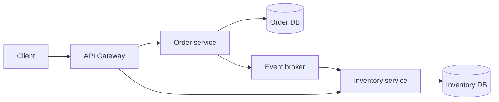

## Microservice độc lập nghĩa là gì
Tách source thành nhiều process chưa đủ. Service boundary tốt sở hữu capability và dữ liệu, có contract versioned, deploy/scale độc lập, failure không kéo cả hệ thống và có team chịu trách nhiệm vận hành. Nếu mỗi deploy cần phối hợp toàn bộ service hoặc join chung database, kiến trúc là distributed monolith.

## Monolith, modular monolith, microservices
| Mô hình | Điểm mạnh | Chi phí chính |
|---|---|---|
| Monolith | Debug/deploy đơn giản | Boundary dễ xói mòn |
| Modular monolith | Transaction/local call + boundary rõ | Scale/deploy vẫn theo application |
| Microservices | Independent deploy/scale/ownership | Network, consistency, operations |

:::best-practice Điểm khởi đầu hợp lệ
Modular monolith thường phù hợp khi domain/team còn nhỏ hoặc boundary chưa ổn định. Nó cho phép học boundary với chi phí vận hành thấp và tách service sau khi có evidence.
:::

## Những chi phí không thể bỏ qua
- Network timeout, retry storm và partial failure.
- Data consistency, saga/outbox và reconciliation.
- Contract compatibility và rollout nhiều version.
- Logs, metrics, traces, correlation ID.
- CI/CD, secret, config và incident ownership cho nhiều deployable.
- Test integration và môi trường local phức tạp.

## Boundary discovery
Bắt đầu từ business capability, invariant và change cadence. Những dữ liệu phải transaction cùng nhau là tín hiệu giữ chung boundary. Chatty synchronous calls và distributed join là tín hiệu boundary sai. Team topology quan trọng nhưng không nên ép domain theo sơ đồ tổ chức tạm thời.

## Failure và resilience
Timeout trước retry; retry chỉ cho operation idempotent và có budget. Circuit breaker bảo vệ khi downstream lỗi nhưng không thay capacity planning. Bulkhead cô lập resource; fallback phải có nghĩa nghiệp vụ, không trả dữ liệu giả khiến correctness sai.

## Trả lời phỏng vấn
Tôi không chọn microservices chỉ để scale. Tôi xem independent deployability, data ownership, team autonomy và failure isolation có tạo giá trị vượt operational cost không. Nếu chưa, modular monolith với boundary/test rõ thường là quyết định tốt hơn.

## Key Takeaways
- Database per service là ownership, không chỉ hạ tầng.
- Distributed monolith nhận cả chi phí mà thiếu lợi ích độc lập.
- Retry/circuit breaker không sửa boundary sai.
- Microservices là socio-technical decision.
