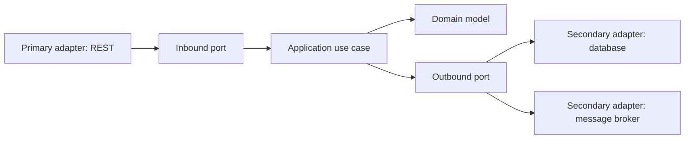

## Mental model: một deployable, nhiều boundary
Modular monolith là một application được build/deploy như một đơn vị nhưng bên trong chia thành module có business ownership, public API và data boundary rõ. Nó giữ lợi ích local call, local transaction và debugging đơn giản, đồng thời tập luyện kỷ luật cần thiết trước khi phân tán hệ thống.

Một cây thư mục có `controller/service/repository` không tự tạo module. Nếu mọi package import entity/repository của nhau và cùng sửa bất kỳ table nào, đó vẫn là monolith coupling cao. Boundary thật phải trả lời được: module sở hữu invariant nào, API nào được công khai, dữ liệu nào chỉ nó được ghi, thay đổi nào không buộc module khác compile lại.



## DDD strategic trước tactical
Domain-Driven Design không bắt đầu bằng `Entity`, `Aggregate` hay repository interface. Strategic design trước hết tìm subdomain và bounded context. Cùng một từ có thể có model khác nhau theo context: “Customer” trong Sales là lead và buying history; trong Billing là legal identity và credit status. Ép một canonical model dùng toàn công ty thường tạo object khổng lồ và coupling.

Ubiquitous language phải xuất hiện nhất quán trong code, API, event và trao đổi với domain expert. Context map mô tả quan hệ giữa các boundary: upstream/downstream, anti-corruption layer, published language. Đây là phần giúp team biết coupling nào được chấp nhận và ai chịu trách nhiệm compatibility.

:::best-practice Heuristic tìm boundary
Những invariant phải commit cùng nhau, thuật ngữ thay đổi cùng nhau và capability do cùng một team sở hữu là tín hiệu giữ chung context. Chatty call, distributed join hoặc cùng release train sau khi tách là tín hiệu boundary chưa đúng.
:::

## Hexagonal architecture kiểm soát hướng dependency
Application core chứa use case và domain rule, không biết HTTP framework, ORM, broker hay vendor cloud. Inbound port diễn tả điều hệ thống cho phép caller yêu cầu; outbound port diễn tả điều core cần từ bên ngoài. Adapter chuyển protocol/technology sang port.

```java title="PlaceOrderUseCase.java"
public interface PlaceOrderUseCase {
    OrderId place(PlaceOrder command);
}

public interface OrderRepository {
    Optional<Order> find(OrderId id);
    void save(Order order);
}

final class PlaceOrderService implements PlaceOrderUseCase {
    private final OrderRepository orders;
    private final PricingPort pricing;

    PlaceOrderService(OrderRepository orders, PricingPort pricing) {
        this.orders = orders;
        this.pricing = pricing;
    }

    public OrderId place(PlaceOrder command) {
        var quote = pricing.quote(command.lines());
        var order = Order.place(command.customerId(), command.lines(), quote);
        orders.save(order);
        return order.id();
    }
}
```

Interface nằm ở phía **consumer/core** vì nó mô tả nhu cầu của core; JPA adapter implement interface đó. Nếu domain model mang annotation persistence khắp nơi hoặc use case trả thẳng HTTP response, technology đã chảy ngược vào core. Điều đó không luôn gây thảm họa, nhưng làm migration và unit test độc lập khó hơn; team nên chọn coupling có ý thức thay vì gọi mọi class là “clean”.

## Module contract và data ownership
Mỗi module nên có façade/use-case API hẹp. Module khác gọi API hoặc consume published event, không import internal repository. Trong cùng database, có thể dùng schema/table ownership và chỉ module chủ sở hữu được ghi. Foreign key xuyên module có lợi cho integrity nhưng làm coupling migration; lựa chọn này cần ADR, không có đáp án tuyệt đối.

Local transaction là lợi thế lớn của modular monolith. Aggregate boundary nên nhỏ và phản ánh invariant cần strong consistency. Không biến toàn context thành một aggregate hay load object graph khổng lồ chỉ để “đúng DDD”. Integration event chỉ publish sau commit, thường qua outbox, để external side effect không phá atomicity.

| Cơ chế giao tiếp | Consistency | Coupling | Khi dùng |
|---|---|---|---|
| Direct module API | Đồng bộ/local transaction có thể có | Compile-time | Query/use case nội bộ đơn giản |
| Domain event nội bộ | Trong process, có thể cùng transaction | Contract event | Nhiều handler trong deployable |
| Integration event/outbox | Eventual | Schema + broker | Chuẩn bị tách hoặc tích hợp ngoài |

## Enforce boundary bằng công cụ và test
Convention không đủ khi codebase lớn. CI có thể kiểm tra dependency graph, cấm import package `internal`, yêu cầu module chỉ expose namespace API, và chạy architecture tests. Test use case bằng in-memory adapter/fake port; integration test riêng cho JPA/HTTP/broker adapter. Contract test bảo vệ public module API và integration event schema.

Đừng mock mọi object domain. Mục tiêu ports/adapters là cô lập I/O không ổn định, không làm business rule biến thành chuỗi interaction test dễ vỡ.

## Failure scenarios
- “Shared” module thành bãi chứa entity/util mọi context cùng phụ thuộc.
- Một transaction sửa table của ba module; không module nào còn ownership thực.
- Mỗi use case có hàng chục port nhỏ đến mức wiring phức tạp hơn domain.
- Event nội bộ được coi là integration event nhưng không version, không outbox.
- Tách process theo package khi chưa có observability, deployment ownership và data migration plan.
- Bọc CRUD đơn giản bằng quá nhiều lớp chỉ để theo mẫu, làm delivery chậm mà không giảm coupling.

## Khi nào tách microservice
Tách khi boundary đã ổn định và có evidence: cần deploy/scale độc lập, data/compliance isolation, team autonomy hoặc failure containment đáng giá hơn network/operations cost. Trước khi tách, đo số cross-boundary call, transaction xuyên module, shared table và coordinated release. Nếu các chỉ số đó cao, extraction chỉ tạo distributed monolith.

## Production checklist
- Mỗi module có owner, ubiquitous language, public API và danh sách dữ liệu sở hữu.
- Dependency chỉ đi qua API/port; CI phát hiện import nội bộ trái phép.
- Transaction boundary và invariant được ghi rõ, không dựa vào “service layer” mơ hồ.
- Event có owner, schema/version, delivery semantics và migration policy.
- Adapter failure được map sang lỗi domain/application có ý nghĩa.
- Mọi đề xuất tách service có ADR cùng evidence về deploy, scale, team hoặc isolation.

## Góc phỏng vấn
Câu trả lời senior nên tránh cực đoan “microservices luôn tốt hơn”. Hãy bắt đầu bằng modular monolith, bounded context và data ownership; dùng hexagonal ports/adapters để giữ core độc lập; rồi nêu tiêu chí extraction dựa trên deployability, scale, team và failure. Nhắc rằng local transaction là tài sản và distributed consistency là chi phí.

## Key Takeaways
- Module là business boundary có contract và ownership, không chỉ là folder.
- DDD strategic tìm context; hexagonal architecture kiểm soát dependency bên trong context.
- Local transaction giúp correctness và là lý do chính đáng để chưa phân tán.
- Chỉ tách service khi lợi ích độc lập có evidence vượt operational cost.
