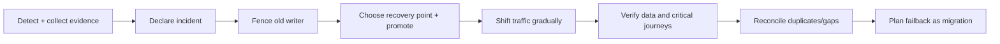

## DR là business contract, không phải sơ đồ hai region

High availability xử lý failure trong domain đã thiết kế; Disaster Recovery (DR) khôi phục sau sự kiện mất một deployment hoặc vùng lớn. Compute ở hai region chưa đủ nếu database, identity, DNS, secret hoặc artifact vẫn phụ thuộc một region.

AWS định nghĩa **RTO** là độ trễ tối đa chấp nhận từ gián đoạn đến khôi phục; **RPO** là khoảng tối đa kể từ recovery point cuối, tức cửa sổ mất dữ liệu. Đây là mục tiêu business/compliance, không phải guarantee từ vendor checkbox. Mỗi capability có thể có RTO/RPO khác.

Phân biệt mục tiêu với bằng chứng:

- **Target:** business chấp nhận gì.
- **Designed capability:** kiến trúc dự kiến đáp ứng gì.
- **Observed recovery:** game day/incident đo được gì.
- **Current risk:** lag, drift hoặc dependency đang đe dọa target nào.

Không hứa RPO bằng không hay failover tức thời khi chưa định nghĩa commit boundary, detector và cách đo lost write.

## Chọn strategy theo cost và trạng thái sẵn có

AWS mô tả backup/restore, pilot light, warm standby và multi-site active/active. Quan trọng là resource nào chạy, data cập nhật ra sao và critical recovery path nào còn thủ công.

| Strategy | Trạng thái secondary | Ưu điểm | Chi phí/rủi ro |
|---|---|---|---|
| Backup/restore | Không chạy workload đầy đủ | Đơn giản, chi phí runtime thấp | Restore infrastructure/data lâu; backup chưa chắc restore được |
| Pilot light | Data/core tối thiểu đang có | Nhanh hơn dựng từ đầu | Scale-up, config và dependency có thể drift |
| Warm standby | Bản thu nhỏ đang chạy | Có thể kiểm tra liên tục | Capacity lúc failover và data lag phải được chứng minh |
| Active-passive | Primary phục vụ, secondary sẵn sàng | Một writer/authority rõ | Secondary dễ “mục” nếu không diễn tập |
| Active-active | Nhiều region cùng phục vụ | Dùng capacity thường xuyên, locality tốt | Conflict, routing, quota và split brain phức tạp nhất |

Active-active compute không bắt buộc active-active data. Có thể read nhiều region nhưng route write theo **home region** của tenant; cần xử lý stale read và chuyển ownership có fencing.

## Data plane: consistency trước topology

Single-writer với async replica tránh synchronous WAN path nhưng failover có thể mất transaction chưa replicate. RPO thực tế phụ thuộc lag và promotion point. Synchronous replication giảm cửa sổ mất commit đã acknowledge nhưng thêm latency và có thể giảm write availability; semantics tùy database/config.

PostgreSQL streaming replication mặc định async. Standby replay WAL và được promote, nhưng database không tự orchestration/fencing toàn hệ thống. Replication slot có thể giữ WAL khi downstream ngừng lâu, nên monitor retained WAL. Synchronous mode phải xét `synchronous_commit`, standby selection và mất standby.

Multi-writer cần conflict model theo invariant, không chỉ last-write-wins. Hai region cùng trừ inventory có thể đúng schema nhưng sai business. Có thể dùng partition ownership, global ID, CRDT cho dữ liệu phù hợp, quorum hoặc reconcile; mỗi cách đổi latency và availability khi partition.

Vẫn cần backup vì replica sao chép cả delete/corruption. Backup cần retention, encryption, isolation, catalog và restore drill. Job thành công không chứng minh app khởi động được, migration tương thích hay key giải mã còn dùng.

## Event và Kafka qua region

Kafka khuyến nghị cluster cục bộ và MirrorMaker 2 cho inter-cluster flow; geo-replication khác broker replication nội cụm. Direction A→B phù hợp active-passive, hai chiều có thể hỗ trợ active-active; topic, config, group offset và ACL được replicate theo cấu hình.

Hai cluster không trở thành một transaction domain. Cutover phải xác định write target, consumer offset, loop prevention, ACL và event in-flight. Consumer nên idempotent; ordering phải xét theo key/partition và hướng flow. Đo lag/oldest unmirrored data, không suy RPO từ connector “RUNNING”.

## Traffic failover và split brain

DNS health routing có thể tránh record unhealthy, nhưng cache, TTL và connection cũ khiến client chưa chuyển ngay. Probe chỉ thấy endpoint được gọi: `/health` quá nông gây false healthy; quá sâu có thể rút cả hai region vì dependency chung.

**Fencing** phải trước promotion: revoke lease/credential, đóng route, dùng epoch/term hoặc quorum để old primary không ghi. Không ping được primary chưa đủ vì partition có thể tạo hai writer. Idempotency key bảo vệ request retry sang region mới.

Failover authority phải rõ: automation cần signal chắc/guardrail; human approval hợp khi false positive gây data split. Runbook nên dùng data-plane operation sẵn có; credential, binary và tài liệu không chỉ nằm trong region hỏng.

## Failback không phải bật công tắc ngược

Sau failover, secondary nhận write mới và thành authority; region cũ có lịch sử phân kỳ. Failback là migration:

1. Giữ region cũ fenced; xử lý nguyên nhân.
2. Re-seed/catch up từ authority mới, không nối hai chiều mù.
3. Reconcile gap, duplicate, event, cache và external side effect.
4. Chạy integrity check, read-only/shadow traffic.
5. Chuyển ownership bằng epoch/lease, rồi canary traffic.
6. Cập nhật incident evidence và RTO/RPO.

Nếu business không cần quay lại ngay, giữ region recovery làm primary có thể an toàn hơn. “Primary region” là role tại thời điểm, không nên hard-code vào application, dashboard hay credential.

## Dependency inventory và game day

:::production Một DR plan hoàn chỉnh phải bao phủ
- Compute, database, object storage, queue/event, cache và search index; phân loại cái nào restore/rebuild được.
- DNS/global routing, certificate/PKI, IdP, KMS/secret, artifact/container registry, feature flag và configuration.
- Third-party allowlist/callback endpoint, quota/payment/email và đường liên lạc ngoài hệ thống.
- Observability ở recovery region; alert và runbook vẫn truy cập được khi primary/control plane hỏng.
- Người có quyền declare, fence, promote, shift traffic, chấp nhận data loss và liên lạc stakeholder.
:::

Game day inject failure trong boundary phê duyệt, có abort condition và quan sát critical journey. Tách các drill: restore backup cô lập; mất inter-region link; replication lag; traffic shift; IdP/KMS unavailable; Kafka failover; failback sau write mới. Ghi milestone, recovery point, record mất/trùng, manual step, drift và saturation để tính achievable RTO/RPO.

## Troubleshooting và failure patterns

- **Failover xong vẫn có write ở region cũ:** dừng traffic/credential, fence theo epoch, bảo toàn log hai phía rồi reconcile; không merge tùy tiện.
- **Replica lag tăng:** tách network, source WAL/log generation, apply throughput, long transaction và storage; giảm load có kiểm soát trước khi promotion nếu RPO bị đe dọa.
- **DNS đã đổi nhưng client còn lỗi:** kiểm authoritative answer, resolver cache, TTL, connection reuse và certificate/SNI ở target.
- **Recovery app xanh nhưng journey đỏ:** kiểm secret/key, third-party allowlist, queue subscription, callback URL, schema migration và data completeness.
- **Kafka mirror chạy nhưng consumer thiếu dữ liệu:** kiểm direction/topic filter, checkpoint/offset sync, ACL, connector task, lag theo partition và timestamp recovery.
- **Secondary thiếu capacity:** admission/load shedding, ưu tiên critical capability, scale theo runbook; không mở mọi batch/report cùng lúc.

## Góc phỏng vấn

:::interview Thiết kế active-active để đạt RTO/RPO thấp như thế nào?
Tôi không bắt đầu bằng nhãn active-active. Tôi lấy RTO/RPO theo capability, map mọi dependency/failure domain rồi chọn write authority và consistency. Compute có thể active-active nhưng data dùng home-region hoặc single-writer nếu invariant không chịu conflict. Tôi thiết kế replication lag telemetry, fencing trước promotion, idempotency cho retry, traffic convergence có DNS/cache caveat và failback như migration. Cuối cùng, backup restore và game day cung cấp RTO/RPO quan sát được; nếu chưa có evidence, đó chỉ là designed target.
:::

## Key Takeaways

- RTO/RPO là business objectives theo workload; kiến trúc phải chứng minh bằng restore/game day.
- Active-active tăng độ phức tạp data conflict và split brain; không mặc định tốt hơn active-passive.
- Fencing old writer là điều kiện trước promotion và traffic write cutover.
- Async replication có lag; synchronous replication đổi latency/availability, không có lựa chọn miễn phí.
- DNS failover không chuyển mọi cache/connection tức thời; health signal phải phản ánh critical journey.
- Failback là migration có re-seed, reconciliation, canary và ownership transfer.
