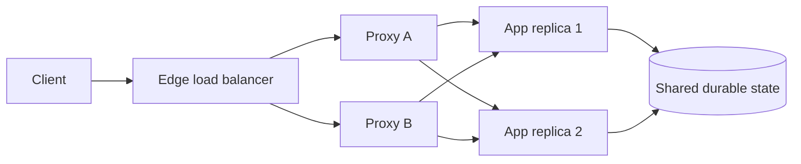

## Scaling bắt đầu từ bottleneck, không phải số instance

**Scale up** tăng resource cho một node. Cách này ít coordination nhưng bị giới hạn bởi kích thước máy và một failure domain lớn. **Scale out** thêm node để chia tải, đổi lại phải giải quyết routing, state, consistency và rollout. Có thể scale up để thoát bottleneck trước, rồi scale out sau khi chứng minh workload phân tán được.

Thêm replica không tự tạo capacity. Nếu mọi request cùng chờ database lock, hot partition hoặc downstream, tầng ứng dụng chỉ tăng contention. Trước khi scale, tách latency thành queue, compute, network, dependency; đo saturation và load test gần production. Headroom cho rollout, node failure, burst phải xuất phát từ SLO và phép đo.

Scale ngang thuận lợi khi instance gần **stateless**: session, file và scheduler ownership không nằm duy nhất trong process mà ở store có replication/concurrency rule rõ. Sticky session có thể là bước chuyển tiếp, nhưng gây phân phối lệch và khó drain khi rollout.

Sơ đồ cũng nhắc rằng load balancer phải có redundancy. Một cụm application khỏe phía sau một proxy duy nhất vẫn có single point of failure.

## L4, L7 và reverse proxy

Load balancer **Layer 4** quyết định theo TCP/UDP address, port và connection. Nó không hiểu HTTP path/header, phù hợp protocol tùy ý hoặc TLS passthrough. Một connection dài vẫn có thể mang lượng việc rất khác connection khác.

Load balancer **Layer 7** hiểu protocol ứng dụng, thường là HTTP; có thể route theo host/path/header, cache, giới hạn body, terminate TLS và đo từng request. Nó thêm parsing, buffering, cấu hình và trust boundary. HTTP/2/gRPC multiplex nhiều stream, nên phải biết thuật toán đếm connection, request hay stream.

**Reverse proxy** đứng trước server và gọi upstream thay client; forward proxy đại diện client đi ra ngoài. NGINX dùng `server`/`location`, `proxy_pass` và upstream group cho HTTP; TCP/UDP dùng `stream`. Edition/module quan trọng: tài liệu phân biệt Open Source với Plus ở active health check, slow start và API reconfiguration. Không giả định directive Plus có trong Open Source.

## Chọn thuật toán từ tín hiệu workload

| Thuật toán | Tín hiệu | Hợp khi | Failure/trade-off |
|---|---|---|---|
| Round robin | Lượt phân phối | Replica gần đồng nhất, request ngắn | Không biết request nặng nhẹ |
| Weighted round robin | Lượt + weight | Capacity replica khác nhau hoặc canary | Weight sai gây hotspot |
| Least connections | Active connection | Thời lượng connection biến thiên | Connection không luôn đại diện lượng công việc |
| Hash theo key/IP | Key ổn định | Affinity hoặc cache locality | Skew key, churn khi membership đổi |
| Random/power of choices | Sample backend | Nhiều balancer không có global view | Cần hiểu xác suất và quan sát phân bố |

NGINX HTTP dùng round robin mặc định, hỗ trợ `least_conn`, `ip_hash` và weight. Thuật toán chỉ tối ưu tín hiệu thấy được: least-connections không biết backend kẹt GC/query; IP hash có thể gom user sau NAT vào một replica. Khi cost chênh lệch, admission hoặc queue quan trọng hơn đổi thuật toán.

## Health check, readiness và draining

Health không phải một boolean duy nhất:

- **Liveness** trả lời process còn có thể tiến triển hay cần restart.
- **Readiness** trả lời replica có nên nhận request mới, xét startup, dependency thiết yếu và draining.
- **Deep dependency check** hữu ích cho chẩn đoán nhưng dễ tạo cascading failure nếu mọi replica bị rút khỏi pool chỉ vì một dependency dùng chung đang chậm.

NGINX Open Source có passive health check: failure quan sát trong traffic thật kết hợp `max_fails` và `fail_timeout` có thể tạm loại upstream. Active probe bằng directive `health_check` trong tài liệu quản trị là tính năng NGINX Plus. Passive check phát hiện chậm khi traffic ít; active check có thể sai nếu endpoint quá nông, quá sâu hoặc credential hết hạn. Probe phải rẻ, bounded và thể hiện đúng khả năng phục vụ loại traffic tương ứng.

Khi deploy hoặc scale in, quy trình đúng là đánh dấu not-ready, ngừng cấp request mới, chờ in-flight request/stream kết thúc trong deadline, rồi mới terminate. Delay cố định không chứng minh đã drain. Long-lived WebSocket, gRPC stream và upload cần policy riêng: giới hạn lifetime, gửi tín hiệu reconnect hoặc chấp nhận đóng có kiểm soát.

## Connection, timeout và TLS boundary

Có hai chặng: client → proxy và proxy → upstream. Keep-alive giảm handshake; pool quá lớn giữ socket và dồn connection vào replica cũ, quá nhỏ gây churn/TLS/port pressure. Timeout connect, read, idle và total phải theo deadline toàn flow; proxy timeout dài hơn caller chỉ giữ việc vô ích.

TLS termination ở edge cho phép route L7 và quản lý certificate tập trung, nhưng traffic nội bộ không mặc nhiên an toàn. Có thể tái mã hóa, xác minh hostname/trust chain hoặc dùng mTLS theo threat model. TLS passthrough giảm khả năng quan sát HTTP. Identity/source-IP header phải được proxy thay thế và chỉ tin từ proxy chain allowlist để tránh spoof.

Retry tại proxy đặc biệt nguy hiểm. Một timeout không cho biết upstream đã commit hay chưa; retry `POST` sang replica khác có thể tạo hai side effect. Chỉ retry operation an toàn/idempotent, trong deadline budget, có attempt limit và backoff; xác định đúng một layer sở hữu retry để tránh nhân số lần gọi.

## Production rollout và troubleshooting

:::production Checklist trước khi đưa load balancer vào critical path
- Validate config và render diff; canary một proxy hoặc một route trước khi mở rộng.
- Xác nhận discovery cập nhật cả add/remove endpoint, health threshold và drain behavior.
- Dashboard theo listener/upstream: request hoặc connection rate, active/queued, connect error, timeout, retry, response code, latency, TLS handshake và certificate expiry.
- Log upstream address, upstream timing, request ID và retry attempt; không log token/cookie nhạy cảm.
- Chuẩn bị đường rollback và break-glass không phụ thuộc cùng control plane đang hỏng.
:::

Khi có lỗi, khoanh vùng theo hop thay vì restart đồng loạt:

1. **502/connect refused:** kiểm tra endpoint discovery, port, listener, NetworkPolicy và application bind address.
2. **504/latency tăng:** tách queue tại proxy, connect time, time-to-first-byte và upstream processing; đối chiếu saturation/dependency.
3. **Một replica nóng:** xem weight, hash-key skew, long connection và membership stale; đừng chỉ tăng replica.
4. **Tất cả upstream unhealthy:** so nội dung probe với readiness thực, DNS, certificate và dependency chung; kiểm tra liệu probe đang tự tạo overload.
5. **Client IP/protocol sai:** audit trusted proxy chain, `Forwarded`/`X-Forwarded-*`, PROXY protocol và TLS termination point.
6. **Deploy làm rớt request:** kiểm tra readiness transition, connection draining, termination grace và deadline của stream.

Một reverse proxy có thể bảo vệ hệ thống bằng body limit, connection limit, rate limit và queue bound, nhưng queue vô hạn chỉ đổi overload thành latency/memory exhaustion. Load shedding sớm với lỗi rõ thường tốt hơn để mọi request cùng timeout.

## Góc phỏng vấn

:::interview Scale out và đặt NGINX phía trước đã đủ high availability chưa?
Chưa. Tôi chứng minh application có thể chạy nhiều replica mà không giữ state cục bộ độc quyền, rồi tìm bottleneck downstream. Tôi chọn L4/L7 và thuật toán theo protocol, connection shape và routing cần thiết; thiết kế readiness, passive/active health, drain và timeout. Bản thân NGINX, DNS/control plane, certificate, database và observability cũng cần failure plan. Cuối cùng tôi load test cả degraded mode, kiểm tra retry không nhân side effect và đo distribution thay vì suy luận từ số instance.
:::

Follow-up senior thường hỏi: least-connections sai khi nào; TLS terminate ở đâu; health endpoint có nên gọi database; vì sao sticky session cản rollout; xử lý WebSocket khi scale in; phân biệt 502 với 504; NGINX Open Source và Plus khác gì ở health check.

## Key Takeaways

- Scale up đơn giản nhưng hữu hạn; scale out thêm resilience lẫn distributed-state complexity.
- L4 cân bằng connection, L7 hiểu request; chọn theo protocol và trust boundary.
- Thuật toán không sửa được bottleneck downstream hay hot key.
- Health check phải phản ánh readiness, còn deploy cần explicit draining.
- Connection pool, deadline, retry và TLS có hai phía của proxy và phải được quan sát riêng.
- Load balancer cũng là critical dependency: cần redundancy, canary, rollback và runbook.
