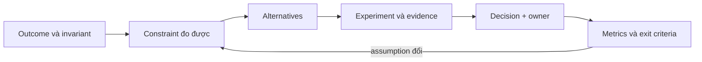

## Câu hỏi đúng không phải “công nghệ nào tốt nhất?”

Một technology decision tốt nối được ba thứ: outcome kinh doanh, constraint kỹ thuật và bằng chứng có thể kiểm tra. “Dùng Kafka vì cần scale” chưa phải lập luận. Ta cần biết flow nào, peak rate bao nhiêu, ordering theo key nào, mức mất dữ liệu chấp nhận được, consumer chậm thì sao và ai trực vận hành broker lúc 2 giờ sáng.

Mental model hữu ích là xem mỗi công nghệ như một khoản vay: capability nhận ngay, còn complexity, failure modes, migration và on-call là phần lãi phải trả liên tục. Baseline nên là thiết kế đơn giản nhất thỏa invariant và SLO, không phải thiết kế ít thành phần nhất bằng mọi giá.

## Decision record tối thiểu

Một Architecture Decision Record (ADR) ngắn nhưng hữu ích nên trả lời:

1. Context: flow, user impact, scale hiện tại và dự báo, compliance, team ownership.
2. Invariants: điều tuyệt đối không được sai, ví dụ không trừ tiền hai lần.
3. Quality attributes: latency percentile, availability, durability, consistency, recovery time.
4. Alternatives: luôn có phương án “giữ hiện trạng và sửa điểm nghẽn”.
5. Evidence: profile, query plan, load test, incident data hoặc prototype representative.
6. Consequences: failure mới, kỹ năng, cost, migration, observability và security.
7. Exit criteria: tín hiệu nào khiến quyết định bị xem xét lại; rollback có khả thi không.

:::warning Fake precision
Không biến estimate thành sự thật. Ghi rõ traffic assumption và khoảng bất định. Một benchmark laptop không chứng minh production capacity; nó chỉ có thể bác bỏ hoặc hỗ trợ một giả thuyết hẹp.
:::

## Ma trận chọn capability

| Lựa chọn | Tín hiệu nên cân nhắc | Tín hiệu chưa nên dùng | Failure mới phải sở hữu |
|---|---|---|---|
| Redis cache | Read lặp lại, source of truth chịu tải cao, stale window xác định được | Chưa đo DB; dữ liệu bắt buộc read-after-write tuyệt đối | Stampede, eviction, stale data, failover, fallback overload |
| Kafka/event log | Nhiều consumer độc lập, replay có giá trị, throughput bền vững, ordering theo key | Chỉ cần một HTTP call đồng bộ đơn giản | Lag, rebalance, duplicate, schema evolution, broker operations |
| Microservices | Boundary và owner rõ, cần deploy/scale/failure isolation độc lập | Team nhỏ, shared database, release vẫn phải đồng bộ | Partial failure, contract drift, distributed tracing, consistency |
| CQRS | Read model khác write model rõ rệt và được đo là bottleneck | CRUD thông thường; team chưa vận hành eventual consistency | Projection lag, rebuild, duplicate event, reconciliation |
| Database sharding | Một node đã được tối ưu nhưng vẫn vượt capacity; shard key tự nhiên và ổn định | Slow query/index/schema còn chưa sửa | Hot shard, reshard, cross-shard query/transaction, routing |
| Distributed lock | Cần mutual exclusion giữa process và side effect có thể fence | Có thể dùng unique constraint, atomic update hoặc single owner | Lease expiry, split brain, stale owner, clock/network pause |
| Kubernetes | Nhiều workload cần scheduling, reconciliation, rollout và policy chuẩn hóa | Vài service ổn định, platform/on-call chưa sẵn sàng | Control plane, networking, probes, resource policy, upgrade |

## “Có nên cache dữ liệu này?”

Bắt đầu từ access pattern và correctness, không bắt đầu từ Redis. Xác định cache key, value size, cardinality, hit rate kỳ vọng, invalidation event và stale tolerance. Nếu source query có thể được sửa bằng index hoặc projection đơn giản, cache có thể chỉ che một lỗi data access.

Cache-aside làm miss đi qua database rồi ghi cache. Nó không tạo atomicity giữa DB và cache: update có thể commit trước khi invalidation tới nơi. Vì thế phải chọn rõ consistency contract như TTL ngắn, delete-on-write, versioned key hoặc chấp nhận eventual consistency. Khi cache down, “fallback DB” chỉ an toàn nếu có timeout, concurrency limit và admission control; nếu không, cache outage trở thành DB outage.

Một thử nghiệm tốt đo p50/p95/p99, DB CPU/IO, hit ratio, request coalescing và behavior khi cache bị vô hiệu hóa. Exit criteria có thể là hit ratio quá thấp, invalidation quá phức tạp hoặc DB vẫn đủ capacity sau tối ưu.

## “Có nên dùng Kafka?”

Kafka đáng giá khi log bền vững, replay, fan-out consumer hoặc decoupled processing giải quyết yêu cầu thật. Nếu producer cần câu trả lời nghiệp vụ tức thời, REST/RPC thường vẫn nằm trên critical path; đẩy mọi thứ qua event không tự làm flow đơn giản hơn.

Trước khi chọn, hãy viết delivery contract: key/partition, retention, maximum event size, compatibility, retry, dead-letter/quarantine, idempotency và lag SLO. At-least-once có nghĩa duplicate là trạng thái bình thường cần thiết kế. “Exactly-once” phải nói rõ boundary; side effect ngoài Kafka vẫn cần idempotency hoặc reconciliation.

Prototype phải thử rebalance, consumer chậm, poison event và broker unavailable, không chỉ đo happy-path throughput. Nếu chỉ có một producer, một consumer và không cần replay, queue/service call ít vận hành hơn có thể phù hợp hơn.

## “Có nên tách microservice hoặc thêm CQRS?”

Tách theo business capability và ownership, không theo table hay technical layer. Trước khi tách process, hãy chứng minh module boundary trong code và data ownership. Modular monolith thường là bước quan sát tốt: nếu module vẫn gọi xuyên boundary và join trực tiếp table của nhau, network chỉ biến coupling thành chậm và khó debug hơn.

CQRS không đồng nghĩa hai database. Nó là tách read model khỏi write model khi hai phía có nhu cầu khác nhau. Chi phí thật là projection lag, rebuild, schema evolution và UI phải hiểu dữ liệu có thể chưa hội tụ. Hãy bắt đầu bằng DTO/read query riêng; chỉ thêm event-driven projection khi measurement cho thấy cần.

## “Có nên shard hay dùng distributed lock?”

Sharding là biện pháp capacity lớn và khó đảo ngược. Trước đó cần kiểm tra query plan, index, archival, partitioning, read replica và vertical headroom. Shard key phải phân phối write/read, hỗ trợ query quan trọng và tránh tenant/hot key quá lớn. Một quyết định không có kế hoạch reshard chưa hoàn chỉnh.

Distributed lock chỉ cấp quyền tạm thời; process có thể pause quá lease rồi tiếp tục ghi như một stale owner. Với side effect quan trọng, cần fencing token tăng đơn điệu và resource phải từ chối token cũ. Nhiều bài toán được giải an toàn hơn bằng database unique constraint, compare-and-set có version, idempotency key hoặc một queue partition có single consumer.

## “Có nên dùng Kubernetes?”

Kubernetes cung cấp declarative API, scheduler và reconciliation; nó không tự viết đúng probe, resource request, PodDisruptionBudget hay disaster recovery. Giá trị tăng khi tổ chức có nhiều workload và cần một platform contract chung. Chi phí tăng theo cluster lifecycle, networking, supply-chain security, policy, observability và kỹ năng incident response.

Trước khi migrate, thử một service đại diện có state dependency, graceful shutdown và rollout. Đo deployment lead time, recovery, resource efficiency và incident complexity. Nếu VM/container service được quản lý đã thỏa SLO với ít người hơn, Kubernetes có thể chưa phải constraint cần giải.

## Scenario: API catalog bắt đầu chậm

Giả sử p99 tăng từ 180 ms lên 1,4 s ở giờ cao điểm. Team đề xuất đồng thời Redis, Kafka và microservices. Quy trình evidence-first sẽ làm khác:

1. Tách queue time, application time và DB time bằng trace; xem query plan với bind value đại diện.
2. Nếu một query scan sai do statistic/index, sửa và load test trước.
3. Nếu read hot vẫn chiếm phần lớn DB capacity, thử cache-aside cho đúng endpoint với stale contract.
4. Kafka chỉ vào thiết kế nếu có công việc bất đồng bộ hoặc nhiều consumer cần event, không để chữa query latency.
5. Chỉ tách service nếu catalog có owner, data boundary và independent scaling/deployment tạo giá trị.

Decision tốt đôi khi là “chưa thêm gì”. Đây là kết quả kỹ thuật hợp lệ khi evidence cho thấy baseline đã đạt SLO với safety margin.

## Failure scenarios và guardrails

- Assumption drift: traffic/data/team đổi nhưng ADR không review. Guardrail là owner và review trigger.
- Sunk-cost bias: giữ công nghệ vì đã đầu tư. Guardrail là exit criteria định trước.
- Success benchmark, failed operations: load test đẹp nhưng không thử dependency loss. Guardrail là fault scenario và recovery verification.
- Hidden coupling: event/API đổi làm nhiều consumer hỏng. Guardrail là contract compatibility và consumer inventory.
- Tool sprawl: mỗi team chọn một stack. Guardrail là paved road và exception dựa trên evidence.

## Trả lời phỏng vấn

:::interview 30 giây
Tôi không chọn công nghệ từ tên use case mà từ invariant, SLO, scale và failure model. Tôi so sánh với baseline đơn giản nhất, chạy experiment representative, ghi consequences và exit criteria. Redis, Kafka hay Kubernetes chỉ được thêm khi capability của chúng giải quyết một constraint đã được chứng minh và team sở hữu được operational cost.
:::

Senior follow-up thường xoáy vào: dữ liệu nào chứng minh bottleneck, failure mới là gì, lựa chọn có đảo ngược được không, rollout/rollback thế nào và metric nào sẽ bác bỏ quyết định.

## Key Takeaways

- Constraint và invariant đi trước product name.
- Mọi capability mới mang theo một failure model và chi phí on-call.
- Giữ hiện trạng là một alternative bắt buộc phải đánh giá.
- Benchmark phải representative và bao gồm degraded path.
- ADR cần owner, consequences, evidence và exit criteria; không phải biên bản hợp thức hóa quyết định có sẵn.
