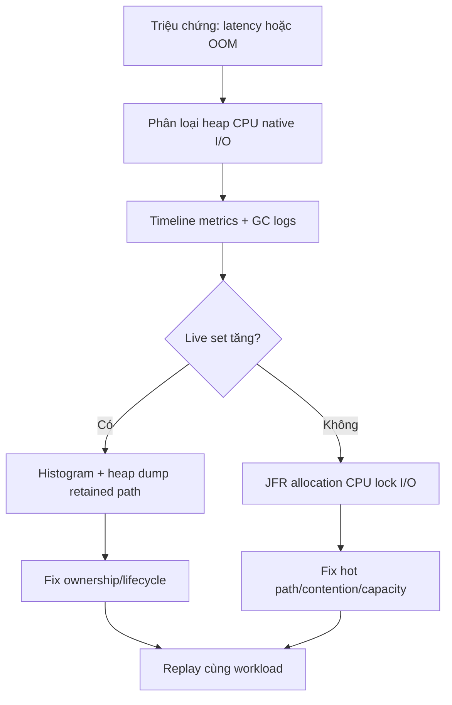

## Bốn tín hiệu không được trộn lẫn
Heap cao không tự động là leak, và GC chạy thường xuyên không tự động là lỗi. Chẩn đoán bắt đầu bằng bốn đại lượng:

| Tín hiệu | Câu hỏi đúng |
|---|---|
| Allocation rate | Ứng dụng tạo bao nhiêu byte object mỗi đơn vị thời gian? |
| Live set | Sau major/full collection còn bao nhiêu object reachable? |
| Pause/CPU của GC | Collector lấy bao nhiêu latency budget và CPU? |
| Native/process memory | Phần ngoài Java heap có đang tăng không? |

Allocation rate cao nhưng live set ổn định có thể là workload hợp lệ hoặc code tạo quá nhiều object tạm. Live set tăng qua nhiều chu kỳ dưới workload ổn định gợi ý retention. RSS tăng trong khi heap ổn định hướng điều tra tới metaspace, thread stacks, direct buffers, native library hoặc memory mapping.

## Collector là quyết định workload
Không có “GC tốt nhất” độc lập với mục tiêu. Một hệ thống batch có thể ưu tiên throughput; API tương tác quan tâm tail latency; container nhỏ quan tâm footprint. Heap size, CPU quota, allocation pattern và object lifetime đều ảnh hưởng kết quả. Dùng collector mặc định là baseline hợp lý, sau đó chỉ đổi khi measurement cho thấy mục tiêu không đạt.

Pause có thể đến từ safepoint work ngoài việc thu object. Một dòng log “Full GC” là triệu chứng cần correlation với allocation spike, class loading, explicit GC, humongous allocation hoặc memory pressure; không phải kết luận nguyên nhân.

:::warning Flag archaeology
Sao chép hàng chục JVM flags từ một hệ thống hoặc phiên bản JDK khác làm mất baseline và có thể vô hiệu khi runtime thay đổi. Mỗi thay đổi phải gắn với hypothesis, metric kỳ vọng và rollback.
:::

## Evidence ladder an toàn
Thu bằng chứng từ rẻ đến đắt, ưu tiên dữ liệu theo thời gian:

1. Correlate request rate, latency, CPU, heap-used-after-GC và container memory.
2. Bật unified GC logging với rotation phù hợp, đọc pause reason và heap trước/sau.
3. Thu Java Flight Recorder trong khoảng đại diện để xem CPU samples, allocation, locks, I/O và GC.
4. Dùng class histogram để tìm type tăng bất thường.
5. Chỉ lấy heap dump khi cần retained-path analysis và đã tính disk, pause, dữ liệu nhạy cảm.

```bash title="DiagnosticCommands.sh"
jcmd <pid> VM.flags
jcmd <pid> GC.class_histogram
jcmd <pid> JFR.start name=incident settings=profile duration=5m filename=incident.jfr
```

Lệnh diagnostic có overhead và quyền truy cập đáng kể. Thời lượng, filename và nơi lưu phải phù hợp môi trường thật; không chạy mù trong container gần hết disk.

## Allocation khác retention
Allocation profiling trả lời “type nào được tạo nhiều và call site nào tạo nó”. Heap dump với dominator tree và retained size trả lời “ai đang giữ graph sống”. Shallow size của một cache entry nhỏ có thể đánh lừa nếu nó giữ graph lớn; retained size và path to GC root mới chỉ ra ownership.

Ví dụ, hàng triệu `String` có thể đến từ parse request bình thường; root path đi qua một static `Map` không eviction mới là bằng chứng retention. Ngược lại, giảm allocation DTO tạm có thể hạ GC CPU dù không có leak.

## CPU profiling và coordinated omission
CPU cao cần sample profile trước khi tối ưu. Wall-clock event cho lock/I/O khác CPU sample; method chờ socket lâu không nhất thiết tiêu CPU. Warm-up, JIT compilation và traffic mix phải được ghi lại khi so hai bản build.

Load test chỉ phát request sau khi response trước hoàn tất có thể bỏ qua khoảng trễ trong lúc hệ thống nghẽn — coordinated omission. Quan sát throughput cùng p95/p99, error, queue depth và resource saturation; average latency không đủ.

## Quy trình incident


Một fix chỉ đáng tin khi workload tái hiện giống nhau và metric mục tiêu cải thiện mà error/correctness không xấu đi.

## Production checklist
1. Lưu JVM version, flags, container limits và collector cùng artifact.
2. Có GC log rotation và đủ telemetry trước incident.
3. Alert trên xu hướng after-GC/live set, không chỉ heap tức thời.
4. Bảo vệ heap dump/JFR như dữ liệu production nhạy cảm.
5. Đổi một nhóm biến có hypothesis mỗi lần và giữ rollback.
6. Xác nhận headroom CPU/memory sau khi tối ưu latency.

## Câu hỏi phỏng vấn
**Heap dùng 90% có phải memory leak?** Chưa đủ dữ kiện. Cần xem live set sau GC qua thời gian, workload và path giữ object. Collector có thể chủ động dùng phần lớn heap để tăng hiệu quả.

**JFR khác heap dump?** JFR là event timeline cho CPU, allocation, lock, I/O và runtime; heap dump là snapshot object graph để phân tích retention, thường nặng và nhạy cảm hơn.

## Key Takeaways
- Phân biệt allocation, live set, GC cost và native memory.
- Thu timeline trước snapshot.
- Tuning là thí nghiệm dựa trên workload, không phải danh sách flags.
- Retained path chỉ ra ownership tốt hơn số lượng object đơn thuần.
