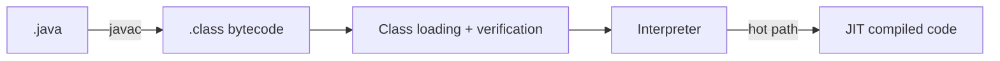

## Từ source đến runtime
javac biên dịch source thành bytecode trong class file. Class loader đưa type vào JVM; verifier kiểm tra bytecode; execution engine diễn giải hoặc JIT compile các đoạn nóng thành machine code. JVM là runtime specification và implementation, không đồng nghĩa với JDK.

## Stack và Heap
Mỗi thread có JVM stack riêng gồm các frame cho method invocation: local variables, operand stack và metadata trả về. Heap được các thread chia sẻ và chứa object/array. Reference có thể nằm trong local variable trên stack nhưng object được tham chiếu thường nằm ở heap.

| Vùng | Scope | Lifetime điển hình | Failure |
|---|---|---|---|
| Stack | Theo thread | Theo lời gọi method | StackOverflowError |
| Heap | Chia sẻ | Theo reachability | OutOfMemoryError |
| Metaspace | Native memory | Theo class loader | Metaspace OOME |

:::warning Hiểu đúng
Không thể kết luận mọi local variable nằm vật lý trên stack: JIT có thể scalar replacement hoặc tối ưu khác. Stack/heap là mental model ngôn ngữ runtime, không phải cam kết layout cho mọi object.
:::

## Garbage collection theo reachability
GC bắt đầu từ GC roots như live thread stacks, static fields và JNI references. Object không còn đường đi từ root trở thành eligible for collection. Java vẫn có memory leak khi ứng dụng giữ reference không còn hữu ích: cache không giới hạn, listener không unregister hoặc ThreadLocal không cleanup.

## Điều tra production
1. Xác nhận triệu chứng: heap tăng, pause tăng, native memory hay allocation rate.
2. Thu heap usage và GC logs theo thời gian; không chỉ nhìn một snapshot.
3. Lấy heap dump có kiểm soát, so dominator tree và retained size.
4. Tìm đường từ object nghi ngờ về GC root.
5. Sửa ownership/lifecycle rồi load test lại cùng workload.

:::production Failure mode
Tăng Xmx có thể trì hoãn crash nhưng cũng kéo dài pause hoặc che cache không giới hạn. Phải phân biệt thiếu capacity hợp lệ với retention bug.
:::

## Trả lời phỏng vấn
Stack thuộc từng thread và lưu execution frame; heap chia sẻ và lưu object. GC thu object theo reachability từ roots, không theo việc “reference count bằng zero”. Memory leak trong Java là reference vẫn reachable nhưng dữ liệu không còn giá trị nghiệp vụ.

## Key Takeaways
- JDK chứa toolchain; JVM thực thi bytecode.
- Stack frame theo invocation, heap object theo reachability.
- GC không ngăn leak logic.
- Chẩn đoán bằng GC log, allocation profile, heap dump và retained path.
