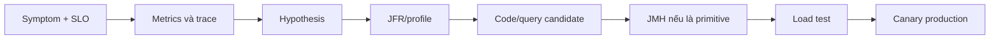

## Performance engineering bắt đầu bằng câu hỏi

“API chậm” chưa phải hypothesis. Ta cần biết workload nào, thời gian nào, percentile nào, traffic/concurrency, resource saturation và thay đổi gần nhất. Average có thể bình thường trong khi p99 vỡ SLO; CPU cao có thể là useful work, allocation/GC, spin hoặc logging. Tối ưu trước khi đo dễ chuyển bottleneck và làm code khó bảo trì.

Một workflow có kiểm soát:



Metrics cho biết **khi nào và bao nhiêu**; trace cho biết request path; profile/JFR cho biết runtime đã làm gì; benchmark kiểm một mechanism; load test xác minh interaction/capacity. Không công cụ nào thay toàn bộ chuỗi evidence.

## JFR là event recording tích hợp JVM

Java Flight Recorder thu events từ JVM và application: CPU sampling, allocation, GC, locks, thread park/sleep, socket/file I/O, class loading, exceptions và configuration. Recording có duration/threshold/stack-trace settings; overhead phụ thuộc events và workload. Official templates là điểm bắt đầu, không phải bảo đảm overhead cố định cho mọi service.

Có thể giữ continuous recording với bounded disk repository để “quay lại quá khứ” khi incident, rồi dùng profiling recording ngắn hơn khi cần detail. Chính sách phải gồm dung lượng, retention, access và redaction: recording có class/method names, paths, network metadata và custom event fields.

```text title="JfrOperations.txt"
jcmd <pid> JFR.start name=incident settings=profile duration=5m filename=/safe/incident.jfr
jcmd <pid> JFR.check
jcmd <pid> JFR.dump name=incident filename=/safe/snapshot.jfr
jfr summary /safe/snapshot.jfr
jfr print --events jdk.CPULoad,jdk.ThreadCPULoad /safe/snapshot.jfr
```

Command khả dụng có thể khác theo JDK build; dùng `jcmd <pid> help` và `jfr help`. Container cần quyền attach/process visibility và writable volume phù hợp. Không mở attach/JMX rộng chỉ để tiện debug.

## Đọc JFR theo hypothesis, không theo biểu đồ đẹp

Nếu p99 tăng, tạo timeline đồng nhất với deploy/traffic. Một số nhánh:

| Tín hiệu | Events/evidence cần ghép |
|---|---|
| CPU JVM cao | execution samples, thread CPU, compilation, OS CPU |
| CPU thấp nhưng latency cao | socket/file I/O, parks, locks, pool waits, downstream trace |
| GC pause/allocation tăng | allocation stack, live set, GC phases, heap after GC |
| Request treo | monitor enter/wait, thread park, socket read, timeout chain |
| Metaspace tăng | class load/unload, class-loader lifetime, redeploy history |

Sampling không đếm chính xác mọi invocation. Threshold có thể bỏ qua nhiều event ngắn nhưng cộng dồn đáng kể. Một recording “không thấy lock dài” không chứng minh synchronization không tốn chi phí. Điều chỉnh event/threshold trong khoảng ngắn, theo dõi overhead và so baseline.

Custom JFR events hữu ích để đánh dấu business phase hoặc queue wait, nhưng tránh payload/PII và cardinality không kiểm soát. Event chỉ commit khi đủ giá trị; version field để consumer phân tích không vỡ khi schema đổi.

## JMH giải quyết benchmark traps của JVM

JVM warmup, tiered compilation, inlining, escape analysis, constant folding và dead-code elimination làm `System.nanoTime` loop tự viết rất dễ đo sai. JMH tạo harness, warmup/measurement iterations, forks, state scopes và result statistics phù hợp hơn.

```java title="ParserBenchmark.java"
@BenchmarkMode(Mode.Throughput)
@OutputTimeUnit(TimeUnit.SECONDS)
@Warmup(iterations = 5)
@Measurement(iterations = 8)
@Fork(3)
@State(Scope.Thread)
public class ParserBenchmark {
  @Param({"small", "unicode"})
  public String sample;

  @Benchmark
  public Parsed parse(Blackhole blackhole) {
    Parsed value = Parser.parse(sample);
    blackhole.consume(value);
    return value;
  }
}
```

Các con số iteration/fork trên chỉ là cấu hình ví dụ, không phải chuẩn cho mọi benchmark. Chọn đến khi fork-to-fork ổn định đủ cho quyết định và ghi toàn bộ environment.

### State và setup

`Scope.Thread` cô lập state mỗi benchmark thread; `Scope.Benchmark` share state và có thể đo contention thật hoặc vô tình tạo data race. Đặt input trong `@Setup`, nhưng không chuyển công việc cần đo ra setup. Nếu input là constant quá dễ đoán, JIT có thể specialize; dùng `@Param`/state đủ đa dạng nhưng deterministic.

### Consume result và side effect

Nếu kết quả không được quan sát, JIT có thể loại bỏ computation. Return value thường đủ; `Blackhole` hữu ích cho nhiều results/side effects giả. Nhưng Blackhole không cứu benchmark có workload không thực tế hay setup sai.

### Fork và warmup

Warmup cho JIT/profile đạt trạng thái phù hợp. Fork JVM mới giảm ảnh hưởng state từ benchmark trước và bộc lộ variance process. Không chạy chỉ trong IDE rồi công bố một score; giữ command, JDK vendor/version, flags, CPU/container quota, OS, power policy và commit.

## Những thứ microbenchmark không trả lời

JMH không mô phỏng network, database, queueing, GC interaction toàn service, autoscaling hay coordinated omission của load generator. Một method nhanh hơn theo nanosecond có thể không thay API latency; một optimization giảm allocation có thể có giá trị dưới tải dù throughput micro chênh nhỏ.

Đừng biến score trên laptop thành capacity claim production. Result chỉ áp dụng cho code, parameters và environment được ghi. So distribution/error, không chỉ point estimate; chạy benchmark candidates xen kẽ/fork đủ để tránh thermal/background bias nếu quyết định nhạy.

## Từ JFR tới JMH rồi quay lại production

Ví dụ JFR cho thấy allocation tập trung ở formatter của một endpoint. Ta tạo benchmark cho current/candidate với input distribution đại diện, kiểm output tương đương, allocation profiler nếu cần. Sau đó chạy load test endpoint gồm serialization/logging/network, xem p95/p99, CPU, allocation, GC và error. Cuối cùng canary, so cùng traffic class và có rollback.

Nếu JMH thắng nhưng load test không đổi, có thể bottleneck nằm elsewhere hoặc candidate bị tối ưu khác khi integrated. Giữ code đơn giản; không săn micro gain không có product/SLO impact.

## Failure và troubleshooting

- Recording settings quá chi tiết trong thời gian dài gây disk/CPU pressure: dừng, hạ event/stack/threshold, dùng bounded repository.
- File JFR chứa dữ liệu nhạy cảm: giới hạn quyền, mã hóa, retention và scrub theo policy.
- Benchmark constant-fold toàn operation: inspect generated/assembly khi cần, dùng dynamic state và consume result.
- Benchmark gộp parsing với random/file setup: tách setup hoặc đặt tên benchmark đúng scope.
- Dùng `Scope.Benchmark` cho mutable non-thread-safe state: result đo race chứ không đo algorithm.
- Chỉ một fork trên shared CI: noise bị hiểu nhầm là regression.
- Tuning GC/JIT flags để thắng microbenchmark nhưng không test startup, memory và tail latency.

:::production Diagnostic runbook
Chuẩn bị trước incident: attach permissions, nơi ghi recording có headroom, command theo JDK, retention, người được truy cập và correlation timestamp. Incident không phải lúc đầu tiên thử quyền `jcmd` trong container.
:::

## Câu hỏi phỏng vấn

**JFR khác JMH thế nào?** JFR quan sát events/runtime behavior của workload đang chạy; JMH đo một benchmark JVM được kiểm soát. JFR giúp tìm candidate, JMH kiểm mechanism, load/canary xác minh impact hệ thống.

**Tại sao warmup chưa đủ?** State/JIT từ cùng process có thể nhiễm giữa tests; forks độc lập giúp đo variance process và giảm profile contamination.

## Key Takeaways

- Bắt đầu từ SLO, workload và hypothesis, không từ optimization yêu thích.
- JFR là timeline evidence; cấu hình, overhead và data policy phải được kiểm soát.
- JMH xử lý nhiều JVM benchmark traps nhưng không đại diện toàn hệ thống.
- Ghi environment/version và không biến micro score thành production claim.
- Candidate chỉ hoàn tất khi load test và canary xác nhận outcome mong muốn.
