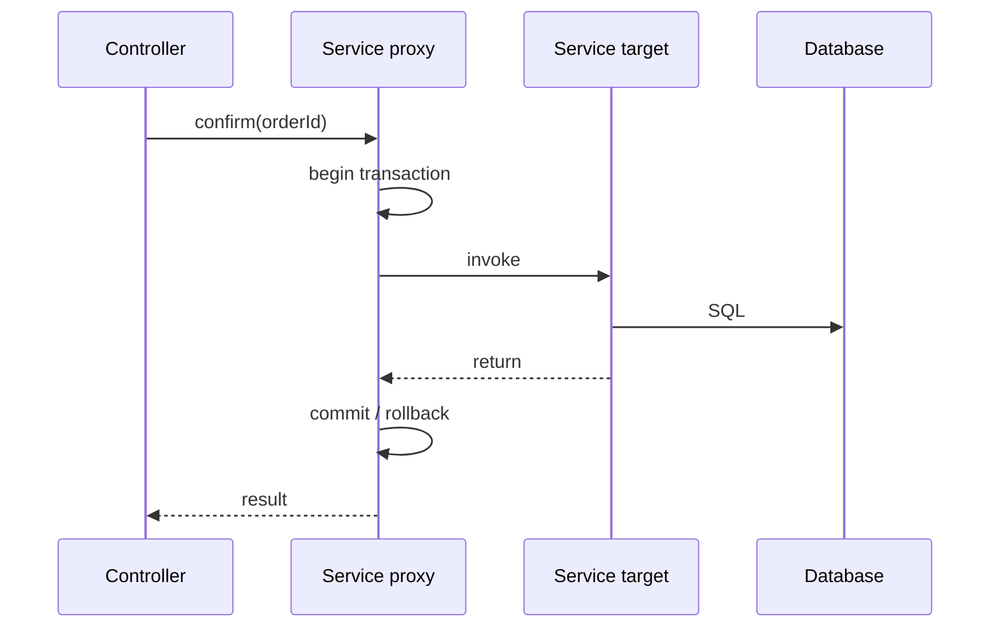

## Mental model: proxy đứng trước target
Spring AOP thường tạo proxy bao quanh target bean. Caller gọi proxy; interceptor quyết định mở transaction, authorization, metric hoặc behavior khác; sau đó mới gọi target. Advice chỉ chạy khi invocation đi qua proxy.



Self-invocation như `this.recalculate()` không đi ra rồi quay lại proxy, nên advice gắn ở method được gọi nội bộ có thể không chạy. Cách tốt nhất thường là đặt transaction tại public application-service boundary hoặc tách collaborator có trách nhiệm riêng, thay vì lấy self-proxy để chữa triệu chứng.

## JDK proxy, class proxy và method contract
JDK dynamic proxy hoạt động qua interfaces; class-based proxy tạo subclass. `final` class/method và method visibility có thể hạn chế interception tùy cơ chế. Vì vậy annotation trên một method không phải bằng chứng runtime đã áp dụng advice. Integration test cần quan sát behavior thật.

Proxy cũng ảnh hưởng type/introspection và ordering khi nhiều advice cùng tồn tại. Transaction, security, retry và caching quanh cùng method có thứ tự khác nhau sẽ cho semantic khác; ví dụ retry nằm bên ngoài transaction tạo transaction mới mỗi attempt, còn retry bên trong có thể lặp trong một context đã rollback-only.

## Transaction boundary
Transaction nên bao trọn một business invariant cần atomic trong cùng resource, và càng ngắn càng tốt. Không mở transaction rồi chờ HTTP call lâu: connection/lock bị giữ, latency tăng và failure space mở rộng.

```java title="OrderApplicationService.java"
@Transactional
public OrderReceipt confirm(OrderId id, Command command) {
  Order order = orders.findForUpdate(id).orElseThrow();
  order.confirm(command);
  outbox.append(OrderConfirmed.from(order));
  return mapper.toReceipt(order);
}
```

Đưa outbox record vào cùng database transaction cho phép commit state và intent publish atomically trong database. Gọi broker hoặc email trực tiếp bên trong transaction không thể tạo atomicity xuyên hai hệ thống; callback có thể thành công rồi database rollback.

## Propagation không phải decoration
`REQUIRED` thường tham gia transaction hiện có hoặc tạo mới. `REQUIRES_NEW` suspend transaction ngoài và cần resource/connection độc lập; dùng nhiều trong một request có thể cạn pool. `NESTED` phụ thuộc savepoint support và không đồng nghĩa transaction phân tán.

Nếu inner `REQUIRED` đánh dấu rollback-only nhưng outer code bắt exception và tiếp tục commit, outer có thể nhận `UnexpectedRollbackException`. Catch exception không tự xóa trạng thái transaction.

:::warning Audit với REQUIRES_NEW
Ghi audit bằng transaction mới có thể tồn tại dù nghiệp vụ chính rollback. Đó có thể là yêu cầu đúng, nhưng phải phân biệt “attempt audit” và “committed business event”; nếu không, báo cáo sẽ nói một hành động đã hoàn tất dù thực tế thất bại.
:::

## Rollback và exception taxonomy
Mặc định declarative transaction thường rollback với unchecked exception và `Error`, không tự rollback mọi checked exception. Policy có thể cấu hình, nhưng exception taxonomy phải phản ánh retryability và business outcome. Nuốt exception hoặc đổi thành success trước khi proxy nhìn thấy có thể dẫn tới commit.

`readOnly` thường là hint cho transaction infrastructure/driver, không phải security guarantee cấm mọi write. Flush có thể xảy ra trước commit khi query cần đồng bộ persistence context; database constraint có thể nổ ở flush hoặc commit, không nhất thiết ngay tại `save`.

## Isolation và concurrency
Isolation do database thực thi và behavior cụ thể phụ thuộc vendor/MVCC/lock. Spring chỉ truyền yêu cầu nếu transaction manager/resource hỗ trợ. Isolation cao hơn không tự sửa lost update cho mọi flow; optimistic `@Version`, conditional update hoặc lock có thể cần để bảo vệ invariant.

Không truyền transaction context sang thread từ `@Async` hoặc executor rồi giả định nó còn nguyên. Transaction thường gắn với execution context của thread; asynchronous boundary là transaction boundary mới cần thiết kế rõ.

## Production checklist
1. Đặt transaction ở application-service method biểu diễn use case.
2. Xác minh call đi qua proxy và method có thể được advise.
3. Không giữ transaction qua remote I/O nếu tránh được.
4. Ghi rõ propagation, isolation và rollback policy khi khác mặc định.
5. Theo dõi transaction duration, pool wait, deadlock và rollback rate.
6. Dùng outbox/saga cho side effect xuyên resource.

## Câu hỏi phỏng vấn
**Vì sao `@Transactional` self-invocation có thể không chạy?** Lời gọi `this.method()` vào thẳng target, không đi qua proxy nơi interceptor transaction được gắn.

**`save()` thành công có nghĩa dữ liệu đã commit?** Không. Persistence context có thể chưa flush, transaction có thể rollback hoặc constraint chỉ xuất hiện ở flush/commit.

## Key Takeaways
- Annotation chỉ có hiệu lực khi runtime interception xảy ra.
- Transaction là business/resource boundary, không phải wrapper tùy tiện.
- Propagation thay ownership của transaction và connection.
- Atomicity database không bao phủ broker/HTTP; cần pattern phối hợp.
