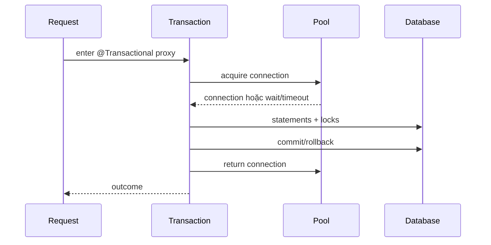

## DataSource là resource boundary

`DataSource` là factory cung cấp JDBC `Connection`; pool là một implementation tái sử dụng physical connections và giới hạn số database sessions đồng thời. Spring Boot auto-configure pool khi dependency phù hợp có mặt, nhưng auto-configuration không thể biết database capacity, số replicas hay SLO của hệ thống.

Trong transaction JDBC/JPA điển hình, Spring bind connection với execution context của transaction. `JdbcTemplate`, transaction manager và ORM phối hợp lấy/trả connection; business code không nên tự giữ connection ngoài lifecycle này. Dùng `DataSource.getConnection()` trực tiếp ở code tham gia Spring transaction có thể bỏ qua transaction-bound connection; Spring cung cấp `DataSourceUtils` và framework templates để giữ semantics đúng.



Connection có thể được acquire lazily tùy stack/config; nhưng khi đã giữ, mọi remote call, sleep, serialization hoặc queue wait bên trong transaction đều kéo dài thời gian chiếm pool và có thể giữ DB locks.

## Pool là concurrency limiter, không tạo database capacity

Pool quá nhỏ làm requests chờ dù database còn headroom. Pool quá lớn đẩy concurrency vào database, tăng sessions, memory, lock contention, I/O queue và tail latency. Quan trọng nhất là **global connection budget**:

```text
total potential connections = replicas × pool per replica
                            + jobs + migration + admin reserve
```

Autoscaling application mà giữ pool size cố định trên mỗi Pod có thể vượt database limit đúng lúc traffic cao. Pool budget phải đi cùng maximum replicas và capacity test của database. Little's Law giúp sanity-check concurrency trung bình từ throughput và thời gian giữ connection; burst/tail cần headroom được đo, không phải multiplier tùy ý.

Đừng đặt pool bằng số HTTP threads hay số virtual threads. Thread dồi dào không làm sessions/CPU/locks dồi dào. Dùng admission control trước pool để overload fail sớm có chủ đích thay vì tạo hàng nghìn request chờ connection.

## Timeout ladder thay vì một con số

Các timeout bảo vệ những phase khác nhau:

| Timeout | Bảo vệ | Khi hết hạn |
|---|---|---|
| Connect/login | Mở physical connection tới DB | Pool không tạo/replace connection được |
| Pool acquisition | Chờ mượn connection | Request chưa chạy SQL |
| Validation | Kiểm tra connection còn dùng được | Evict/replace connection lỗi |
| Statement/query | Chờ statement thực thi | Driver yêu cầu cancel; outcome cần kiểm tra |
| Lock | Chờ lock ở database | Statement/transaction có thể abort tùy DB |
| Transaction | Tổng work trong transaction | Spring/transaction system đánh dấu rollback theo support |
| Request/deadline | Budget end-to-end | Client có thể đã bỏ; DB work không tự biến mất |
| Socket/network | I/O driver với DB | Outcome commit có thể không rõ |

Timeout ngoài phải lớn hơn ngân sách hữu ích của các bước trong, nhưng không cộng mỗi retry một full budget. Ví dụ request deadline phải chừa thời gian serialize/return error; SQL timeout phải nhỏ hơn phần budget còn lại. Propagate deadline và giảm budget qua từng downstream call.

Spring transaction timeout chỉ được áp xuống statement khi transaction manager/driver path hỗ trợ; custom raw JDBC statement cần áp transaction timeout đúng cách. HTTP client disconnect hoặc `Future.cancel` không bảo đảm database statement đã dừng. Test driver và database thật, quan sát active query sau timeout.

## Cấu hình là điểm bắt đầu, không phải đáp án

```yaml title="application.yml"
spring:
  datasource:
    hikari:
      maximum-pool-size: 20
      minimum-idle: 5
      connection-timeout: 500ms
      validation-timeout: 250ms
      max-lifetime: 25m
```

Các giá trị chỉ minh họa shape cấu hình; không copy thành baseline production. `max-lifetime` phải phối hợp với database/proxy/network idle lifetime để pool chủ động retire connection trước infrastructure, có jitter/implementation behavior theo pool. `minimum-idle` cao trên nhiều replicas tạo connection burst khi scale-out.

Externalize theo environment nhưng giữ schema/validation. Secret URL/password không log. Config thay đổi pool là capacity change cần review, canary và rollback, không phải tuning vô hại.

## Transaction boundary quyết định thời gian giữ connection

`@Transactional` thường hoạt động qua proxy; self-invocation có thể bypass advice. Giữ transaction quanh invariant database, không quanh toàn orchestration:

```java title="OrderService.java"
public OrderResult place(Command command) {
  Quote quote = pricingClient.quote(command); // có timeout, ngoài DB tx
  return transactionTemplate.execute(status -> persist(command, quote));
}
```

Tách remote call ra ngoài transaction giảm hold time nhưng thay đổi concurrency semantics: state có thể đổi giữa quote và persist. Revalidate invariant/optimistic version trong transaction. Nếu cần DB state lock xuyên remote call, thiết kế thường đang coupling resource nguy hiểm; cân nhắc reservation/saga.

`readOnly=true` là hint/optimization tùy transaction manager/database, không phải security boundary ngăn mọi write. Read replica routing cần hiểu consistency lag và transaction context; một flow “write rồi read” không tự thấy data nếu bị route replica.

## Pool exhaustion: leak hay slow ownership?

Pool `active=max`, pending tăng không chứng minh connection leak. Có thể là query chậm, lock wait, transaction dài, remote call trong transaction hoặc database saturated. Leak thật là connection không được trả vì code/lifecycle sai; framework-managed code vẫn có “logical leak” khi transaction bị treo.

Điều tra theo evidence:

1. Xác nhận acquisition wait/timeout, active/idle/pending theo timestamp.
2. Xác định endpoints, transactions và stack giữ connection lâu.
3. Ghép database activity/query/lock/transaction age với application trace.
4. Kiểm thread dump: ai chờ pool, ai giữ ở remote/socket/lock.
5. Kiểm pool lifetime với proxy/database close policy cho stale connection.
6. Reproduce slow DB, lock và network reset dưới concurrency đại diện.
7. Sửa query/boundary/limit; chỉ đổi pool sau capacity evidence.

Leak detection threshold quá thấp có thể tạo noise và overhead; bật có thời hạn, hiểu stack capture semantics. Tăng pool có thể tạm giảm acquisition wait nhưng làm database tệ hơn và che root cause.

## Failure semantics và retry

Acquisition timeout xảy ra trước SQL nhưng retry ngay vẫn thêm offered load vào pool đang quá tải. Statement timeout có thể rollback statement hoặc transaction tùy DB/error; đừng tiếp tục dùng transaction đã marked rollback-only. Connection reset lúc commit tạo **unknown outcome**: không được đoán rollback rồi ghi lại side effect không idempotent.

Phân loại exception theo SQL state/vendor semantics và operation. Retry serialization/deadlock có giới hạn ở whole-transaction boundary chỉ khi side effects an toàn. Constraint violation business không phải transient. Dùng idempotency key/status reconciliation cho unknown outcome.

:::production Metrics tối thiểu
Theo dõi acquisition duration/timeouts, active/idle/pending, connection creation/close, transaction duration, query/lock wait và DB saturation. Tag bằng endpoint template/operation bounded; không dùng raw SQL hoặc user ID gây cardinality và lộ dữ liệu.
:::

## Câu hỏi phỏng vấn

**Pool chạm max có nên tăng size?** Chưa. Phải xem acquisition wait, transaction hold time, query/locks và DB saturation. Tăng pool chỉ chuyển queue xuống database và nhân theo replicas.

**Request timeout có hủy SQL không?** Không đảm bảo. Cần statement/driver/database timeout và cancellation được kiểm chứng; outcome commit có thể không rõ khi network hỏng.

## Key Takeaways

- Pool quản concurrency vào database; nó không tạo capacity.
- Sizing phải tính toàn cluster, autoscaling và operational reserve.
- Timeout là ladder theo phase và deadline, không phải một property chung.
- Transaction càng ôm I/O ngoài DB càng giữ connection/lock lâu.
- Pool exhaustion cần evidence hai phía application và database.

