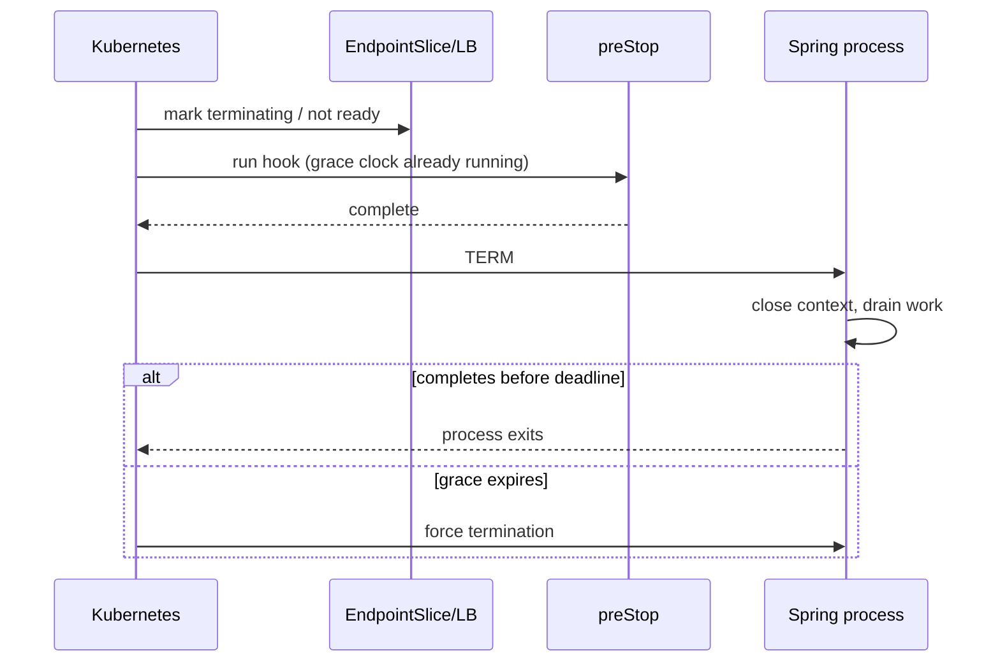

## Graceful shutdown là distributed protocol có deadline

Không có một nút “graceful” làm mọi tầng an toàn. Kubernetes điều phối Pod/EndpointSlice và signal; container runtime chuyển signal tới process; Spring đóng `ApplicationContext` và `SmartLifecycle` beans; web server, Kafka container, scheduler và application code quyết định work nào hoàn tất. Load balancer/client còn có connection, retry và propagation delay riêng.

Mục tiêu thực tế:

- Không nhận work mới sau khi bắt đầu drain, trong giới hạn platform.
- Work đang chạy hoàn tất trong deadline hoặc có thể retry/resume an toàn.
- Offset/ack chỉ commit cho work đã durable.
- Resource đóng theo dependency order.
- Hard kill vẫn không làm corruption hoặc duplicate nguy hiểm.

Graceful shutdown tăng xác suất hoàn tất; nó không thay idempotency và crash recovery.

## Pod termination timeline

Khi Pod bị xóa với grace period, control plane đánh dấu terminating và endpoint không còn ready cho regular traffic; kubelet bắt đầu local shutdown. Nếu có `preStop`, hook chạy trước TERM và **thời gian hook nằm trong cùng termination grace period**. Sau đó runtime gửi TERM tới process 1. Khi hết grace, remaining process bị cưỡng chế dừng.



Endpoint propagation và external load balancer behavior không tức thời tuyệt đối. Request mới có thể tới trong cửa sổ chuyển tiếp hoặc qua keep-alive. Server phải từ chối/handle theo contract và client retry chỉ operation idempotent.

## Spring Boot shutdown lifecycle

Spring Boot hiện bật graceful shutdown mặc định cho embedded Tomcat, Jetty và Reactor Netty ở servlet/reactive apps. Khi context đóng, web server ngừng nhận request mới theo implementation và cho in-flight requests thời gian hoàn tất. `spring.lifecycle.timeout-per-shutdown-phase` đặt timeout mỗi lifecycle phase, không phải một ngân sách tự động đồng bộ Kubernetes.

```yaml title="application.yml"
spring:
  lifecycle:
    timeout-per-shutdown-phase: 25s
management:
  endpoint:
    health:
      probes:
        enabled: true
```

Giá trị minh họa; phải lấy từ request/job duration và Pod budget thật. Shutdown từ IDE/kill không gửi TERM đúng có thể không chạy flow. Trong container, Java process cần nhận signal: tránh shell wrapper nuốt signal hoặc đảm bảo `exec`/init forwarding.

`SmartLifecycle` phase điều khiển thứ tự start/stop: phase cao start muộn và stop sớm. Producer work nên dừng trước dependency executor/pool mà nó dùng. Callback `stop(Runnable)` phải gọi callback khi hoàn tất; block/hang vượt phase timeout sẽ bị tiến trình shutdown bỏ lại cho outer deadline.

## Readiness, liveness và startup không đồng nghĩa

Startup probe cho app khởi động chậm mà không bị liveness restart sớm. Readiness quyết định có nhận traffic; liveness quyết định restart process bị kẹt. Đưa shared database vào liveness có thể restart mọi Pod khi DB outage và tạo cascade. Readiness có thể phản ánh serving capability, nhưng optional dependency hỏng không nhất thiết loại toàn bộ capacity nếu có degraded mode.

Spring Actuator cung cấp liveness/readiness health groups. Expose endpoints tối thiểu trên management/security boundary. Probe phải rẻ, bounded, không chạy query nặng hay tiết lộ details.

Trong termination, Kubernetes đã cập nhật endpoint state; hack `preStop: sleep 20` cố chờ propagation có thể hữu ích với infrastructure cụ thể nhưng tiêu tốn grace và không phải guarantee chung. Đo traffic-after-TERM trên cluster/load balancer thật trước khi dùng; ưu tiên termination-aware routing và application drain.

## Lập termination budget

Ngân sách cần thỏa quan hệ:

```text
preStop duration
+ Spring lifecycle phases cần thiết
+ in-flight cleanup margin
< terminationGracePeriodSeconds
```

Nếu web request cho phép 30 giây nhưng Pod grace chỉ 20 giây, không có config Spring nào cứu request dài nhất. Giảm request timeout, làm async/resumable hoặc tăng grace phù hợp rollout speed. Grace quá dài làm deployment/node drain chậm; grace quá ngắn tăng forced kill.

Nhiều Spring lifecycle phases có thể mỗi phase dùng timeout riêng, nên không đơn giản đặt Kubernetes grace bằng đúng một property. Inventory beans thực tế: web server, Kafka listeners, task executors, schedulers, connection pools, telemetry exporters.

## HTTP và connection draining

Khi TERM đến, web server graceful stop ngăn new requests theo server behavior và chờ active requests. Streaming/WebSocket/Server-Sent Events có thể sống rất lâu; cần shutdown signal ở application protocol, client reconnect/backoff và resume cursor. Không chờ vô hạn connection dài.

Client có thể retry request bị reset. POST cần idempotency key hoặc status reconciliation; nếu server commit DB rồi connection đóng trước response, client thấy unknown outcome. Shutdown test phải cover điểm crash này, không chỉ GET health.

## Kafka consumer và background jobs

Kafka listener phải dừng poll, xử lý/rollback in-flight và commit offset đúng durable boundary. Nếu handler dài hơn grace, forced kill tạo redelivery; inbox/idempotency làm điều đó an toàn. Đừng ack rồi mới submit vào executor không durable.

Scheduler cần ngừng tạo jobs trước khi executor drain. Job dài nên checkpoint/lease với fencing hoặc resumable state. `@PreDestroy` không nên bắt đầu work mới hoặc gọi dependency đã đóng. Database pool đóng sau consumers/jobs còn cần DB; telemetry exporter cần flush bounded sau signals quan trọng nhưng trước process exit.

```text title="ShutdownOrder.txt"
stop admission / readiness
→ stop HTTP new work and message polling
→ finish or checkpoint in-flight work
→ flush bounded outbox/telemetry
→ close executors
→ close database, Kafka, Redis clients
→ exit
```

Thứ tự cụ thể do dependency graph quyết định; flush outbox đồng bộ có thể không cần nếu relay khác tiếp tục và rows đã durable.

## Rolling deployment và availability

Deployment strategy (`maxUnavailable`, `maxSurge`), readiness delay, PodDisruptionBudget và topology capacity quyết định có đủ ready replicas trong lúc old Pod drain/new Pod warm. PDB chỉ giới hạn một số voluntary disruptions; nó không bảo vệ node crash hay application bug.

New Pod không ready trước khi migrations/warmup critical hoàn tất. Nhưng readiness phụ thuộc cache warm đầy đủ có thể làm rollout deadlock/tải dồn; warm minimum serving set và dùng progressive traffic. Schema migration phải backward/forward compatible khi old/new app cùng chạy.

## Failure injection và verification

1. Gửi traffic đại diện, bao gồm request gần timeout và long-lived connection.
2. Xóa Pod/rollout và ghi timestamp endpoint removal, TERM, Spring logs, request outcomes.
3. Làm downstream chậm để thấy drain khi handler bị block.
4. Chạy Kafka records, verify offset/redelivery/idempotency.
5. Cưỡng chế kill trước grace để chứng minh crash recovery.
6. Test node drain/scale-down, không chỉ manual app stop.
7. Quan sát forced termination, shutdown duration, in-flight, errors, duplicate business effect và consumer lag.

Nếu deploy “thành công” nhưng p99/error spike, rollout policy chưa đạt. Nếu không có log “graceful shutdown complete”, kiểm signal PID1, grace budget và lifecycle bean treo. Thread dump/JFR trước deadline có thể chỉ owner, nhưng collection phải nhanh và không làm miss grace.

:::production Runbook
Dashboard rollout cần desired/updated/available replicas, terminating Pod age, readiness transitions, HTTP in-flight/error, Kafka lag/rebalance và forced-kill reason. Alert khi shutdown thường xuyên chạm deadline, không chờ data loss report.
:::

## Câu hỏi phỏng vấn

**`preStop sleep` có bảo đảm không còn traffic không?** Không. Nó chỉ trì hoãn TERM và ăn vào grace; propagation/LB behavior phải đo. Kubernetes endpoint termination và server drain mới là các phần chính.

**Graceful shutdown có loại duplicate Kafka không?** Không. Kill/crash có thể xảy ra mọi lúc; offset sau durable work và idempotency vẫn bắt buộc.

## Key Takeaways

- Graceful shutdown là protocol giữa Kubernetes, runtime, Spring và workload.
- `preStop` dùng chung termination grace; không cộng thêm thời gian.
- Đồng bộ budget giữa probe/routing, Spring lifecycle và Pod grace.
- HTTP unknown outcome, Kafka redelivery và hard kill cần idempotency.
- Chỉ rollout/failure injection trên cluster thật mới xác minh drain behavior.

