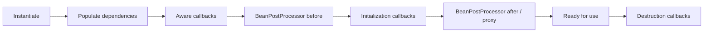

## Mental model: container sở hữu object graph
Inversion of Control nghĩa là application khai báo components và dependencies, còn container chịu trách nhiệm instantiate, configure, nối graph và quản lý lifecycle. Dependency Injection là cơ chế chính để thực hiện IoC. Lợi ích không nằm ở việc bỏ từ khóa `new`, mà ở chỗ composition root tập trung và dependency có contract rõ.

```java title="CheckoutConfiguration.java"
@Configuration(proxyBeanMethods = false)
class CheckoutConfiguration {
  @Bean
  CheckoutService checkoutService(OrderRepository orders, PaymentPort payments) {
    return new CheckoutService(orders, payments);
  }
}
```

Constructor injection làm dependency bắt buộc hiện rõ, hỗ trợ immutable field và unit test không cần container. Nếu constructor có quá nhiều dependency, đó thường là tín hiệu class giữ quá nhiều trách nhiệm; không nên che bằng field injection.

## Bean definition và scope
Container tạo bean từ component scanning, `@Bean`, import hoặc auto-configuration. Tên/type/qualifier là dữ liệu resolution; nhiều implementation cùng type cần `@Qualifier` hoặc một primary policy rõ.

Singleton scope của Spring là một instance trên mỗi `ApplicationContext`, không phải singleton toàn JVM. Prototype tạo instance mới mỗi lần container resolve, nhưng container không quản lý trọn destruction lifecycle của prototype. Khi inject prototype trực tiếp vào singleton, instance thường được resolve lúc singleton tạo; muốn lookup theo lần dùng cần provider/factory có chủ đích.

Request/session scopes dùng proxy để một singleton có thể giữ reference đại diện và resolve instance theo context hiện tại. Truy cập ngoài request thread/context có thể thất bại; scope là lifecycle contract chứ không chỉ annotation.

## Lifecycle và extension points
Một flow đơn giản hóa:



`BeanPostProcessor` có thể wrap bean bằng proxy, nên object cuối container trả ra có thể không phải raw instance. Code trong constructor và early lifecycle không nên giả định mọi cross-cutting concern đã hoạt động. `@PostConstruct` phù hợp validation/khởi tạo nhẹ; đừng block startup bằng migration hoặc remote call không timeout.

:::production Startup dependency
Nếu mọi instance đồng loạt gọi một downstream trong initialization, deploy có thể tạo thundering herd. Tách readiness khỏi liveness, đặt timeout và cân nhắc lazy/background warm-up khi tính đúng đắn cho phép.
:::

## Circular dependency là design signal
`A -> B -> A` thường cho thấy boundary hoặc responsibility chưa rõ. Constructor cycle không thể tạo object graph hoàn chỉnh theo cách trực tiếp. Dùng lazy/provider chỉ khi domain thật sự cần deferred lookup; giải pháp bền thường là tách orchestration, publish event hoặc rút abstraction thứ ba.

Cycle cũng có thể làm một bean nhìn thấy reference sớm trước khi proxy/lifecycle hoàn tất. Vì vậy “container vẫn khởi động được” không chứng minh thiết kế an toàn.

## Spring Boot auto-configuration
Boot auto-configuration là tập configuration có điều kiện theo classpath, beans đang có, properties và environment. Nó “back off” khi application cung cấp bean/config tương ứng. Đây là convention có thể kiểm tra, không phải magic.

Khi bean không xuất hiện:

1. Xác nhận auto-configuration class có được import.
2. Đọc condition evaluation report để biết condition nào không match.
3. Kiểm tra property binding, profile và dependency classpath.
4. Tìm bean user-defined khiến auto-config back off.
5. Tránh giải quyết bằng component scan quá rộng.

`@ConfigurationProperties` gom config có type, validation và metadata tốt hơn việc rải `@Value`. Secret không nên có default giả; log config phải redact.

## Failure scenarios
- Inject một `List<Strategy>` nhưng vô tình phụ thuộc ordering không được khai báo.
- Làm network I/O trong constructor: startup treo và object chưa thể test riêng.
- Dùng static service locator lấy bean: dependency ẩn, coupling container lan vào domain.
- Scan package quá rộng: bean ngoài ý muốn, startup chậm hoặc collision.
- Override auto-config mà không hiểu condition: behavior đổi khi dependency/version thay đổi.

## Production checklist
1. Constructor injection cho dependency bắt buộc; optional dependency phải có semantic rõ.
2. Giữ component scanning trong application boundary.
3. Validate typed configuration khi startup và redact secret.
4. Initialization có timeout, idempotent và quan sát được.
5. Dùng condition report khi debug Boot.
6. Xem circular dependency như vấn đề thiết kế trước khi dùng `@Lazy`.

## Câu hỏi phỏng vấn
**Spring singleton có thread-safe không?** Không tự động. Scope chỉ nói container có một instance; code của bean vẫn phải tránh shared mutable state hoặc đồng bộ đúng.

**Auto-configuration có ghi đè bean của ứng dụng không?** Thường auto-config dùng conditions và back off khi bean user-defined phù hợp tồn tại; phải đọc condition cụ thể, không suy diễn cho mọi config.

## Key Takeaways
- Container quản lý composition và lifecycle của object graph.
- Scope là ownership/lifetime contract.
- Proxy có thể xuất hiện qua post-processing sau raw initialization.
- Auto-configuration phải được debug bằng conditions và report.
