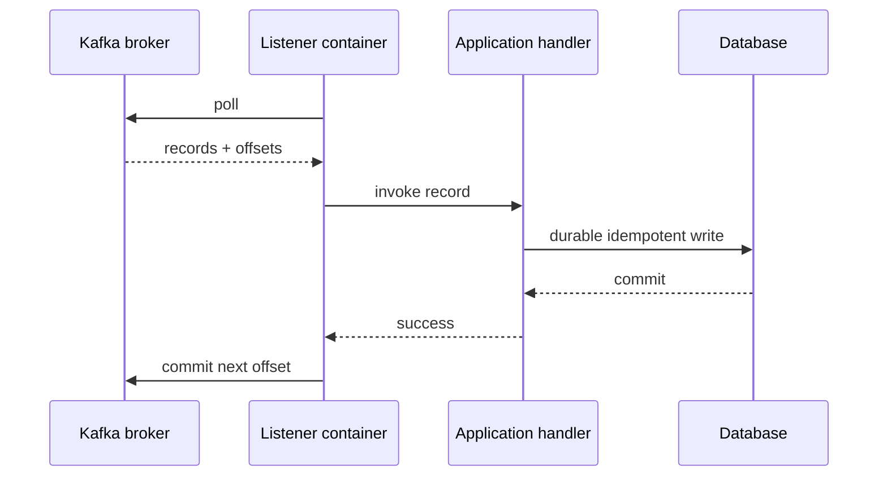

## Listener là một state machine, không chỉ method annotation

`@KafkaListener` đăng ký endpoint; listener container sở hữu Kafka consumer, poll loop, partition assignment, offset commit, pause/resume, error handler và lifecycle. Method chỉ là một bước trong state machine. Cấu hình concurrency tạo nhiều consumer threads/instances; ordering chỉ được Kafka giữ trong từng partition, không trên toàn topic.



Nếu process chết sau DB commit nhưng trước offset commit, record sẽ được giao lại. Vì vậy default mental model là **at-least-once processing** và handler phải chịu duplicate. Commit sớm trước durable side effect đổi failure thành message loss.

## Ack mode là checkpoint policy

Spring container mặc định quản offset và thường đặt `enable.auto.commit=false` trừ khi override. `AckMode.RECORD` commit sau mỗi record listener thành công; `BATCH` commit sau batch poll được xử lý; manual modes cho code gọi `Acknowledgment`. Manual không tự làm hệ thống “chính xác hơn”; nó tăng số state cần quản.

```java title="OrderEvents.java"
@KafkaListener(topics = "orders.v3", groupId = "billing-v2")
public void on(OrderPlaced event) {
  transactionTemplate.executeWithoutResult(status -> {
    if (!inbox.tryInsert(event.eventId())) return; // unique event_id
    invoices.createFrom(event);
  });
}
```

Unique inbox insert và business write phải trong cùng database transaction. Nếu duplicate, handler trả success để offset có thể tiến. Dùng business event ID ổn định, không chỉ partition-offset nếu event được copy/replayed sang topic khác.

Batch listener tăng throughput nhưng failure semantics phức tạp: một record giữa batch lỗi thì retry toàn batch hoặc partial recovery theo container configuration. Side effects trước failure vẫn phải idempotent. Chọn batch vì evidence, không vì “ít commit hơn” chung chung.

## Key, partition và concurrency

Producer key quyết định partitioning strategy; cùng aggregate key vào cùng partition giúp giữ thứ tự. Tăng partitions/concurrency tăng parallelism nhưng phá mọi giả định global order và là operational change. Concurrency lớn hơn số assigned partitions tạo consumers rảnh; lớn hơn database/downstream capacity chỉ chuyển bottleneck.

Listener code mặc định chạy trên consumer thread. Blocking lâu làm poll interval bị đe dọa. Không đẩy record sang executor rồi return nếu offset được commit trước task; khi crash, task mất. Nếu handoff async, phải có durable queue/coordination và commit frontier bảo toàn thứ tự—thường phức tạp hơn tăng partitions và xử lý đồng bộ có bounded timeout.

## Rebalance và `max.poll.interval.ms`

Consumer phải poll đủ thường xuyên. Handler quá lâu so với `max.poll.interval.ms` có thể làm member bị coi là thất bại và partitions được reassign; instance cũ có thể vẫn đang side-effect. Tăng interval che slow path nhưng làm recovery membership chậm hơn. Tốt hơn là đo processing time, giới hạn batch/poll records, timeout downstream, pause/resume có chủ đích và scale partitions theo capacity.

Rebalance revoke partitions trong lúc work đang chạy cần container lifecycle đúng. Static membership có thể giảm rebalance do restart ngắn nhưng không loại deployment/scale/failure rebalances. Generation/commit có thể stale; handler vẫn cần idempotency.

## Retry: transient, permanent và poison record

Phân loại failure:

| Loại | Ví dụ | Policy |
|---|---|---|
| Transient bounded | downstream timeout ngắn | retry ít lần, backoff/jitter, có budget |
| Permanent data | schema/validation không hỗ trợ | DLT/quarantine kèm metadata an toàn |
| Business conflict | state không cho phép | outcome domain hoặc quarantine, không retry mù |
| Programming defect | null/invariant bug | alert, stop/quarantine theo blast radius |
| Overload | DB pool saturated | pause/admission, không nhân tải bằng retry |

`DefaultErrorHandler` và recoverer cho blocking retry/DLT trong container. Non-blocking retry topics giải phóng original partition nhưng thay đổi ordering và không kết hợp giống container transactions trong mọi mode. Chọn dựa ordering, delay, throughput và operations.

DLT không phải thùng rác. Record cần original topic/partition/offset, event ID, schema/version, failure class đã sanitize, timestamp/attempt và trace context. DLT consumer/tool phải có authorization, retention, replay idempotency và audit. Không log payload chứa PII chỉ để debug.

Deserialization có thể lỗi trước khi listener nhận object. Cấu hình error-handling deserializer/recoverer phù hợp để poison bytes không khóa partition mãi; lưu raw payload phải theo security/size policy.

## Kafka transactions và giới hạn exactly-once

Khi container transaction được cấu hình, nó bắt đầu Kafka transaction, listener-produced records tham gia và offsets được gửi vào transaction trước commit. Điều này cung cấp EOS cho Kafka `read → process → write` trong phạm vi transaction/producers/consumers cấu hình đúng.

Nó không tự làm HTTP call, email hay relational DB commit atomic với Kafka. Spring có transaction synchronization giữa managers, nhưng hai commits vẫn có thứ tự và commit thứ hai có thể fail sau commit thứ nhất. Với DB + event, transactional outbox thường cho failure/recovery rõ hơn; với event consumer + DB, inbox/idempotency vẫn thiết yếu.

Transactional producer ID phải unique giữa application instances theo Spring Kafka guidance để tránh fencing. Producer cache/lifetime và broker transaction timeout cần vận hành theo phiên bản. Non-blocking retry và container transaction có compatibility constraint; đọc docs đúng minor trước khi kết hợp.

## Backpressure và dependency protection

Kafka có thể giao nhanh hơn handler service rate. Consumer lag là backlog, không tự là lỗi: đánh giá lag age, arrival/processing rate và SLO. Khi DB chậm, tăng concurrency/retry làm nặng hơn. Pause partitions/containers, giảm max poll records, dùng bulkhead và autoscale trong giới hạn downstream.

Không dùng unbounded in-memory queue giữa listener và worker. Nó tách offset khỏi completion, tăng heap và làm shutdown mất work. Nếu cần pipeline async, thiết kế bounded queue, rejection, per-partition ordering và checkpoint frontier rõ; load test rebalance/crash.

## Observability và graceful stop

Theo dõi records processed/error/retried/recovered, handler duration, consumer lag/lag age, poll idle, rebalance count/duration, commit failures, paused partitions, DLT rate và downstream saturation. Tag topic/group bounded; partition tag có thể lớn nhưng vẫn finite, cân nhắc backend cost.

Shutdown đúng: ngừng nhận work mới, container dừng poll, hoàn tất hoặc rollback in-flight theo deadline, commit chỉ phần durable, đóng producer/consumer sau handlers. Kubernetes termination grace phải dài hơn worst acceptable handler + Spring lifecycle phase, hoặc handler phải resumable/idempotent khi bị kill.

:::production Replay drill
Test replay từ offset/DLT trên staging data đại diện. Xác nhận duplicate không nhân side effect, schema cũ còn đọc hoặc được migrate, rate limit bảo vệ dependencies và audit ghi ai replay phạm vi nào.
:::

## Câu hỏi phỏng vấn

**Khi nào commit offset?** Sau khi side effect cần thiết đã durable hoặc được đưa vào cùng Kafka transaction. Crash giữa side effect và commit tạo duplicate, nên handler idempotent/inbox.

**Kafka EOS có làm DB update exactly-once không?** Không tự động. EOS bảo vệ Kafka read-process-write trong transaction Kafka; DB là resource khác và cần inbox/outbox/compensation.

## Key Takeaways

- Listener container sở hữu poll, offset, error và lifecycle semantics.
- Ack là checkpoint; idempotency mới làm duplicate an toàn.
- Retry/DLT phải phân loại failure và bảo vệ ordering/capacity.
- Rebalance và slow handler luôn có thể giao lại work.
- Kafka EOS không biến external side effects thành atomic transaction.

