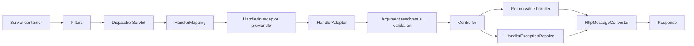

## Bản đồ request
Spring MVC chạy trên Servlet stack. Container nhận connection/request, chạy servlet filter chain, rồi `DispatcherServlet` điều phối framework. Một flow giản lược:

Thực tế có security filters, async/error dispatch, view rendering và nhiều resolvers. Bản đồ giúp đặt concern đúng chỗ và xác định log/metric nào bao trọn latency.

## Filter: servlet boundary
`Filter` chạy trước/sau target servlet và có thể wrap request/response. Nó phù hợp CORS, security chain, correlation, low-level logging, compression hoặc header normalization. Filter thấy cả request không map vào controller và static/error dispatch tùy registration.

`OncePerRequestFilter` hướng tới một lần trên request dispatch thông thường, nhưng async và error dispatch có thread/lifecycle riêng; subclass phải quyết định có filter chúng không. “Once” không được hiểu là tuyệt đối một invocation cho mọi dispatch type.

Đọc request body trong filter có thể consume stream khiến controller nhận body rỗng. Wrapper cache body làm memory tỷ lệ payload và có thể log secret/file. Ưu tiên metadata; nếu cần body audit, giới hạn kích thước, media type, redaction và quyền.

## DispatcherServlet và HandlerMapping
DispatcherServlet tìm handler qua `HandlerMapping`. Mapping dựa path, method, consumes/produces, headers và conditions. Trailing slash hoặc forwarded path không nhất quán có thể làm authorization rule khác controller mapping.

Sau khi tìm handler, `HandlerAdapter` biết cách gọi loại handler đó. Với annotated controllers, framework:

- Resolve method arguments từ path/query/header/body/context.
- Chọn `HttpMessageConverter` theo content type.
- Bind/convert và validate.
- Invoke controller.
- Xử lý return value thành body/status/view/async result.

Lỗi “415 Unsupported Media Type” thường xảy ra trước controller vì không có converter cho request `Content-Type`; “406 Not Acceptable” liên quan response representation theo `Accept`. Đừng đặt breakpoint chỉ trong method rồi kết luận request không tới server.

## Interceptor: handler-aware boundary
`HandlerInterceptor` chạy quanh handler đã map: `preHandle`, `postHandle`, `afterCompletion`. Nó phù hợp telemetry hoặc policy dựa handler metadata. Nó không phải lớp security chính; path matching của MVC và security có thể khác, và interceptor chỉ chạy sau mapping. Spring Security filter chain có integration/bảo đảm phù hợp hơn.

`postHandle` không phải lúc chắc chắn response body đã serialize. `afterCompletion` nhận exception đã resolve theo flow và có thể chạy ở dispatch khác với async. Resource/context cleanup phải xét asynchronous lifecycle.

## ControllerAdvice và AOP
Chọn extension point theo thông tin cần:

| Concern | Boundary thường phù hợp |
|---|---|
| Authentication/CORS/header trước MVC | Filter/security chain |
| Handler metadata, request timing | Interceptor |
| Binding chung, exception-to-response | ControllerAdvice |
| Business transaction/authorization method | Service proxy/AOP |
| JSON conversion | HttpMessageConverter/custom serializer |

Không dùng AOP quanh controller để thay filter security; request có thể fail trước controller. Không dùng interceptor để mở database transaction bao cả serialization/lazy load nếu service boundary mới là unit of work.

## Exception resolution
Exception từ mapping, binding, controller hoặc conversion có thể đi qua các resolver khác nhau. `@ExceptionHandler`/`@ControllerAdvice` là một phần chain, không bắt mọi lỗi ở servlet container/security filters. Security authentication/authorization failure cần entry point/access denied handler tương ứng.

Response đã commit thì exception handler không thể đổi status/body sạch. Streaming response có failure sau khi header gửi; API phải thiết kế partial transfer và observability khác request-response nhỏ.

Log một lần với correlation ID. Error handler không nên đọc lại body lớn hoặc gọi dependency đang outage để enrich message.

## Async Servlet processing
Controller có thể trả `Callable`, `DeferredResult` hoặc async type được hỗ trợ. Request chuyển sang async mode, container thread được trả, công việc chạy/hoàn tất rồi có async dispatch để produce response.

Điều này giải phóng servlet thread trong lúc chờ nhưng không biến JDBC/HTTP client thành non-blocking và vẫn cần executor capacity. ThreadLocal MDC/security/locale không tự truyền sang mọi executor; framework hooks hoặc explicit context snapshot cần thiết.

Timeout async ở servlet layer không chắc hủy downstream call. Cần client timeout, cancellation và idempotency giống CompletableFuture.

## Forwarded headers và trusted proxy
Scheme/host/client IP có thể đến từ `Forwarded`/`X-Forwarded-*`. Chỉ tin khi request đi qua proxy được kiểm soát; client Internet có thể tự gửi header giả nếu edge không strip/replace. Sai cấu hình tạo redirect URL sai, secure-cookie sai hoặc audit IP giả.

Filter xử lý forwarded headers cần deployment trust model. Application không thể tự phân biệt header do proxy tin cậy hay attacker nếu network boundary không enforce.

## Tracing toàn lifecycle
Tạo correlation ở outer filter để bao cả 404/security failure. Metric MVC handler cho route template ổn định, không tag raw path/user ID gây cardinality cao. Đo:

- Container accept/active threads.
- Filter/security time.
- Handler duration.
- Serialization/write time.
- Async queue/wait.
- Response status và aborted connections.

Nếu controller nhanh nhưng client latency cao, xem queue trước handler, response write/network và downstream proxy.

## Failure scenarios
- Filter order đặt custom auth trước CORS preflight handling.
- Request wrapper đọc body không reset: `@RequestBody` empty.
- Interceptor dùng raw path làm security nhưng mapping decode khác.
- MDC còn sót trên pooled executor thread.
- Async timeout trả lỗi nhưng task nền vẫn commit.
- Exception xảy ra sau response commit và bị log như response 200.

## Production checklist
1. Document filter/interceptor order và dispatch types.
2. Không log body mặc định; limit/redact khi thật sự cần.
3. Contract-test content negotiation và error path trước controller.
4. Propagate/clear context qua async boundary.
5. Trust forwarded headers chỉ sau trusted proxy.
6. Bound async executor và downstream timeout.
7. Metric theo route template, không raw cardinality.

## Câu hỏi phỏng vấn
**Filter khác interceptor?** Filter thuộc Servlet chain, chạy trước DispatcherServlet và không cần handler; interceptor thuộc Spring MVC sau khi handler được map và thấy handler metadata.

**Async MVC có làm JDBC non-blocking không?** Không. Nó trả servlet thread trong lúc xử lý ở thread khác; JDBC vẫn block thread thực thi và connection vẫn hữu hạn.

## Key Takeaways
- DispatcherServlet điều phối mapping, binding, invocation và response.
- Extension point đúng phụ thuộc boundary và thông tin cần.
- Async/error dispatch làm lifecycle dài hơn một method call.
- Body, context và forwarded headers đều có security/resource trade-off.
