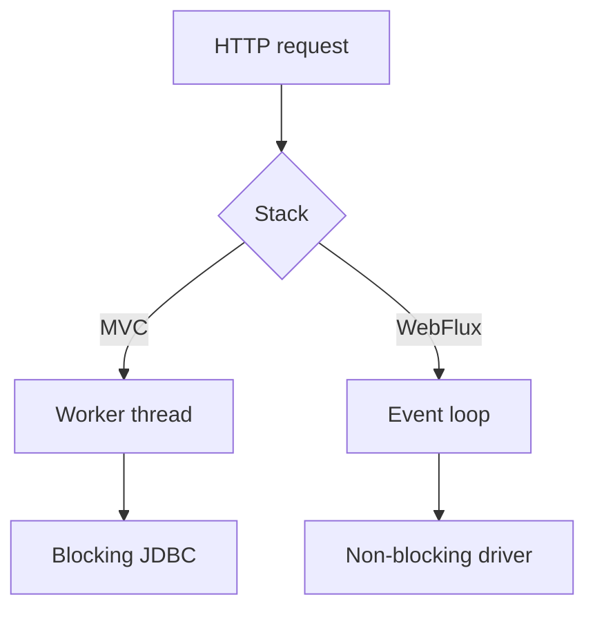

## Hai execution model
Spring MVC dựa trên Servlet API; mô hình phổ biến gắn request đang xử lý với một worker thread, dù Servlet async vẫn tồn tại. WebFlux là reactive stack, hỗ trợ non-blocking I/O và Reactive Streams backpressure, thường chạy event loop với số thread nhỏ.

| Tiêu chí | Spring MVC | Spring WebFlux |
|---|---|---|
| Programming model | Imperative, dễ debug | Reactive chain |
| I/O path phù hợp | JDBC và blocking libraries | R2DBC, reactive clients |
| Concurrency | Worker thread pool | Event loop + scheduler |
| Overload | Pool/queue/timeout | Demand, backpressure, timeout |

## Backpressure thực sự nói gì
Backpressure cho phép consumer biểu đạt demand lên publisher trong pipeline hỗ trợ Reactive Streams. Nó không thể tự làm một database, external REST API hay Kafka cluster có thêm capacity. Biên không hỗ trợ backpressure cần buffer, rate limit, drop, batch hoặc admission control rõ ràng.

## Blocking call trong reactive chain
Một JDBC call hoặc SDK blocking trên event-loop thread giữ thread phục vụ nhiều connection và làm tail latency tăng mạnh. Chuyển nó sang boundedElastic có thể cô lập tạm thời, nhưng không biến driver thành non-blocking và thêm context-switch/operational complexity.

:::production Quyết định theo dependency path
WebFlux chỉ phát huy khi phần lớn đường đi I/O là non-blocking và team đủ khả năng debug reactive stack. Nếu ứng dụng CRUD dùng JPA/JDBC và tải bình thường, MVC thường đơn giản, dễ vận hành hơn.
:::

## CPU-bound workload
Cả hai stack đều không tăng tốc mã CPU-bound. Việc chạy calculation nặng trên event loop còn nguy hiểm hơn vì chặn nhiều connection. Hãy dùng bounded worker pool, job queue hoặc tách workload và đo saturation.

## Common misconceptions
WebFlux không “luôn nhanh hơn”. Nó có thể phục vụ concurrency I/O cao với ít thread hơn, nhưng complexity, driver ecosystem, tracing context và debugging là chi phí thật. MVC kết hợp virtual threads cũng là một lựa chọn cần benchmark trên workload thực.

## Khung trả lời phỏng vấn
Nêu workload, dependency blocking hay reactive, concurrency target và kỹ năng vận hành. So sánh thread model, backpressure, debugging, library support; cuối cùng mô tả benchmark và failure handling thay vì chọn theo xu hướng.

## Key Takeaways
- Blocking/non-blocking là thuộc tính của toàn call chain.
- Event loop tuyệt đối tránh công việc blocking hoặc CPU dài.
- Backpressure quản lý demand, không tạo capacity.
- MVC là lựa chọn hợp lệ và thường đơn giản hơn cho JDBC/JPA.
