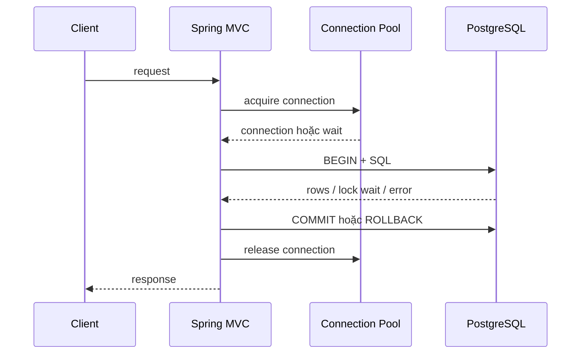

## Một request giữ nhiều resource hơn ta tưởng

Flow MVC phổ biến giữ request thread, transaction context, JDBC connection và database work trong một khoảng chồng lấp. Nếu code gọi HTTP chậm bên trong transaction, nó có thể giữ connection và row lock trong lúc chờ network. Vì vậy pool size, request concurrency, transaction boundary và timeout không thể tune độc lập.



Connection pool là concurrency limiter trước database, không phải cache làm query nhanh hơn. Pool quá nhỏ tạo queue wait; pool quá lớn có thể dồn concurrency vào DB, tăng context switching, lock contention và memory. Giá trị đúng phụ thuộc transaction service time, target throughput, DB capacity và các application replicas cùng chia sẻ database.

## Capacity model từ ngoài vào trong

Hãy inventory mọi tầng admission:

```text
load balancer / ingress
→ server in-flight requests
→ application executor
→ connection pool
→ PostgreSQL sessions/workers/locks/IO
```

Nếu 20 Pods, mỗi Pod pool 30 connections thì worst-case là 600 connections, chưa tính migration, admin và background jobs. Autoscaling application có thể vô tình overload database. Reserve capacity cho health/operations và đặt global budget thay vì copy một pool size mặc định.

Little's Law là sanity check: với throughput 400 transactions/s và average DB-holding time 50 ms, concurrency trung bình khoảng 20. Tail, burst và lock wait cần headroom, nhưng không suy ra “pool càng lớn càng an toàn”. Đo acquisition wait, active/idle/pending, transaction duration và database saturation cùng nhau.

:::production Pool metric bắt buộc
Theo dõi active, idle, pending/acquire time, timeout count và connection lifetime; ghép với DB sessions, locks, CPU/IO và endpoint trace. Pool utilization riêng lẻ không nói root cause.
:::

## Transaction boundary và Spring proxy

`@Transactional` thường được áp qua proxy. Self-invocation trong cùng object có thể không đi qua proxy; visibility/mode và cấu hình framework theo version cũng quan trọng. Transaction bắt đầu ở method boundary hiệu lực, không phải nơi annotation nhìn “có vẻ gần SQL nhất”.

Giữ transaction quanh invariant cần atomicity, nhưng càng ngắn càng tốt. Không gửi email, gọi payment API hay chờ Kafka trong database transaction nếu không có lý do rõ. Database rollback không rollback được side effect ngoài DB. Với publish event sau commit, cân nhắc transactional outbox.

```java title="OrderApplicationService.java"
@Transactional
public OrderId place(PlaceOrder command) {
  Customer customer = customers.lockForUpdate(command.customerId());
  Order order = Order.place(customer, command.lines());
  orders.save(order);
  outbox.append(OrderPlaced.from(order));
  return order.id();
}
```

Ví dụ ghi order và outbox trong cùng local transaction. Nó không hứa exactly-once end-to-end; publisher/consumer vẫn phải xử lý duplicate.

## Isolation, MVCC và lock

PostgreSQL dùng MVCC để nhiều read/write tiến hành đồng thời, nhưng isolation level không thay thế invariant. Unique constraint, foreign key và check constraint đưa rule xuống nơi mọi writer đều phải tuân thủ. Check-then-insert ở application vẫn race nếu không có constraint/atomic statement.

Pessimistic lock hợp khi conflict cao và critical section ngắn, nhưng tạo wait/deadlock. Optimistic version hợp khi conflict hiếm, nhưng cần retry/user conflict workflow. Retry toàn transaction phải giới hạn, có backoff và chỉ lặp side effect an toàn. Deadlock là kết quả hợp lệ của concurrency control; database abort một participant, application phải phân loại và xử lý.

Đặt lock acquisition/statement/transaction timeout theo SLO và semantics. Timeout ở HTTP client nhưng SQL tiếp tục chạy làm work mồ côi. Cần propagation/cancellation ở mức hỗ trợ, statement timeout và observability để biết tầng nào kết thúc trước.

## Persistence Context không phải database

Trong transaction, Hibernate quản lý entity state và dirty checking; query không nhất thiết chạy ngay khi gọi `save`. Flush đồng bộ thay đổi vào SQL trước query/commit tùy flush mode. Vì thế exception constraint có thể xuất hiện cuối method, và log code trước commit không chứng minh transaction đã thành công.

Entity graph lớn làm dirty checking và memory tăng. Batch write cần flush/clear theo chunk, cấu hình JDBC batching và kiểm tra generated ID strategy/order. Bulk update bypass state entity đang managed; clear/refresh để tránh đọc stale object.

Open Session in View có thể cho lazy loading trong web layer nhưng kéo data access ra khỏi service boundary, tạo N+1 khó thấy và giữ resource lâu. Nếu dùng, phải hiểu behavior và query count; với API phức tạp, DTO projection/fetch plan theo use case thường dễ kiểm soát hơn.

## Query shape, pagination và index

Repository method đẹp không đảm bảo SQL tốt. Capture SQL + bind pattern có kiểm soát, lấy `EXPLAIN (ANALYZE, BUFFERS)` trên môi trường/data đại diện và so estimated với actual rows. Không chạy `ANALYZE` bừa lên destructive statement trong production; dùng transaction/read-safe procedure phù hợp.

Offset pagination phải scan/bỏ qua ngày càng nhiều row và có thể trùng/thiếu khi data đổi. Keyset pagination dùng stable, unique ordering tuple làm cursor, nhanh và ổn định hơn cho feed dài nhưng không nhảy trang tùy ý dễ dàng. Composite index phải theo predicate/order thực tế; index thêm write, storage và maintenance cost.

Fetch join collection với pagination có thể nhân row hoặc buộc xử lý không như kỳ vọng. Tách query ID page rồi fetch detail, DTO projection hoặc batch fetching tùy cardinality. Luôn xác minh SQL, row count và memory, không chỉ query count.

## Timeout budget và retry

Giả sử API SLO 800 ms: ingress, queue, pool acquisition, SQL, serialization và network đều cần budget; không đặt mỗi tầng timeout 800 ms rồi cộng thành nhiều giây. Timeout phải giảm dần theo downstream deadline và có margin để cleanup/response.

Retry database phù hợp cho lỗi transient đã phân loại như serialization/deadlock trong operation idempotent. Không retry syntax, constraint business hay “mọi SQLException”. Mỗi retry tăng load lúc DB đang yếu; giới hạn attempt, jitter, retry budget và admission control.

| Failure | Retry? | Điều kiện |
|---|---|---|
| Deadlock/serialization abort | Có thể | Toàn transaction idempotent, attempt nhỏ, jitter |
| Unique violation business | Không tự động | Trả conflict/idempotency result theo contract |
| Connection acquisition timeout | Hiếm khi tại chỗ | Bảo vệ overload trước; retry có thể làm queue nặng hơn |
| Connection reset trước outcome | Unknown | Dùng idempotency/status reconciliation, không đoán rollback |
| Invalid SQL/schema mismatch | Không | Roll back deployment/migration hoặc fix compatibility |

## Schema migration không được giả định atomic tuyệt đối

Dùng expand-contract cho zero/low-downtime change: thêm nullable/new structure tương thích, deploy code đọc/ghi chuyển tiếp, backfill có throttle/checkpoint, chuyển read, rồi contract sau khi mọi version cũ biến mất. Đừng rename/drop column trong cùng release nếu rolling deployment còn binary cũ.

Migration cần lock/time estimate trên data thật, statement timeout, owner và rollback/forward-fix plan. Một index build hoặc validation có thể ảnh hưởng IO/lock. Tách DDL nhạy cảm khỏi startup của mọi replica để tránh nhiều instance tranh migration.

## Quy trình chẩn đoán pool exhaustion

1. Xác nhận pool pending/acquisition timeout và endpoint/transaction nào giữ lâu.
2. Ghép trace với DB active query, lock wait, connection state và transaction age.
3. Phân biệt query chậm, lock, remote call trong transaction, connection leak hay capacity toàn cục.
4. Kiểm tra timeout/lifetime giữa pool, proxy và PostgreSQL; stale connection có pattern khác saturation.
5. Reproduce bằng concurrency đại diện; thay một biến.
6. Fix boundary/query/lock hoặc capacity sau khi chứng minh; không chỉ tăng pool.
7. Xác minh p99, pending, DB saturation, error và recovery khi dependency chậm.

Connection leak detection có thể hỗ trợ nhưng threshold thấp tạo noise. Thread dump cho biết ai chờ pool; PostgreSQL activity/locks cho biết connection đang làm gì. Cần cả hai phía để không đổ lỗi cho “database chậm” một cách chung chung.

## Security và data boundary

Credentials dùng secret manager/rotation và least privilege; migration role khác runtime role nếu có thể. TLS/auth không thay query parameterization. JPA parameter binding giúp chống SQL injection cho value, nhưng dynamic identifier/order cần allowlist. Không log bind value chứa PII/token; sampling/debug phải có redaction.

Tenant isolation không được dựa chỉ vào filter UI. Enforcement cần ở service/query/data policy phù hợp, test bypass path và background jobs. Backup tồn tại chưa đủ: restore drill, RPO/RTO và migration compatibility mới chứng minh recoverability.

## Trả lời phỏng vấn

:::interview Tại sao tăng connection pool có thể làm hệ thống chậm hơn?
Pool giới hạn concurrency vào database. Tăng nó có thể giảm queue ở application nhưng chuyển tải sang DB, làm CPU/IO/lock contention và tail latency tăng; nhiều Pods còn nhân tổng connections. Tôi đo acquire wait, transaction time và DB saturation, lập global connection budget rồi load test cả degraded path trước khi đổi.
:::

Senior follow-up: annotation `@Transactional` có hiệu lực qua self-invocation không; HTTP timeout có hủy SQL không; deadlock retry ở boundary nào; OSIV che N+1 ra sao; rollout migration khi hai app version cùng chạy thế nào.

## Key Takeaways

- Request thread, transaction, connection và DB work là một capacity chain.
- Pool size phải tính toàn cluster và database capacity, không theo từng Pod riêng lẻ.
- Transaction chỉ bao invariant local; side effect ngoài DB cần pattern khác.
- ORM abstraction không loại bỏ SQL, MVCC, locks, row cardinality hay query plan.
- Timeout, retry, migration và observability phải được thiết kế trước failure production.
