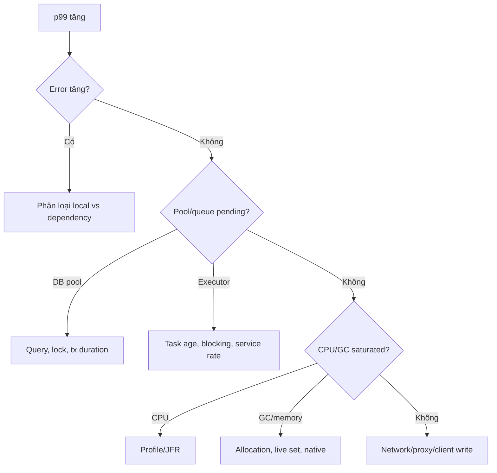

## Actuator là diagnostic surface, không phải dashboard tự đủ
Actuator cung cấp health, metrics, mappings, conditions, loggers, thread dump, heap dump và nhiều endpoint tùy classpath/config. Availability của endpoint, exposure qua HTTP/JMX và authorization là ba quyết định khác nhau. Endpoint tồn tại không có nghĩa nên public.

Một baseline hẹp:

```yaml title="application.yml"
management:
  endpoints:
    web:
      exposure:
        include: health,info,prometheus
  endpoint:
    health:
      probes:
        enabled: true
      show-details: never
```

Giá trị thật phụ thuộc platform. Management port/network riêng giảm exposure nhưng vẫn cần TLS/auth/network policy. `heapdump`, `env`, `configprops`, `logfile`, `mappings`, `conditions` và `threaddump` có thể lộ code path, PII, secret hoặc operational topology.

## Liveness và readiness
Liveness trả lời process có bị kẹt không và có nên restart không. Readiness trả lời instance hiện có nên nhận traffic mới không. Đưa database/external API vào liveness có thể tạo restart cascade khi dependency chung outage: mọi replica restart dù process vẫn khỏe.

Readiness có thể phản ánh khả năng phục vụ nhưng cũng cần thận trọng. Nếu một optional dependency hỏng, đánh toàn service unready có thể loại hết capacity thay vì degraded mode. Health group phải theo business criticality và fallback.

Custom `HealthIndicator` gọi remote dependency cần timeout nhỏ, không tạo load lớn, và không leak detail. Probe được gọi liên tục; nó không nên chạy query/report đắt. Liveness không phải end-to-end synthetic test.

## RED + saturation
Cho request path, bắt đầu với:

- **Rate:** request/second theo route template.
- **Errors:** status/failure taxonomy.
- **Duration:** histogram và tail latency.
- **Saturation:** connection active/pending, executor active/queue, CPU, heap/GC.

Spring Boot instrument `http.server.requests`; JVM/system/process metrics và datasource pool gauges được auto-config khi support có mặt. Tên metric exported có thể được registry đổi convention, nên truy actuator bằng meter name nội bộ.

Đừng tạo tag theo URL raw, user ID, exception message hoặc SQL; cardinality làm backend metrics tốn memory/cost và khó query.

## Connection pool không phải database capacity
Pool tái sử dụng connections và giới hạn concurrency tới database. Quá nhỏ gây wait dù DB rảnh; quá lớn làm DB context switching/locks/memory tăng và mỗi replica nhân tổng connections.

Đọc bốn tín hiệu cùng nhau:

| Symptom | Hypothesis cần kiểm |
|---|---|
| active gần max, pending/wait tăng | Query chậm, transaction dài hoặc pool nhỏ |
| active thấp, request queue cao | Bottleneck trước DB/executor/downstream |
| active max, DB CPU thấp | Lock wait, network hoặc connection leak |
| DB CPU max, tăng pool làm tệ hơn | Database đã saturated |

Pool “leak” có thể là connection không close, nhưng với framework transaction nó cũng có thể là transaction bị giữ qua remote call/queue wait. Thread dump + trace + transaction duration chỉ ra owner tốt hơn tăng leak-detection verbosity vô hạn.

Little’s Law nhắc rằng concurrency xấp xỉ throughput nhân thời gian service. Sizing phải dựa workload và DB capacity; không đặt pool bằng số HTTP threads hoặc số virtual threads.

## Executor và request thread saturation
Bounded executor có active count, pool size, queue size, task wait và rejection. Queue dài với completion rate thấp nghĩa arrival vượt service rate; tăng queue chỉ trì hoãn reject và tăng latency.

Thread dump cho biết:

- Nhiều threads chờ cùng lock.
- Nhiều request chờ connection pool.
- Blocking call trên event loop/common pool.
- Deadlock hoặc recursive hot stack.
- CPU runners lặp trong cùng method.

Lấy vài dumps cách nhau trong khoảng ngắn để tìm stack ổn định/progress; một snapshot có thể bắt trạng thái bình thường. Với rất nhiều virtual threads, dùng công cụ/dump hỗ trợ runtime hiện tại và JFR thay vì chỉ dump truyền thống khổng lồ.

## JVM memory và GC
Correlate heap-used-after-GC, allocation rate, pause, GC CPU và process/container memory. Heapdump endpoint tạo file lớn và chứa dữ liệu nhạy cảm; chỉ mở tạm thời qua kênh quản trị, bảo đảm disk/headroom và xóa/bảo vệ artifact theo policy.

Nếu container bị OOMKilled mà Java heap không đầy, điều tra direct buffers, metaspace, thread stacks, native library và overhead. Actuator metrics là điểm bắt đầu; JFR/native tools mới trả root cause.

## Dependency saturation và timeout
Một downstream chậm làm local threads/connections/queue bị giữ. Metrics cần client latency/error/timeout và bulkhead active/pending. Retry phải được tính vào offered load; metric request logical và attempts tách nhau.

Timeout ở controller lớn hơn tổng downstream timeout không đủ nếu mỗi retry có full timeout. Dùng deadline budget. Circuit breaker chỉ giảm calls khi policy trip; nó không sửa capacity và có thể làm recovery burst.

## Diagnostic endpoints an toàn
`conditions` giúp debug auto-config; `mappings` giúp xác minh routes; `loggers` có thể đổi level runtime; `threaddump` và `heapdump` hỗ trợ incident. Mỗi endpoint là privileged operation:

- Chỉ expose khi cần, tốt nhất management network.
- Authorization riêng, không dùng user role nghiệp vụ chung.
- Audit access/change.
- Có timeout/size/rate limit.
- Không giữ debug level sau incident.
- Support bundle phải redact và mã hóa khi lưu/chuyển.

:::danger Dynamic log level
Bật SQL/body/security DEBUG có thể lộ credential/PII và làm disk/I/O bùng nổ. Đặt timebox, owner và lệnh rollback trước khi bật.
:::

## Graceful shutdown
Khi deploy:

1. Instance chuyển không nhận traffic mới/readiness false theo platform flow.
2. Server ngừng accept hoặc từ chối request mới theo implementation.
3. In-flight requests/jobs có khoảng thời gian hoàn tất.
4. Consumer dừng poll và xử lý/commit theo delivery contract.
5. Executor/database pool đóng sau producers.
6. Quá deadline thì cancel/terminate có metric.

Graceful shutdown không đảm bảo mọi work hoàn tất nếu orchestration gửi kill sớm hơn timeout app. Đồng bộ termination grace period, server shutdown phase và job duration. Long request cần idempotency/resume.

## Incident decision tree


Mỗi bước giữ timestamp/correlation và traffic change. Restart có thể giảm triệu chứng nhưng xóa evidence; thu metrics/dumps an toàn trước nếu incident budget cho phép.

## Failure scenarios
- Public actuator lộ env/mappings/heap.
- Database outage làm liveness fail và cả cluster restart loop.
- Tăng pool trên mọi replicas vượt max connections DB.
- Queue unbounded che overload tới OOM.
- Health indicator tự tạo traffic nặng lên dependency yếu.
- Grace period platform ngắn hơn app shutdown.
- Metric tag raw path tạo cardinality explosion.

## Production checklist
1. Exposure allowlist và management security riêng.
2. Liveness không phụ thuộc external shared system.
3. Readiness phản ánh critical serving capability.
4. Dashboard rate/error/duration cùng pools/queues/JVM.
5. Alert trên wait/saturation, không chỉ utilization.
6. Thread/heap artifacts được bảo vệ như production data.
7. Load-test graceful shutdown và dependency slowdown.
8. Runbook có evidence order, owner và rollback.

## Câu hỏi phỏng vấn
**Vì sao không đưa database vào liveness?** Shared DB outage có thể làm mọi pod bị restart dù process khỏe, tạo cascade và không sửa dependency.

**Pool active chạm max có chắc cần tăng pool?** Không. Có thể query/lock/transaction dài hoặc DB đã saturated; phải xem pending wait, DB CPU/locks và duration.

## Key Takeaways
- Actuator endpoint là privileged diagnostic surface.
- Health, readiness và liveness trả lời câu hỏi khác nhau.
- Pool/queue không tạo capacity; chúng quản lý concurrency/chờ.
- Chẩn đoán tốt correlate request, resource và dependency timeline.
