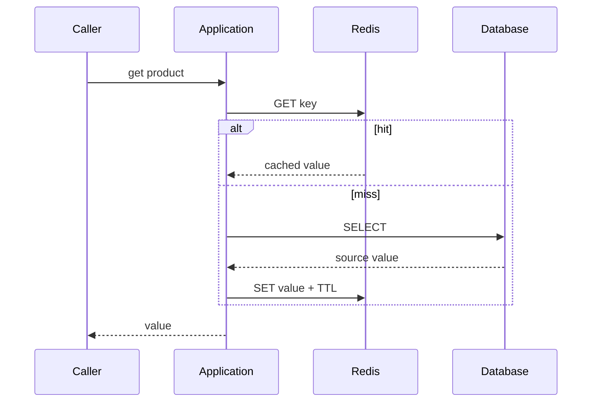

## Cache là bản sao có lifecycle khác source of truth

Spring Cache cung cấp abstraction annotation/API; Redis là một cache store implementation. Annotation không tạo distributed consistency. Khi database là source of truth và Redis giữ bản sao, ta phải định nghĩa stale window, invalidation, failure policy và ownership.

Cache-aside read path:



Giữa DB read và Redis set, writer khác có thể update DB/invalidate; miss loader sau đó ghi giá trị cũ trở lại cache. Đây là stale repopulation race. TTL giới hạn tuổi tối đa trong một số kịch bản, không loại race và không bảo đảm read-your-writes.

## Spring proxy semantics vẫn áp dụng

`@Cacheable`, `@CacheEvict`, `@CachePut` thường được áp qua proxy. Self-invocation trong cùng bean có thể bỏ qua cache advice, giống transaction advice. Cache key mặc định dựa arguments; object mutable, equality không ổn định, tenant thiếu trong key hoặc overload method dễ collision/tenant leak.

```java title="ProductQuery.java"
@Cacheable(cacheNames = "product-v3", key = "#tenantId + ':' + #productId",
           unless = "#result == null")
public ProductView find(String tenantId, String productId) {
  return repository.findView(tenantId, productId)
      .orElseThrow(ProductNotFound::new);
}
```

Tên cache `v3` là namespace version để rollout schema serialization mới. Key phải bounded, deterministic, không chứa secret/PII thô và có tenant boundary. Hash key nếu cần che identifier vẫn cần collision/rotation policy.

`sync=true` trên `@Cacheable` yêu cầu cache provider hỗ trợ synchronization semantics tương ứng; kể cả có, coordination có thể chỉ local hoặc theo implementation. Đừng giả định nó là distributed single-flight nếu chưa kiểm docs/test version cụ thể.

## Invalidation và transaction commit

Evict trước DB commit tạo miss; reader khác có thể đọc DB cũ rồi repopulate. Evict sau method return nhưng transaction cuối cùng rollback/commit failure cũng có mismatch nếu advice ordering sai. Mục tiêu phổ biến là publish invalidation **sau commit thành công**.

Các lựa chọn:

- Transaction synchronization evict sau commit: đơn giản trong một service, nhưng Redis outage khiến invalidation mất.
- Transactional outbox ghi event cùng DB transaction: relay retry và consumers invalidate; có delay/duplicate nên handler idempotent.
- Versioned values/keys: cache entry mang entity version; writer mới không bị value cũ overwrite nếu compare/update đúng.
- Short TTL: giới hạn stale window nhưng tăng misses/load; không thay event invalidation cho requirement chặt.

Không có atomic transaction chung tự nhiên giữa relational DB và Redis. “Update DB rồi cache” và “cache rồi DB” đều có failure window. Chọn thứ tự dựa correctness: thường DB commit là authority, cache failure chỉ làm degraded performance; invalidation có retry/reconciliation.

## TTL, TTI và expiration semantics

Spring Data Redis cho cấu hình TTL cố định hoặc `TtlFunction` theo entry. Time-to-idle behavior có thể được mô phỏng bằng việc reset expiration khi read ở version hỗ trợ, nhưng tăng writes và phụ thuộc command semantics. Ghi rõ đang dùng TTL hay TTI; đừng gọi lẫn.

Jitter TTL phân tán expiration của nhiều keys cùng được warm, giảm synchronized miss. Jitter range phải bounded và không làm vi phạm freshness requirement. Negative cache cho “not found” cần TTL ngắn/policy riêng vì object có thể được tạo ngay sau đó và authorization có thể đổi.

Redis expiration không xảy ra đúng tại một nanosecond cam kết cho mọi key; correctness không nên dựa vào cache tự biến mất chính xác. Business expiry như coupon phải enforce ở source transaction, cache chỉ tăng tốc.

## Non-locking và locking cache writer

Spring Data Redis mặc định dùng non-locking `RedisCacheWriter` để tránh lock overhead; một số multi-command operations như put-if-absent/clean có thể overlap. Locking writer thêm coordination ở cache level nhưng tăng round trips/wait và lock lifecycle. Nó không tự sửa race giữa Redis và database.

Clear cache theo pattern có thể dùng `KEYS` hoặc batch `SCAN` strategy tùy driver/mode. `KEYS` trên keyspace lớn có thể block Redis; `SCAN` incremental nhưng semantics/performance khác và cluster support cần kiểm. Prefer versioned namespace và expire cũ thay vì global clear trong hot production path.

## Serialization và schema evolution

JDK native serialization không phải mặc định an toàn/lâu dài cho untrusted/evolving data. Chọn JSON/binary schema với type allowlist, size limit và version. Đổi class/package/field mà cache cũ còn sống có thể gây deserialize failure storm.

Rollout an toàn: new namespace/version; reader có fallback có thời hạn nếu cần; warm dần; quan sát hit/error; retire old keys bằng TTL. Không dual-read vô hạn. Compression chỉ sau khi đo CPU/network/memory và đặt decompressed-size limit chống payload bomb.

## Stampede và hot keys

Khi hot key hết hạn, nhiều instances cùng load database. Các chiến lược:

1. Local single-flight gộp misses trong một instance.
2. Distributed lock có lease, owner token và timeout; vẫn cần correctness khi owner pause/quá lease.
3. Stale-while-revalidate trả value cũ trong freshness budget và một worker refresh.
4. Proactive refresh trước expiry dựa popularity, có rate limit.
5. Admission/load shedding bảo vệ database khi Redis outage.

Không giữ distributed lock rồi thực hiện work không bounded. Nếu refresh thất bại, lock TTL tránh deadlock nhưng có thể cho hai loaders chạy; result write cần version check để old loader không overwrite new data.

## Redis outage: fail-open hay fail-closed

Với product catalog, cache unavailable thường fail-open sang DB có bulkhead/rate limit. Nếu mọi request fallback không giới hạn, database collapse theo. Với security revocation/quota, cached data có thể là correctness boundary; fail-open có rủi ro an ninh, fail-closed giảm availability. Quyết định theo use case, không theo một global exception handler.

Timeout Redis phải ngắn trong request budget; retry cache call nhiều lần thường tăng latency và load. Circuit breaker có thể tạm bypass cache; metrics phải tách hit, miss, load success/error, Redis timeout và fallback rejection.

:::danger Cache không phải authorization source mặc định
Role/permission cached lâu có thể giữ quyền đã bị thu hồi. Nếu cache authorization, phải có revocation/version/freshness requirement rõ và fail policy được threat-model; tenant ID luôn nằm trong enforcement path.
:::

## Troubleshooting stale data

1. Decode key gồm cache name/version/tenant/arguments đúng chưa.
2. Xác nhận method thật đi qua proxy và condition/unless.
3. Lập timeline DB commit, eviction event, cache GET/SET với entity version.
4. Tìm miss loader ghi value cũ sau invalidation.
5. Kiểm TTL/serializer giữa application versions và Redis nodes.
6. Kiểm dropped outbox/invalidation, consumer lag và retry/DLT.
7. Fix ordering/version protocol; không chỉ flush toàn cache.

## Câu hỏi phỏng vấn

**Evict cache trước hay sau DB update?** Không thứ tự nào tạo atomicity. Thường commit DB trước, invalidation sau commit với outbox/retry nếu cần; đồng thời chống stale repopulation bằng version/coordination và có TTL.

**TTL có giải quyết consistency không?** Chỉ bound freshness theo assumptions nhất định. Nó không ngăn race, read-your-writes failure hay stale overwrite trước expiry.

## Key Takeaways

- Spring Cache là abstraction; distributed consistency vẫn phải thiết kế.
- DB và Redis không commit atomically; after-commit/outbox/version giảm failure window.
- Key, serializer và namespace là public operational contract.
- Stampede control cần lease/timeout/version và database admission protection.
- Cache outage policy phụ thuộc correctness/security của từng dữ liệu.
