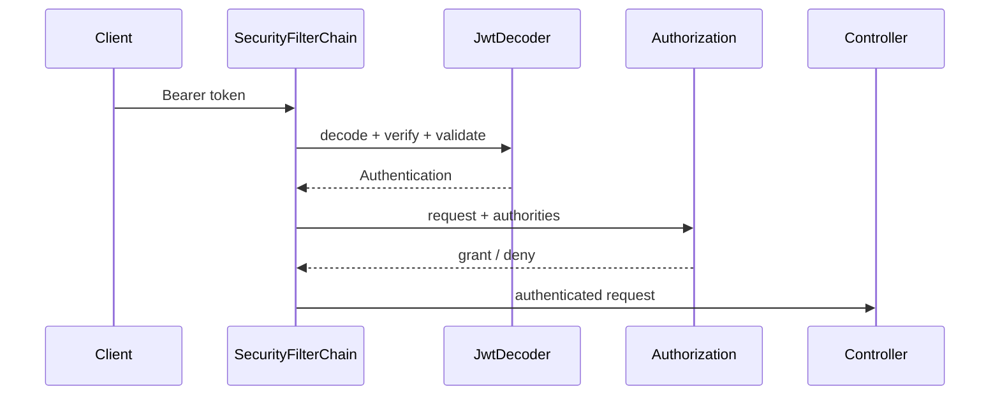

## Mental model: request đi qua chuỗi filter
Trong servlet application, Spring Security đặt filter chain trước controller. Filter đọc credential, tạo `Authentication`, lưu security context cho request và chạy authorization. Authentication trả lời “principal là ai và credential có hợp lệ không”; authorization trả lời “principal được làm action này trên resource này không”.



Một application có thể có nhiều `SecurityFilterChain`; request matcher và order quyết định chain nào áp dụng. Một endpoint “lọt” sang chain rộng hơn là security defect, nên test negative cases và startup configuration.

## Resource server không phải authorization server
Authorization server xác thực user/client và phát token. Resource server nhận access token rồi bảo vệ API. JWT resource server có thể verify token cục bộ bằng public key/JWK; điều đó giảm lookup mỗi request nhưng tạo trade-off về revocation và freshness.

```java title="SecurityConfiguration.java"
@Bean
SecurityFilterChain api(HttpSecurity http) throws Exception {
  return http
      .authorizeHttpRequests(auth -> auth
          .requestMatchers("/actuator/health").permitAll()
          .requestMatchers(HttpMethod.GET, "/orders/**").hasAuthority("SCOPE_orders.read")
          .requestMatchers("/orders/**").hasAuthority("SCOPE_orders.write")
          .anyRequest().authenticated())
      .oauth2ResourceServer(oauth -> oauth.jwt(Customizer.withDefaults()))
      .build();
}
```

Rule tổng quát đặt sau rule cụ thể; `anyRequest().authenticated()` là default-deny đối với anonymous nhưng chưa phải object-level authorization.

## Validate JWT đầy đủ
JWT là container claim có chữ ký, không phải dữ liệu đáng tin chỉ vì decode được Base64. Resource server cần:

- Chỉ chấp nhận thuật toán mong đợi; không lấy algorithm tùy ý từ token rồi tin.
- Verify signature với key đúng và xử lý `kid`/key rotation.
- Validate `iss` để token đến từ issuer tin cậy.
- Validate `aud` để token thực sự dành cho API này.
- Validate `exp`, `nbf` và clock skew có kiểm soát.
- Chỉ map authorities từ claim/schema đã thống nhất.

Issuer compromise, key rotation hoặc token bị đánh cắp vẫn là failure model thật. JWK cache cần refresh nhưng không biến outage của authorization server thành việc chấp nhận token không kiểm chứng.

:::danger Token logging
Không log access token, refresh token, Authorization header hoặc toàn bộ claims chứa PII. Log subject đã pseudonymize nếu cần, issuer, decision, reason code và correlation ID.
:::

## Authorization theo resource và action
Role thô như `ADMIN` dễ phình thành quyền toàn cục. Scope/authority nên mô tả capability; ownership/tenant/state cần kiểm ở service/domain với dữ liệu resource. URL rule bảo vệ lớp ngoài, method security có thể bảo vệ use case được gọi từ nhiều entry point.

```java title="OrderAuthorization.java"
@PreAuthorize("hasAuthority('SCOPE_orders.write')")
public void cancel(OrderId orderId, UserId actor) {
  Order order = orders.find(orderId).orElseThrow();
  policy.requireCanCancel(actor, order);
  order.cancel();
}
```

Không nhận `userId` từ body rồi xem đó là principal. Lấy identity từ trusted authentication context, sau đó resolve quyền trên resource ở server. Multi-tenant query phải scope theo tenant từ context và bảo vệ ở repository/data boundary, không chỉ ẩn nút trên UI.

## CORS, CSRF và session
CORS là chính sách browser quyết định origin JavaScript nào được đọc/gửi request; nó không xác thực client ngoài browser. Cấu hình `*` với credential là sai mô hình. Allow origin, method và header tối thiểu.

CSRF khai thác credential browser tự động đính kèm như cookie. Stateless API chỉ nhận bearer token trong Authorization header thường có exposure khác, nhưng nếu token nằm trong cookie hoặc app dùng login session thì CSRF protection vẫn cần. “Dùng JWT” không tự động tắt CSRF một cách đúng đắn.

JWT không nhất thiết đồng nghĩa stateless toàn hệ thống. Logout/revocation tức thời có thể cần token ngắn hạn, denylist, token version hoặc introspection; mỗi lựa chọn đổi latency, availability và consistency.

## Failure handling và observability
Credential thiếu/sai thường dẫn tới `401` cùng challenge phù hợp; principal hợp lệ nhưng thiếu quyền là `403`. Không trả lý do quá chi tiết giúp attacker phân biệt account/resource. Metric nên tách invalid signature, expired, issuer/audience mismatch và access denied, nhưng tránh label cardinality theo user/token.

JWK/issuer dependency cần timeout, cache và startup/runtime behavior được thử khi provider unavailable. Authorization decision quan trọng cần audit có integrity và retention policy.

## Production checklist
1. Pin issuer, audience và accepted algorithms.
2. Có key rotation test, cache policy và clock synchronization.
3. Default deny; test endpoint mới không tự public.
4. Kiểm object ownership/tenant/state trong service.
5. Phân tích CSRF dựa trên cách credential được gửi.
6. Redact token/PII và rate-limit authentication failure.

## Câu hỏi phỏng vấn
**JWT có mã hóa payload không?** Thông thường không; signed JWT bảo vệ integrity/authenticity, payload vẫn có thể đọc. Không đặt secret vào claims.

**Vì sao kiểm chữ ký chưa đủ?** Token có thể hợp lệ về chữ ký nhưng do issuer khác phát, dành cho audience khác, hết hạn hoặc chưa có hiệu lực.

## Key Takeaways
- Security filter chain là runtime boundary cần test, không chỉ config annotation.
- OAuth resource server và authorization server có vai trò khác nhau.
- JWT phải validate signature lẫn semantic claims.
- Authorization cần capability và resource context, không chỉ role.
