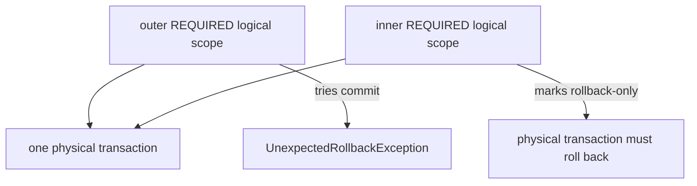

## Bắt đầu từ hai lớp: logical và physical
Mỗi method có transaction metadata tạo một logical scope. Với `REQUIRED`, nhiều logical scopes có thể cùng tham gia một physical database transaction. Inner scope đánh dấu rollback-only thì physical transaction không thể commit, dù outer scope catch exception và tiếp tục.



`UnexpectedRollbackException` bảo vệ caller khỏi tin rằng commit đã xảy ra. Nó không phải lỗi ngẫu nhiên của Spring.

## Scenario 1: catch nhưng vẫn rollback
```java title="CheckoutService.java"
@Transactional
public Receipt checkout(Command command) {
  try {
    inventory.reserve(command.items());
  } catch (InventoryTemporarilyUnavailable failure) {
    audit.recordAttempt(command.id(), failure); // outer vẫn muốn tiếp tục
  }
  orders.save(Order.pending(command));
  return Receipt.accepted();
}
```

Nếu `inventory.reserve` tham gia cùng transaction và exception khiến interceptor đánh dấu rollback-only, catch trong outer không phục hồi transaction. Commit cuối cùng thất bại.

Các lựa chọn phải theo semantic:

- Nếu failure phải hủy toàn use case: đừng catch thành success.
- Nếu branch được phép fail mà outer commit: tách operation ngoài transaction hoặc dùng transaction độc lập có resource/capacity rõ.
- Nếu chỉ muốn thử một phần rồi rollback về savepoint: xem `NESTED` và support thực tế.
- Nếu flow branching phức tạp: `TransactionTemplate` có thể làm boundary explicit hơn proxy annotations.

Không chữa bằng `noRollbackFor=Exception.class` rộng; nó có thể commit state sau programming/data failure.

## Scenario 2: REQUIRES_NEW làm cạn pool
`REQUIRES_NEW` suspend outer physical transaction và mở transaction mới. Outer vẫn giữ connection/resource trong khi inner cần connection khác. Khi nhiều request đồng thời đều giữ outer connection rồi chờ inner, pool có thể cạn và tạo wait cycle.

Ví dụ audit transaction mới:

```java title="AttemptAuditService.java"
@Transactional(propagation = Propagation.REQUIRES_NEW)
public void recordAttempt(Attempt attempt) {
  attempts.save(attempt);
}
```

Điều này chỉ hoạt động nếu call đi qua proxy khác, và audit row sẽ commit độc lập dù business rollback. Đó là “attempt observed”, không phải “business committed”. Pool phải có headroom theo concurrency graph; tăng pool vô hạn có thể chuyển bottleneck sang database.

Một alternative là ghi outbox/audit cùng transaction khi chỉ muốn event của committed business state. Với failure attempt cần durable độc lập, cân nhắc queue/log boundary không giữ outer DB transaction.

## Scenario 3: NESTED không phải transaction độc lập
`NESTED` thường map tới JDBC savepoint trong cùng physical transaction. Inner rollback về savepoint cho phép outer tiếp tục, nhưng outer rollback vẫn hủy tất cả. Support phụ thuộc transaction manager/driver/resource; JPA behavior không được giả định từ một unit test.

Savepoint không giải quyết external HTTP/broker side effect. Nó cũng giữ locks/resources tới outer completion.

## Scenario 4: isolation khai báo nhưng không có hiệu lực
Inner `REQUIRED` tham gia transaction đã tồn tại, nên local isolation/timeout/read-only declaration thường không tạo physical transaction mới và có thể bị outer characteristics chi phối. Spring transaction manager có tùy chọn validate existing transaction để reject mismatch thay vì im lặng tham gia.

```java title="IsolationMismatch.java"
@Transactional(isolation = Isolation.READ_COMMITTED)
public void outer() {
  pricing.serializableCalculation(); // inner REQUIRED cannot upgrade same physical tx
}
```

Isolation name vẫn chỉ là request tới resource; anomaly cụ thể phụ thuộc database/MVCC/locks. Test concurrent scenario trên engine production-compatible, không suy từ enum.

## Scenario 5: checked exception vẫn commit
Default rollback phổ biến của Spring là unchecked `RuntimeException` và `Error`; checked exception không tự rollback trừ policy. Các Spring Framework mới có khả năng cấu hình default rollback rộng hơn, nhưng codebase phải ghi rõ version/global config; đừng trả lời dựa vào mặc định chung khi project đã override.

```java title="ExplicitRollback.java"
@Transactional(rollbackFor = ExportFailed.class)
public void createAndExport(Command command) throws ExportFailed {
  createState(command);
  export(command);
}
```

Ví dụ trên vẫn có vấn đề nếu export là remote side effect: database rollback không hoàn tác file/message đã phát. Rollback rule chỉ kiểm database transaction, không tạo distributed atomicity.

Pattern rule theo tên exception có thể match ngoài ý muốn; type-safe class rule dễ audit hơn. Exception bị catch/biến thành normal return trước khi rời proxy sẽ không kích hoạt rollback theo rule throw.

## Scenario 6: retry sai thứ tự
Deadlock/serialization failure có thể retry, nhưng retry phải bao **một transaction mới**. Nếu retry interceptor chạy bên trong transaction interceptor, attempt sau có thể dùng transaction đã rollback-only. Ordering của AOP advices phải được test.

Use case được retry phải idempotent hoặc chỉ có database effects rollback được. Payment/email đã gửi trong attempt đầu không được rollback bởi DB. Outbox, idempotency key và command dedupe cần đi cùng retry.

Retry có limit, deadline và jitter. Conflict nghiệp vụ hoặc constraint permanent không phải transient failure.

## Scenario 7: @Async và thread boundary
Transaction của `PlatformTransactionManager` thường thread-bound. Gọi async tạo execution thread khác; đừng giả định nó tham gia caller transaction. Caller có thể commit/rollback trước task.

Nếu async task cần database atomicity, task mở transaction riêng và nhận immutable ID/command, không nhận managed entity. Nếu chỉ được chạy sau commit, dùng after-commit event/outbox với failure recovery; submit task trước commit có race task đọc state chưa visible.

## Scenario 8: transaction quá dài
Remote call, user think time, file parse hoặc queue wait bên trong transaction giữ connection, locks và persistence context. Symptom:

- pool active chạm max, pending tăng;
- lock wait/deadlock;
- transaction duration dài hơn request handler business time;
- rollback tốn kém;
- replica lag hoặc vacuum/version retention tăng tùy DB.

Tách prepare/remote/commit, dùng optimistic version để xác nhận state chưa đổi. Atomicity xuyên boundary cần saga/outbox/compensation, không phải transaction dài.

## Diagnostic runbook
1. Lấy trace/log có transaction name, method boundary và exception cause.
2. Xác định proxy có được đi qua không.
3. Vẽ logical scopes, propagation và physical resources.
4. Ghi điểm rollback-only đầu tiên, không chỉ exception lúc commit.
5. Correlate duration với connection-pool active/pending và database locks.
6. Kiểm rollback rules/global config/version.
7. Tái hiện trên database phù hợp với concurrent requests.
8. Verify external side effects và idempotency sau fix.

:::production Instrumentation caution
Không bật SQL/transaction debug verbose vô hạn trong production; nó có thể lộ parameters và tạo I/O lớn. Dùng sampling, thời gian ngắn, redaction và correlation.
:::

## Production checklist
1. Transaction boundary theo use case, ngắn và observable.
2. `REQUIRES_NEW` có semantic độc lập và capacity model.
3. Isolation/rollback khác default được document/test.
4. Retry ở ngoài transaction và chỉ cho idempotent operation.
5. Async task không nhận managed entity/context ngầm.
6. External side effect dùng outbox/saga/idempotency.
7. Alert pool wait, transaction time, rollback và deadlock.

## Câu hỏi phỏng vấn
**Tại sao catch exception vẫn nhận UnexpectedRollbackException?** Inner logical scope đã đánh dấu shared physical transaction rollback-only; outer catch không thể biến nó thành committable.

**REQUIRES_NEW có luôn an toàn hơn?** Không. Nó đổi semantic commit độc lập và cần connection/resource thứ hai trong khi outer đang giữ resource, có thể gây pool starvation.

## Key Takeaways
- Logical scope không đồng nghĩa physical transaction riêng.
- Propagation thay ownership, resource và commit semantics.
- Rollback chỉ bao phủ resource trong transaction.
- Retry/async/external I/O phải được đặt theo boundary thật.
