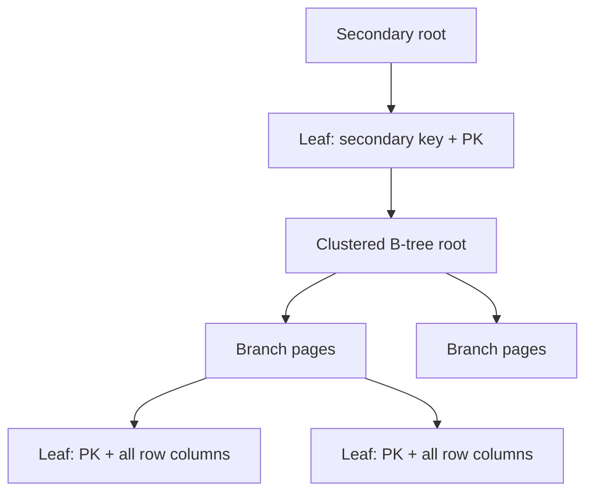

## Mental model: table data nằm trong một B-tree
Trong InnoDB, clustered index leaf chứa row data. Khi table có `PRIMARY KEY`, key đó tổ chức clustered index. Nếu không có, InnoDB chọn unique non-null index phù hợp; nếu vẫn không có, nó tạo hidden clustered row ID. Vì vậy "table heap rồi primary index trỏ vào row" không phải model đúng cho InnoDB thông thường.

Primary-key lookup đi từ root/branch tới leaf chứa row. Range theo primary key có locality tốt vì rows lân cận về key nằm gần nhau theo B-tree order, dù page split, deletion và storage layout khiến không nên hiểu như file luôn tuần tự hoàn hảo.



## Secondary index leaf lưu primary key
Secondary index record chứa secondary key và primary-key columns của row. Khi query cần column không cover trong secondary leaf, InnoDB tìm candidate trong secondary B-tree rồi dùng primary key lookup clustered B-tree. Đây là double lookup thường gọi secondary-to-clustered lookup.

```sql title="Secondary index và lookup"
CREATE TABLE orders (
  id BIGINT PRIMARY KEY,
  tenant_id BIGINT NOT NULL,
  status VARCHAR(20) NOT NULL,
  created_at DATETIME(6) NOT NULL,
  total_minor BIGINT NOT NULL,
  KEY idx_tenant_status_created (tenant_id, status, created_at)
) ENGINE=InnoDB;
```

Query chỉ lấy `tenant_id,status,created_at,id` có thể được cover vì secondary index đã có declared columns và PK `id`. Nếu lấy `total_minor`, engine có thể lookup clustered row cho mỗi match. `EXPLAIN`/`EXPLAIN ANALYZE` và handler/I/O evidence xác nhận, không suy từ DDL alone.

## Primary key width nhân lên toàn hệ thống index
Vì PK nằm trong mỗi secondary record, UUID/string/composite PK rộng làm mọi secondary index lớn, giảm fan-out mỗi page, tăng tree height/cache footprint và write I/O. Một table có tám secondary indexes trả giá PK width tám lần cộng clustered storage.

Điều này không có nghĩa luôn chọn auto-increment key. Business identity, merge/offline generation, security leakage, sharding và migration có trade-off. Một chiến lược là narrow surrogate clustered PK và unique business key riêng; đổi lại thêm index/lookup và mapping. Đánh giá tổng workload, không khẩu hiệu "UUID xấu".

Random key distribution có thể insert vào nhiều pages và page split/cache churn hơn monotonic key. Monotonic key tạo locality nhưng có thể tập trung concurrent insert vào rightmost pages. MySQL/version/hardware và concurrency quyết định bottleneck thật.

## B-tree page, split và fill
InnoDB indexes dùng pages; khi target leaf không đủ chỗ, B-tree có thể split và phân phối records. Delete không luôn co file tức thì; purge/reorganization/rebuild lifecycle khác nhau. Fragmentation được đánh giá bằng size, page utilization và workload, không chỉ `DATA_FREE` hay một ratio truyền miệng.

Large variable-length columns có thể dùng overflow/off-page storage theo row format. `SELECT *` khiến engine đọc/chuyển payload không cần thiết; projection hẹp cải thiện cả covering cơ hội lẫn network/object allocation.

## Extended secondary index
Optimizer có thể xem primary-key columns được append ngầm vào secondary index khi chọn ref/range/order/group optimizations. Nếu PK composite `(tenant_id,id)` và secondary khai báo `(created_at)`, internal key còn mang PK columns. Hiểu điều này tránh tạo index dư chỉ để append lại PK, nhưng exact order/coverage phải xem `EXPLAIN` và documentation.

Một secondary unique index vẫn cần PK để định vị clustered row; uniqueness semantics áp trên declared unique columns, còn physical record identity có thêm PK.

## Composite order theo equality, range và order
Với index `(tenant_id,status,created_at,id)`, equality trên tenant/status cho phép range/order tiếp theo. Nếu query chỉ filter status toàn hệ thống, prefix tenant không giúp lookup trực tiếp. Low cardinality status vẫn hữu ích sau tenant vì subset tenant nhỏ hơn và query/order shape phù hợp.

```sql title="Keyset pagination ăn khớp index"
SELECT id, created_at, total_minor
FROM orders
WHERE tenant_id = ?
  AND status = ?
  AND (created_at, id) < (?, ?)
ORDER BY created_at DESC, id DESC
LIMIT 50;
```

Để phục vụ tốt, index direction/order phải tương thích và `total_minor` có thể thêm nếu covering benefit đáng write/storage cost. Tuple comparison/collation/type semantics phải test đúng version.

## Buffer pool và access locality
InnoDB buffer pool cache data/index pages. Secondary lookup ngẫu nhiên vào clustered pages có thể rất nhanh khi hot, nhưng thành random storage I/O khi working set vượt cache. Dev dataset vừa RAM che giấu vấn đề; production cardinality và multi-tenant skew làm p99 tăng.

Đo logical/physical reads, buffer pool hit/miss, page reads, query digest và rows examined/returned. Hit ratio tổng cao vẫn che hot query thrash hoặc scan làm đẩy working set quan trọng.

## Online DDL không đồng nghĩa zero impact
Thêm/rebuild index có algorithm/lock options tùy operation/version. "Online" vẫn dùng CPU, I/O, temporary space, redo/binlog và metadata locks ở một số pha. Long-running transaction hoặc DDL queue có thể gây deployment incident. Test table size/update rate tương đương và monitor replica lag/disk.

Invisible index có thể giúp thử optimizer behavior trước drop, nhưng index invisible vẫn có maintenance/storage cost và constraint-related limitations. Observation window phải bao phủ batch/monthly workloads.

## Failure scenarios
- Dùng composite natural PK rất rộng rồi thêm nhiều secondary indexes, storage tăng ngoài dự kiến.
- Secondary range trả hàng trăm nghìn row và mỗi row clustered lookup random.
- Thêm `SELECT *`, covering plan biến mất sau release.
- UUID random benchmark nhỏ ổn nhưng production page/cache churn tăng.
- Dùng monotonic ID nhưng không threat-model enumeration/exposure.
- Rebuild index đầy disk/binlog và làm replica tụt hàng giờ.
- Xóa index "không dùng" nhưng đó là support cho unique/FK hoặc monthly report.

:::production Index investigation
Lấy query digest và bind distribution; map secondary key + appended PK; kiểm tra rows examined/returned và actual plan; đo index/table size + buffer behavior; thử covering/projection/index order; tính write amplification; deploy DDL lock-aware với disk/binlog headroom; theo dõi p95/p99, replica lag và DML latency sau rollout.
:::

## Góc phỏng vấn
"Vì sao primary key InnoDB nên ngắn?" — Row data nằm ở clustered index và mọi secondary leaf mang primary-key columns để lookup clustered row. PK rộng nhân storage/cache/write cost qua mọi secondary index. Tuy nhiên key choice còn business/sharding/security trade-off, nên phải đo tổng workload.

## Key Takeaways
- InnoDB table là clustered primary-key B-tree ở storage model chính.
- Secondary index trỏ bằng PK, không bằng heap pointer ổn định.
- PK width và distribution ảnh hưởng mọi secondary index.
- Covering giảm clustered lookups nhưng tăng index footprint nếu thêm column.
- DDL/index decisions phải tính buffer, binlog, replica và lock impact.
