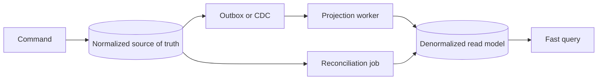

## Mental model: một fact có một owner rõ ràng
Normalization giảm việc lưu cùng một fact ở nhiều nơi. Nếu tên department xuất hiện trên mọi row employee, đổi tên phải update hàng nghìn row và một failure giữa chừng tạo dữ liệu mâu thuẫn. Tách `departments` và tham chiếu bằng foreign key cho fact "tên department" một owner.

Mục tiêu không phải đạt dạng chuẩn cao nhất bằng mọi giá. Mục tiêu là biểu diễn dependency và invariant để write đúng, thay đổi an toàn và người vận hành hiểu nguồn sự thật.

## Functional dependency và các anomaly
Nếu `department_id -> department_name`, thì tên phụ thuộc vào department, không phụ thuộc employee. Lưu cả hai trong bảng employee tạo:
- update anomaly: đổi tên phải sửa nhiều row;
- insert anomaly: chưa có employee thì khó lưu department;
- delete anomaly: xóa employee cuối cùng vô tình mất thông tin department.

1NF thường yêu cầu giá trị atomic trong ngữ cảnh model; 2NF loại partial dependency trên composite key; 3NF loại transitive dependency không thuộc key. BCNF chặt hơn khi mọi determinant phải là candidate key. Trong công việc, giải thích dependency cụ thể có giá trị hơn đọc thuộc định nghĩa.

## Constraint là executable invariant
Application validation cho UX nhưng mọi writer, migration và batch đều cần database guard khi correctness quan trọng.

```sql title="Schema giữ identity và invariant"
CREATE TABLE departments (
  id BIGINT PRIMARY KEY,
  code VARCHAR(30) NOT NULL UNIQUE,
  name VARCHAR(200) NOT NULL
);

CREATE TABLE employees (
  id BIGINT PRIMARY KEY,
  department_id BIGINT NOT NULL,
  email VARCHAR(320) NOT NULL UNIQUE,
  status VARCHAR(20) NOT NULL,
  CONSTRAINT fk_employee_department
    FOREIGN KEY (department_id) REFERENCES departments(id),
  CONSTRAINT ck_employee_status
    CHECK (status IN ('ACTIVE', 'INACTIVE'))
);
```

Engine/version khác nhau về check constraint, deferred constraint, generated identity và online validation. Migration phải test trên đúng vendor/version.

## Modeling many-to-many và lịch sử
Join table không chỉ chứa hai foreign key; nó có thể là entity quan hệ với `role`, `valid_from`, `valid_to`, audit và unique constraint.

```sql title="Membership có lifecycle"
CREATE TABLE team_memberships (
  team_id BIGINT NOT NULL,
  user_id BIGINT NOT NULL,
  role VARCHAR(30) NOT NULL,
  joined_at TIMESTAMP NOT NULL,
  left_at TIMESTAMP NULL,
  PRIMARY KEY (team_id, user_id, joined_at)
);
```

Nếu cần biết trạng thái tại một thời điểm, overwrite một cột current state có thể làm mất lịch sử. Có thể dùng temporal model/event history, nhưng phải định nghĩa overlap, correction và retention rõ.

## Khi denormalization có lý
Denormalization là bản sao có chủ đích để tối ưu read, giảm join cross-boundary hoặc lưu snapshot lịch sử. Ví dụ order line nên lưu product name/price tại thời điểm mua nếu invoice phải bất biến; đó là business snapshot, không đơn thuần cache.

Các dạng thường gặp:
- precomputed counter/summary table;
- materialized view;
- read model theo CQRS;
- JSON snapshot của external response;
- duplicate display field gần aggregate để tránh cross-service join.

Mỗi bản sao cần contract:
1. Source of truth là đâu?
2. Đồng bộ synchronous hay asynchronous?
3. Cho phép stale bao lâu?
4. Làm sao phát hiện drift?
5. Có thể rebuild/replay không?
6. Ai chịu trách nhiệm schema evolution và privacy deletion?

## Write path cho derived data
Synchronous update trong cùng database transaction cho consistency mạnh hơn nhưng làm transaction lớn và coupling cao. Asynchronous CDC/outbox cho scalability và tách boundary nhưng tạo eventual consistency, duplicate và reorder; consumer phải idempotent, có checkpoint và reconciliation.



## Failure scenarios
- Dual write source và summary nhưng chỉ một bên commit.
- Counter cache bị duplicate event cộng hai lần.
- Snapshot chứa PII nhưng quy trình xóa chỉ xử lý bảng gốc.
- JSON "linh hoạt" trở thành nơi giấu schema, không constraint và khó query.
- Denormalize trước khi đo, tăng write complexity nhưng latency không cải thiện.
- Natural key mutable được dùng làm foreign key khắp hệ thống.

:::production Checklist thiết kế schema
Viết entity, fact, invariant và lifecycle; chọn stable key; dùng constraint; mô tả nullability bằng business semantics; dự báo growth/cardinality; lập migration/rollback; với derived data, định nghĩa freshness SLO, idempotency, reconciliation, rebuild và observability trước khi phát hành.
:::

## Decision guide
Giữ normalized nếu write correctness, thay đổi nghiệp vụ và ad-hoc query quan trọng hơn vài join. Denormalize khi query nóng đã được đo, join/cross-service dependency là bottleneck và đội ngũ chấp nhận vận hành consistency lifecycle. Đôi khi index/query rewrite/materialized view giải quyết vấn đề với ít complexity hơn.

## Góc phỏng vấn
"Denormalization có xấu không?" — Không; nó là trade-off. Câu trả lời senior nêu source of truth, consistency window, update mechanism, duplicate/reorder, reconciliation và rebuild. Nếu chỉ nói "để query nhanh" thì thiếu phần correctness và operations.

## Key Takeaways
- Normalization làm dependency và ownership của fact rõ hơn.
- Constraint bảo vệ invariant cho mọi writer.
- Snapshot lịch sử khác cache dữ liệu hiện tại.
- Mọi denormalized copy cần freshness và repair contract.
- Chỉ trả complexity khi bottleneck đã được đo.
