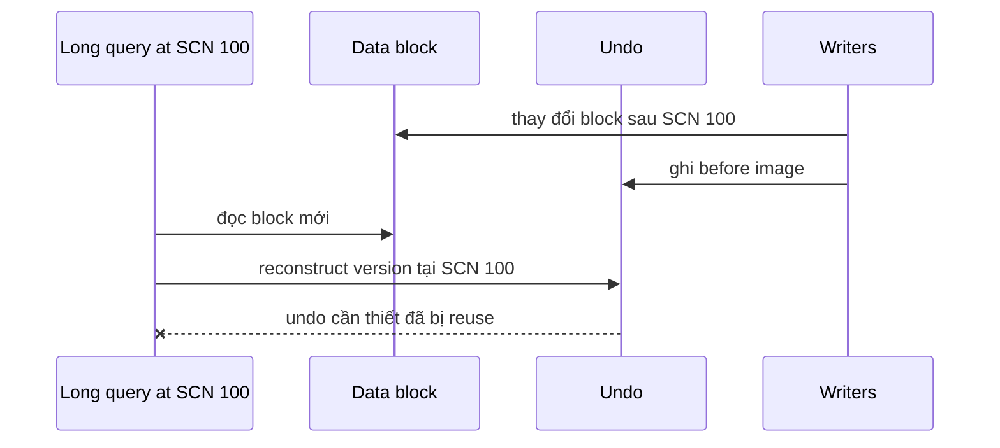

## Read consistency dựa trên SCN và undo
Oracle cung cấp multiversion read consistency: query thấy dữ liệu nhất quán tại một logical point, dùng System Change Number (SCN) và undo để reconstruct old versions khi blocks đã thay đổi. Reader thường không block writer chỉ vì cần bản cũ, và writer không overwrite khả năng đọc nhất quán miễn undo cần thiết còn tồn tại.

Statement-level read consistency nghĩa một query thấy snapshot theo thời điểm statement bắt đầu. Transaction-level behavior phụ thuộc isolation. `READ COMMITTED` có snapshot mới cho statement sau; `SERIALIZABLE`/read-only transaction có contract rộng hơn và có thể báo conflict thay vì âm thầm serialize mọi thứ.

## Undo phục vụ nhiều nhiệm vụ
Undo records hỗ trợ rollback transaction, consistent read, transaction recovery và một số flashback capabilities. Undo tablespace/retention phải phục vụ workload query dài và write churn. Retention là mục tiêu chịu ảnh hưởng space/guarantee configuration, không phải lời hứa mọi old version luôn còn.

`ORA-01555: snapshot too old` xảy ra khi query cần undo cũ nhưng information đã bị overwrite/reused hoặc liên quan LOB/other scenarios. Chỉ "tăng undo" đôi khi giúp, nhưng root cause có thể là query quá lâu, plan regression đọc quá nhiều, commit pattern batch, write spike hoặc retention sizing sai.



## Transaction dài, commit thường xuyên và hiểu lầm
Commit mỗi vài row trong batch không mặc định chữa snapshot-too-old; nó có thể tạo nhiều transaction/undo reuse dynamics và làm restart/reconciliation khó. Batch sizing phải dựa undo/redo, lock, recovery và business atomicity. Query/report dài nên được tune, schedule, offload hoặc flashback/retention architecture phù hợp.

Theo dõi undo consumption/retention, longest query, workload churn và execution plan. Capacity model cần peak write window, không chỉ average.

## Cost-Based Optimizer gồm ba ý chính
Query transformer có thể rewrite view/subquery/OR và transformations tương đương. Estimator tính selectivity, cardinality và cost từ object/system statistics. Plan generator so sánh access paths, join orders/methods và chọn cost thấp nhất trong candidates được xét.

Cost là đơn vị nội bộ để so plans, không phải milliseconds. Một plan cost 100 không bảo đảm chạy 100 ms; so cost giữa môi trường/query không có context là sai. Cardinality estimate (`Rows`) là input trọng yếu: lệch sớm có thể dẫn đến join method/order tệ ở trên.

## EXPLAIN PLAN không phải actual execution
`EXPLAIN PLAN` tạo plan estimate trong `PLAN_TABLE`, có thể khác plan của cursor thật do bind values, environment, adaptive behavior, statistics và execution context. Điều tra production nên xem cursor plan và runtime row-source statistics bằng công cụ/view/package phù hợp, ví dụ `DBMS_XPLAN.DISPLAY_CURSOR` khi statistics được thu.

```sql title="Hiển thị cursor plan với runtime stats"
SELECT *
FROM TABLE(
  DBMS_XPLAN.DISPLAY_CURSOR(
    sql_id          => :sql_id,
    cursor_child_no => :child_no,
    format          => 'ALLSTATS LAST +PEEKED_BINDS +OUTLINE'
  )
);
```

Availability của bind/actual statistics phụ thuộc capture/instrumentation/privilege và cursor. Không bật tracing/statistics nặng toàn hệ thống vô thời hạn.

## Đọc plan theo row-source tree
Plan operations tạo rows cho parent. Indentation/ID giúp đọc data flow từ access nodes qua joins/aggregates. So `E-Rows` với `A-Rows`, starts, buffers/reads, elapsed và predicates. Một operation có A-Rows nhỏ nhưng starts hàng triệu lần có thể là bottleneck nested loop.

Phân biệt access predicate giới hạn index traversal với filter predicate loại rows sau access. `TABLE ACCESS BY INDEX ROWID` cho thấy index lấy rowids rồi table lookup; batched behavior/version có thể xuất hiện. Full table scan không tự là xấu nếu tỷ lệ data lớn hoặc multiblock/parallel scan hợp lý.

## Statistics, histogram và skew
Object statistics gồm table/index/column data. Histogram giúp optimizer nhận biết skew ở cột khi giá trị phổ biến khác rất nhiều average. Statistics stale/missing, sampling và correlated predicates gây estimate sai. `DBMS_STATS` collection strategy nên được quản lý; không analyze thủ công tùy tiện bằng method cũ hay gather toàn schema giờ cao điểm.

Extended column group statistics/dynamic statistics/SQL plan features có thể giúp cases cụ thể, nhưng phải hiểu lifecycle và deployment. Histogram trên cột có bind-sensitive workload có thể tạo nhiều child cursors/adaptive cursor sharing behavior; đây vừa là optimization vừa là operational complexity.

## Bind peeking và parameter-sensitive plan
Một SQL text dùng bind được hard parse với thông tin bind khả dụng; plan tốt cho value hiếm có thể tệ cho value phổ biến. Oracle có adaptive cursor sharing/bind-aware mechanisms, nhưng không giả định tự sửa ngay mọi skew.

Thu evidence theo SQL ID, child cursors, bind classes và execution distribution. Các giải pháp có thể gồm schema/index/statistics, tách query shape có chủ đích, SQL Plan Management/baseline hoặc profile/patch tùy license/process. Hint hard-code là maintenance contract và cần regression test sau upgrade/stats change.

## Plan regression và stabilization
Plan đổi sau statistics gather, schema/index, parameter, upgrade hay environment. Đừng chỉ pin plan cũ: xác nhận plan cũ còn đúng khi data tăng. Một stabilization mechanism có thể giảm incident risk trong khi root cause được điều tra, nhưng stale baseline cũng ngăn optimizer nhận plan tốt hơn.

Runbook nên lưu plan hash, actual stats, bind class, schema/stats change timeline và wait profile. SQL nhanh trong database nhưng request chậm có thể do lock/network/pool/application; execution plan không giải thích mọi latency.

## Failure scenarios
- Dùng `EXPLAIN PLAN` và tuyên bố đó là plan đã chạy với bind production.
- Đọc cost như thời gian milliseconds.
- Tăng undo nhưng không sửa query plan regression làm report kéo dài gấp 20 lần.
- Gather statistics giờ cao điểm gây load và plan churn hàng loạt.
- Histogram/bind skew tạo plan khác nhưng monitoring chỉ group theo SQL text.
- Pin một plan cũ vĩnh viễn dù distribution đã thay đổi.
- Query dài giữ snapshot trong lúc batch write churn cao nhưng capacity chỉ theo average.

:::production Troubleshooting sequence
Chụp SQL ID/child/plan hash, bind class, waits và runtime rows; tìm estimate divergence/starts/buffers; kiểm tra stats/change timeline; đồng thời kiểm tra undo pressure và longest query; reproduce bằng data/bind đại diện; thử fix/stabilization trong staging; rollout có baseline/rollback; theo dõi plan variants, p95/p99 và ORA-01555 rate.
:::

## Góc phỏng vấn
"EXPLAIN PLAN có cho biết query production vừa chạy thế nào không?" — Nó là optimizer estimate riêng và có thể không trùng cursor thật. Cần xem actual cursor/row-source statistics, bind và waits. Oracle consistent read còn dùng undo; plan chậm kéo query dài có thể góp phần snapshot-too-old.

## Key Takeaways
- Oracle dùng undo để reconstruct consistent version theo SCN.
- Undo sizing, write churn và query duration cùng quyết định retention pressure.
- Cost là đơn vị optimizer, không phải elapsed time.
- Cursor actual stats đáng tin hơn EXPLAIN PLAN cho incident đã xảy ra.
- Bind skew và plan lifecycle cần monitoring/stabilization có chủ đích.
