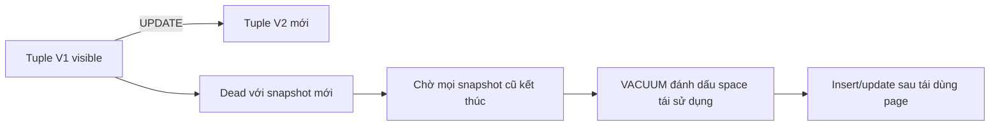

## Mental model: UPDATE tạo version mới
Trong PostgreSQL heap, một logical row có thể có nhiều physical tuple versions. `UPDATE` tạo tuple mới và tuple cũ trở thành không còn visible với transaction tương lai sau khi điều kiện visibility cho phép. `DELETE` cũng không lập tức thu hồi byte trong file. Snapshot của mỗi transaction quyết định version nào thấy được dựa trên transaction metadata.

Thiết kế này giảm reader-writer blocking, nhưng chuyển chi phí sang version lifecycle: dead tuples phải được dọn để space có thể tái sử dụng, statistics phải cập nhật, và transaction ID cũ phải được freeze trước nguy cơ wraparound. "MVCC không lock" là sai; row/table locks vẫn tồn tại, còn MVCC chủ yếu định nghĩa visibility.

## VACUUM thực sự làm gì
Plain `VACUUM` xác định tuple không còn cần cho snapshot nào, cập nhật free space/visibility information và cho phép tái sử dụng space bên trong relation. Nó thường không trả file space về operating system. `VACUUM (ANALYZE)` còn cập nhật planner statistics; `ANALYZE` và garbage collection là hai concern liên quan nhưng khác nhau.

`VACUUM FULL` viết lại relation thành file compact và cần lock mạnh hơn; nó là maintenance operation có impact lớn, không phải cách "chữa autovacuum" định kỳ. Các rewrite/online alternatives tùy môi trường cũng cần capacity, lock, WAL và replication-lag plan.

Visibility map theo dõi page all-visible/all-frozen để vacuum có thể bỏ qua page và index-only scan tránh heap visibility check khi đủ điều kiện. Free space map giúp tìm page còn chỗ; nó không phải bằng chứng file đã co lại trên disk.

## HOT update và index amplification
Heap-Only Tuple (HOT) có thể tránh tạo index entries mới khi update không sửa cột được index và page hiện tại còn chỗ. Chuỗi HOT nối các tuple versions trong cùng page, giảm index bloat và write amplification.

HOT không được đảm bảo: page đầy, sửa indexed column hoặc điều kiện storage khác khiến update thường phải thêm entries vào mọi index liên quan. `fillfactor` thấp hơn chừa chỗ trên page, có thể tăng HOT rate cho table update-heavy nhưng làm table lớn và cache density thấp hơn. Đây là trade-off cần đo bằng workload.

Một index "không dùng" vẫn bị duy trì trên write path và có thể ngăn HOT nếu cột liên quan thay đổi. Audit index cần xét constraint/unique/FK support và thời gian quan sát đủ dài trước khi xóa.

## Autovacuum threshold không tỷ lệ tốt cho mọi table
Autovacuum quyết định chạy dựa trên threshold cộng scale factor và thay đổi ước lượng. Một table cực lớn có thể tích lũy lượng dead tuples rất lớn trước khi scale-based threshold kích hoạt; table nhỏ nhưng write cực nóng có thể cần chạy rất thường xuyên. PostgreSQL hỗ trợ override theo table để tune threshold/scale/cost.

Tuning chỉ tăng worker hay giảm nap time mà không tìm blocker có thể tăng I/O nhưng không giảm backlog. Điều tra theo thứ tự:
1. Table nào có dead tuples/churn cao và lần vacuum/analyze gần nhất?
2. Có autovacuum worker chạy, chờ lock hay tiến độ chậm không?
3. Oldest transaction/snapshot/replication slot nào giữ horizon?
4. Disk IOPS/WAL/CPU có đủ cho maintenance không?
5. Table-level settings và workload batch có phù hợp không?

## Long transaction và cleanup horizon
Transaction mở lâu, kể cả session `idle in transaction`, có thể buộc database giữ version cũ. Replication slot/logical decoding consumer tụt lại cũng có thể giữ WAL hoặc cleanup horizon tùy cơ chế. Một báo cáo chạy nhiều giờ không chỉ giữ connection; nó có thể làm bloat toàn hệ thống write-heavy.

Đặt `statement_timeout`, `lock_timeout` và `idle_in_transaction_session_timeout` theo workload, nhưng không dùng timeout như thay thế sửa transaction boundary. Job dài nên chia chunk có checkpoint, dùng replica/reporting architecture phù hợp hoặc snapshot lifecycle có chủ đích.

## Bloat là triệu chứng, không phải một metric duy nhất
Dead tuple estimate trong statistics view không bằng byte bloat chính xác. Relation lớn có thể có reusable free space và hoạt động tốt; relation ít dead tuple vẫn có fragmentation/index shape không tối ưu. Cần kết hợp:
- `n_dead_tup`, insert/update/delete/HOT counters;
- relation/index size trend và growth so với live rows;
- autovacuum timestamps/counts và progress;
- query buffer reads, cache hit và latency;
- oldest transaction age, replication slot/WAL retention;
- table/index scan/use patterns.

Extension/tool ước lượng bloat có assumptions; chạy query inspection nặng trên production cũng có cost. Luôn ghi phương pháp đo và sai số.

## Transaction ID wraparound là safety concern
Transaction IDs hữu hạn và so sánh theo vòng; tuple rất cũ phải được freeze để vẫn visible đúng sau wraparound. PostgreSQL có anti-wraparound vacuum và sẽ ưu tiên safety, thậm chí gây operational pressure nếu bị bỏ bê. Monitor age trên database/table và đừng disable autovacuum toàn cục như một "performance fix".

Maintenance window phải tính freeze scan, I/O và replica impact trước khi age đến emergency. Một incident wraparound thường là hậu quả nhiều ngày/tuần không xử lý blocker hoặc capacity, không phải spike bất ngờ.

## Failure scenarios
- Batch delete hàng trăm triệu row rồi kỳ vọng file co ngay sau plain `VACUUM`.
- `VACUUM FULL` trên table nóng gây lock outage và WAL/replica lag.
- Autovacuum được tune aggressive nhưng long transaction vẫn giữ mọi dead version.
- Thêm index vào mọi cột làm update amplification tăng và HOT ratio giảm.
- Replication slot bỏ quên giữ WAL tới đầy disk.
- Alert chỉ dựa `n_dead_tup` mà bỏ qua transaction age và relation-size trend.
- Kill autovacuum worker vì thấy I/O cao, khiến backlog và wraparound risk tăng.

:::production Runbook ngắn
Xác nhận user impact và query đang chậm; kiểm tra blocking/old transactions trước; xác định table/index growth cùng churn; xem autovacuum progress/settings; bảo vệ disk/WAL headroom; xử lý blocker; tune per-table và batch size; chỉ chọn rewrite/reindex khi có evidence; theo dõi lại HOT, dead tuple, latency và replica lag sau thay đổi.
:::

## Góc phỏng vấn
"VACUUM có trả disk về OS không?" — Plain VACUUM chủ yếu làm space trong relation tái sử dụng và cập nhật visibility/free-space metadata; thường không co file. VACUUM FULL rewrite và cần lock mạnh. Câu trả lời senior cần nói autovacuum, long snapshot, HOT và wraparound.

## Key Takeaways
- PostgreSQL UPDATE tạo tuple version mới; cleanup là phần của write cost.
- Plain VACUUM tái sử dụng space, không phải file compactor mặc định.
- Long transaction/slot có thể chặn cleanup dù autovacuum chạy.
- HOT phụ thuộc indexed columns và free space trên page.
- Chẩn đoán bloat cần trend, workload và blocker, không một con số đơn lẻ.
