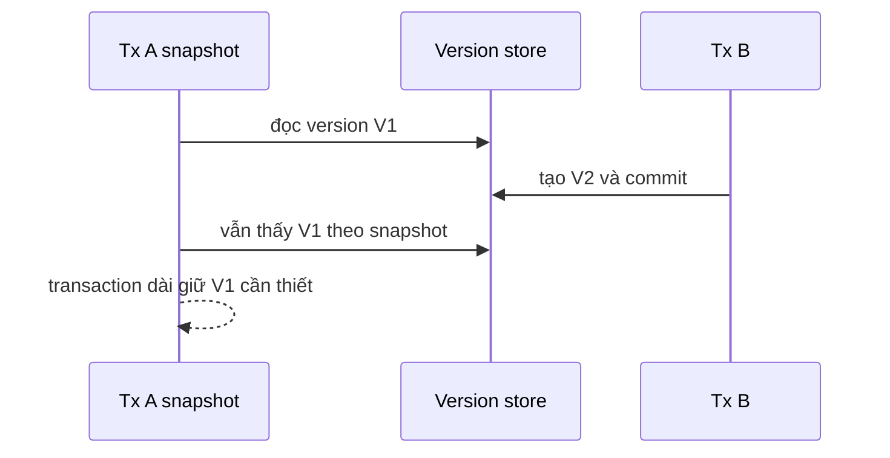

## Transaction bảo vệ invariant, không chỉ gom câu lệnh
Ranh giới transaction nên được suy ra từ invariant: "tổng debit và credit bằng nhau", "một seat chỉ được giữ bởi một booking hợp lệ", hoặc "inventory không âm". Gọi `BEGIN` quanh nhiều statement nhưng không khóa/kiểm tra đúng dữ liệu vẫn có thể sai dưới concurrency.

```sql title="Atomic conditional update tránh check-then-act"
UPDATE inventory
SET available = available - :quantity
WHERE product_id = :product_id
  AND available >= :quantity;
```

Ứng dụng kiểm tra affected row bằng 1 hay 0. Một statement atomic thường có failure surface nhỏ hơn `SELECT available`, kiểm tra trong Java rồi `UPDATE`.

## Isolation là contract về điều được phép quan sát
Tên isolation giống nhau không đồng nghĩa implementation giống hoàn toàn giữa PostgreSQL, InnoDB và Oracle. Hãy hỏi anomaly nào phá invariant thay vì chọn mức cao nhất theo thói quen.

| Anomaly | Ví dụ | Cách bảo vệ thường gặp |
|---|---|---|
| Dirty read | đọc giá chưa commit | `READ COMMITTED` trở lên |
| Non-repeatable read | row đổi giữa hai lần đọc | snapshot phù hợp hoặc lock |
| Phantom | tập row theo predicate đổi | serializable/predicate-range protection tùy engine |
| Lost update | hai writer ghi đè nhau | atomic update, version column hoặc locking read |
| Write skew | hai transaction sửa row khác nhưng phá invariant chung | serializable, explicit lock trên coordination row, redesign constraint |

`READ COMMITTED` thường cho mỗi statement một snapshot mới; `REPEATABLE READ` thường giữ snapshot lâu hơn, nhưng chi tiết phantom/locking khác theo engine. `SERIALIZABLE` mô phỏng kết quả như một serial order bằng blocking, abort/retry hoặc kết hợp; nó không có nghĩa mọi transaction sẽ thành công ngay lần đầu.

## MVCC bên trong
MVCC giữ nhiều phiên bản để reader thấy snapshot phù hợp và writer ít chặn reader hơn. Row version cần metadata về transaction visibility; phiên bản cũ phải được vacuum/purge sau khi không snapshot nào cần nữa. Vì vậy transaction đọc dài có thể giữ old version, tạo bloat, tăng undo/history và làm maintenance khó hơn.

MVCC không xóa lock. Update cùng row vẫn conflict; DDL, unique constraint, foreign key và locking read có lock riêng. Snapshot cũng không tự khóa "sự vắng mặt" của row mà business rule sắp tạo.



## Pessimistic và optimistic concurrency
Pessimistic locking như `SELECT ... FOR UPDATE` phù hợp khi conflict tương đối thường xuyên, thao tác ngắn và row cần khóa xác định được. Nó trả giá bằng waiting/deadlock và phải giữ transaction cực ngắn.

Optimistic locking dùng version:

```sql title="Compare-and-swap bằng version"
UPDATE accounts
SET display_name = :name,
    version = version + 1
WHERE id = :id
  AND version = :expected_version;
```

Affected row bằng 0 báo conflict để reject/merge/retry theo business. Optimistic không đồng nghĩa không có database lock; nó chỉ không giữ lock xuyên bước "người dùng suy nghĩ".

## Deadlock là chu trình chờ
Nếu A khóa account 1 rồi đợi account 2, trong khi B khóa 2 rồi đợi 1, database phải abort một victim để phá cycle. Deadlock detection là cơ chế an toàn, không phải database hỏng.

Giảm deadlock bằng cách:
- truy cập resource theo thứ tự ổn định;
- dùng index để statement khóa ít row/range hơn;
- chia transaction lớn và tránh remote call trong transaction;
- không trộn nhiều workflow có lock order khác nhau;
- ghi nhận deadlock graph/log để tìm cycle thật.

```sql title="Lock theo thứ tự định danh"
SELECT id, balance
FROM accounts
WHERE id IN (:from_id, :to_id)
ORDER BY id
FOR UPDATE;
```

## Retry phải bao quanh toàn transaction
Deadlock victim và serialization failure thường là transient, nhưng retry một statement giữa transaction đã hỏng là sai. Retry callback transaction từ đầu với attempt limit, exponential backoff có jitter và deadline. Mọi input phải còn hợp lệ; side effect ngoài database phải ở sau commit hoặc đi qua outbox/idempotency.

:::warning Không retry mù
Unique violation do business duplicate, insufficient funds hay malformed input không trở thành đúng sau retry. Phân loại error code của đúng driver/engine, không match chuỗi message. Retry storm có thể làm contention nặng hơn, nên cần budget, metric và load shedding.
:::

## Failure scenarios production
- Transaction giữ connection trong lúc gọi payment API, lock wait lan ra pool exhaustion.
- Batch update không có index phù hợp khóa/scans phạm vi lớn.
- Replica read sau primary write không thấy dữ liệu do replication lag.
- Retry sau timeout nhưng client không biết commit đã xảy ra, gây duplicate command.
- Long-running report giữ snapshot cũ, làm version cleanup tụt lại.

## Production checklist
- Ghi invariant và owner của transaction boundary.
- Đặt timeout cho statement, lock wait và toàn request.
- Theo dõi transaction duration, active/idle-in-transaction, deadlock, abort, bloat/history length.
- Dùng connection pool có giới hạn và admission control.
- Test race bằng concurrent actors, không chỉ unit test tuần tự.
- Có idempotency key cho command có thể bị gửi/retry lại.

## Góc phỏng vấn
"MVCC có loại bỏ lock không?" — Không. MVCC cho reader chọn version theo snapshot, giảm reader-writer blocking; write conflict, constraint, DDL và explicit locking vẫn dùng lock. Version cũ còn có lifecycle cleanup, vì vậy transaction dài gây chi phí vận hành.

## Key Takeaways
- Bắt đầu từ invariant và anomaly cần ngăn.
- Isolation contract phải đọc theo engine, không suy từ tên chung.
- MVCC đổi blocking đọc thành quản lý version, không tạo concurrency miễn phí.
- Deadlock cần deterministic ordering, transaction ngắn và retry toàn boundary.
- Không đưa remote side effect vào một database transaction thông thường.
