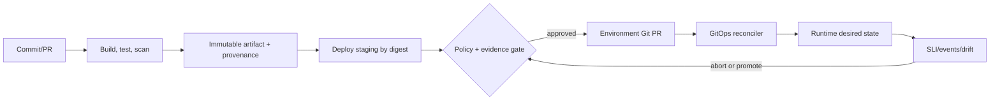

## Mental model: một artifact, nhiều cổng kiểm soát

CI trả lời “commit này có tạo ra artifact đủ tin cậy không?”. Delivery trả lời “artifact nào được phép đi tới environment nào?”. Deployment là hành động thay đổi runtime. GitOps là một operating model trong đó desired state được version-control và agent/reconciler kéo state về cluster rồi liên tục sửa drift theo policy.

Pipeline tốt **build once, promote by immutable identity**. Không rebuild cùng source cho staging và production, vì dependency/time/base tag có thể khác làm bằng chứng test không còn áp dụng. Image dùng digest; release record liên kết commit, workflow, test, SBOM/attestation, configuration revision và actor/approval.

## CI supply chain và environment trust

Workflow chạy code từ repository và dependencies, nên permission tối thiểu là bắt buộc. Pin reusable action/dependency theo immutable revision phù hợp policy; protect branch/workflow; tách untrusted pull-request job khỏi secret-bearing deployment. Artifact registry chặn overwrite tag hoặc promotion dùng digest. Attestation/provenance giúp verifier kiểm tra artifact được tạo bởi workflow nào; nó không chứng minh code không có bug và phải đi cùng review, tests, scanning và policy enforcement tại deploy.

Thay long-lived cloud key bằng GitHub Actions OIDC khi provider hỗ trợ. Trust policy phải giới hạn repository, branch/tag, environment và audience/claims thích hợp; “OIDC” với role quá rộng vẫn nguy hiểm. Job xin short-lived credential chỉ ở deploy stage, không ở build từ fork. Environment protection có reviewer, wait/policy gate và scoped secrets; availability/tính năng cụ thể có thể phụ thuộc GitHub plan/repository type, nên đối chiếu current docs.

Promotion record nên trả lời: ai/automation phê duyệt, digest/config nào, checks nào pass, deploy vào đâu, bắt đầu/kết thúc và rollback nào. Manual approval hữu ích ở high-risk boundary nhưng không thay automated evidence; quá nhiều click tạo rubber stamp.

## Push CD và GitOps pull model

Push pipeline trực tiếp gọi cluster API đơn giản với ít environment. Credential và orchestration nằm trong CI; nếu job chết giữa chừng, phải query runtime để biết observed state. GitOps đặt reconciler gần cluster, theo dõi desired state từ Git/OCI source, apply và báo health/drift. CI không cần broad cluster credential, audit có commit/PR, và deleted resource có thể được reconcile. Đổi lại cần quản lý controller credentials, source availability, reconciliation semantics và emergency procedure.

Tách application source repo và environment repo khi ownership/release cadence khác, nhưng tránh template duplication. PR environment thay digest/config, policy bot validate schema/security, rồi reconciler apply. Secret không commit plaintext: Git chỉ giữ encrypted reference hoặc External Secret/Vault reference tùy platform. Encryption key và recovery vẫn là operational dependency.

Drift policy phải explicit. Auto-heal tốt cho manual edit ngoài quy trình, nhưng có thể liên tục ghi đè hotfix khẩn cấp hoặc đấu với operator/controller khác. Chỉ một owner reconcile mỗi field/resource. Emergency change cần break-glass có audit, TTL và ngay lập tức back-port vào desired state; nếu không, controller sẽ revert hoặc Git sẽ sai thực tế.

## Chọn deployment strategy

**Recreate** dừng bản cũ rồi bật bản mới: đơn giản, phù hợp singleton/dev hoặc khi mixed version không an toàn, nhưng có downtime. **Rolling update** thay dần replica; Kubernetes Deployment hỗ trợ `maxSurge`/`maxUnavailable`, readiness và rollback revision cho Pod template. Nó không tự đánh giá business SLI và không giữ hai complete environments.

**Blue-green** chuẩn bị full green rồi switch route từ blue. Rollback route nhanh nếu data/schema tương thích, đổi lại cần gần gấp đôi capacity trong window và xử lý session/background worker. **Canary** gửi một phần traffic/workload sang version mới, quan sát rồi tăng dần. Nó giảm blast radius nhưng cần traffic segmentation, đủ sample, metric chống low-volume/noise, automated abort và tránh người dùng trải nghiệm lẫn version bất nhất.

Không dùng phần trăm/timeout copy từ bài mẫu. Chọn step/duration dựa trên traffic cycle, error budget, detection latency và hậu quả. Gate nên gồm technical SLI (error, latency, saturation), business invariant (payment/registration outcome), log/trace anomaly và dependency health; định nghĩa missing telemetry là pause/abort, không mặc định success.

State quyết định rollback. Schema migration theo expand/contract: thêm cấu trúc backward-compatible, deploy code đọc/ghi tương thích, backfill có kiểm soát, chuyển read, rồi xóa cũ sau rollback window. Destructive migration trước rollout làm `git revert` manifest vô nghĩa. Message schema/event consumer cũng phải hỗ trợ mixed versions và replay.

## Rollback, roll-forward và Git history

Trong GitOps, rollback thường tạo commit mới bằng `git revert` hoặc PR đưa digest/config về known-good; không force-push xóa lịch sử. Reconciler sau đó hội tụ runtime. Tuy nhiên controller rollback không hoàn tác database, external side effect, queue messages hay feature flag. Runbook ghi từng stateful dependency và compensation/roll-forward path.

Rollback thích hợp khi version cũ còn compatible và nhanh hơn fix. Roll-forward phù hợp khi migration irreversible nhưng patch nhỏ/an toàn. “Automatic rollback” phải có giới hạn: metric dependency chung có thể khiến cả canary lẫn stable lỗi; rollback loop làm hệ thống dao động. Freeze, diagnose hoặc traffic shed có thể đúng hơn.

## Failure scenarios và troubleshooting

- **Staging pass, production fail ngay:** artifact bị rebuild, config/secret/API quota khác hoặc test không đại diện. So digest, config revision, dependency contract và environment diff.
- **Git đã merge nhưng cluster không đổi:** xem source revision reconciler quan sát, auth/branch/path, render error, API rejection và health dependency; đừng rerun CI mù.
- **Controller revert hotfix liên tục:** field có hai owner hoặc hotfix ngoài Git. Pause reconciliation theo documented break-glass, sửa desired state, rồi resume/audit.
- **Canary xanh nhưng full rollout đỏ:** canary traffic không đại diện, cache warm/capacity bottleneck hoặc error chỉ xuất hiện khi concurrency cao. Thêm cohort/load/saturation gate và step capacity.
- **Rolling update kẹt:** readiness fail, quota/scheduler thiếu surge, PDB hoặc old pod không terminate. Kiểm tra Deployment conditions, events và termination/drain.
- **Rollback app nhưng lỗi tiếp:** schema/flag/event/external effect không backward-compatible. Dừng rollout, bảo vệ data, chọn compensation/roll-forward theo state inventory.
- **Credential lộ từ workflow:** revoke session/key, disable path, audit artifacts/logs và trust policy; chuyển short-lived OIDC/minimal permissions.

## Production checklist

- [ ] Build một lần; promotion dùng digest và release evidence có provenance.
- [ ] Workflow/action permissions tối thiểu; untrusted code không tiếp cận deploy secret.
- [ ] OIDC trust giới hạn repo/ref/environment/audience, session ngắn và audit được.
- [ ] Desired-state owner, drift/auto-heal và break-glass procedure được định nghĩa.
- [ ] Strategy phù hợp capacity, traffic, state compatibility và rollback window.
- [ ] Progressive gate dùng SLI + business invariant; telemetry missing sẽ pause/abort.
- [ ] Database/message/config/flag tương thích mixed version và có expand/contract plan.
- [ ] Drill rollback/roll-forward và controller/source outage trước production critical release.

## Góc phỏng vấn

**GitOps có phải CI/CD tool không?** Không nhất thiết. Nó là reconciliation model cho desired state; CI vẫn build/test artifact, policy và PR vẫn kiểm soát promotion.

**Rolling update khác canary?** Rolling thay replica theo availability policy. Canary cố ý giới hạn cohort/traffic và dùng evidence để promote/abort; Kubernetes Deployment đơn thuần không tự làm phân tích canary.

**Revert Git có rollback hoàn toàn?** Chỉ thay desired config/history. External state, database và side effect cần compatibility hoặc compensation riêng.

## Key Takeaways

- Build once và promote immutable digest để evidence đi cùng đúng artifact.
- OIDC/provenance giảm một số supply-chain risk nhưng vẫn cần narrow trust và policy enforcement.
- GitOps cho audit/reconciliation mạnh, đồng thời đòi ownership/drift/break-glass rõ.
- Deployment strategy là quyết định theo capacity, SLI và state, không chỉ YAML.
- Rollback thật bao gồm schema, events, flags và external effects; đôi khi roll-forward an toàn hơn.
