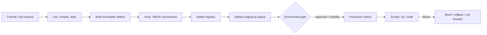

## Mental model: pipeline là chuỗi chuyển giao niềm tin

Continuous Integration (CI) tích hợp thay đổi nhỏ thường xuyên và tự động tạo evidence: source có build được, tests/policy có pass không. Continuous Delivery giữ một artifact đã kiểm chứng luôn sẵn sàng để phát hành, production có thể cần approval. Continuous Deployment tự động đưa mọi thay đổi đạt gate vào production. Ba khái niệm không đồng nghĩa với “có một file YAML”.

Mỗi stage nhận input có identity, chạy trong trust boundary và phát output/evidence cho stage sau. Pipeline tốt trả lời được: commit nào tạo artifact nào, dependency/toolchain nào, tests nào đã chạy, ai/policy nào cho phép promotion, config nào được deploy và runtime đã quan sát kết quả gì.



## Workflow internals: event, job, runner, step

Trong GitHub Actions, event kích hoạt workflow; workflow có các jobs; mỗi job chạy trên runner và chứa ordered steps. Jobs độc lập không tự chia filesystem/process state. Dùng outputs hoặc immutable artifacts để chuyển kết quả, `needs` để diễn đạt dependency. Parallel jobs giảm critical path nhưng chỉ khi tests/data không giẫm nhau.

Runner là execution boundary. GitHub-hosted runner thường được cấp môi trường mới cho job; self-hosted runner cho phép private network/tooling nhưng có persistence, patching và compromise risk lớn hơn. Không giả định cleanup hoàn hảo giữa jobs trên self-hosted machine. Tách runner group cho untrusted PR và deployment; deployment runner không nên chạy arbitrary fork code.

```yaml title="foundation-ci.yml"
name: verify
on:
  pull_request:
  push:
    branches: [main]
permissions:
  contents: read
concurrency:
  group: verify-${{ github.ref }}
  cancel-in-progress: true
jobs:
  test:
    runs-on: ubuntu-latest
    timeout-minutes: 20
    steps:
      - uses: actions/checkout@<reviewed-immutable-ref>
      - run: npm ci
      - run: npm test -- --run
```

Ví dụ minh họa structure, không phải file copy-paste: version action, permission, runtime và command phải theo repository. `timeout-minutes` bound job treo; concurrency có thể hủy run cũ cho validation nhưng không dùng tùy tiện với database migration/deploy đang tạo side effect.

**Dependency cache** tăng tốc bằng cách reuse package/download theo key; **workflow artifact** là output cần lưu/chuyển như report/binary. Cache không phải release registry và có thể bị poisoning nếu trust/key sai. Release artifact cần retention, access control, checksum/digest và immutability phù hợp.

## Build once, promote cùng identity

Build một lần từ reviewed commit, pin lockfile/toolchain/base image theo policy, rồi promote cùng artifact digest qua staging và production. Rebuild ở production có thể lấy dependency/tag khác, làm tests không còn chứng minh đúng bytes được chạy. Tag như `v1.2` hữu ích cho người đọc nhưng deploy record nên giữ digest bất biến.

Artifact record liên kết source SHA, build workflow/run, tests, SBOM/attestation nếu dùng, vulnerability/policy result. Attestation chứng minh provenance theo policy, không chứng minh absence of vulnerability hay logic đúng; bài `secure-cicd-supply-chain` đi sâu trust và verification.

Configuration thay đổi cũng là release. Version manifest/config/feature flag, validate schema và audit actor. Secret không đóng gói vào artifact hoặc upload như test artifact. Environment-specific value được inject tại deploy/runtime qua secret/config system với least privilege.

## Stage và gate theo risk

Fast PR gate nên deterministic: formatting/static analysis, compile, unit/component và integration trọng yếu. Merge/release gate thêm contract, migration, security checks, image scan và representative E2E. Staging smoke xác nhận artifact thực chạy với config/network. Production gate dùng environment protection, change policy hoặc automatic SLI tùy risk.

Gate phải actionable. Scanner finding có severity nhưng thiếu reachability/exception workflow sẽ hoặc block mọi thứ, hoặc bị bypass. Quarantine flaky test cần owner/expiry; retry vô hạn biến failure thành noise. Manual approval cần reviewer có context: diff, evidence, blast radius, rollback; click không thay evidence.

Branch protection và required checks ngăn merge khi gate thiếu, nhưng pipeline file/action chính nó là production code cần review. Pull request từ fork là untrusted input; expression được nội suy vào shell có thể injection. Dùng typed action inputs/environment an toàn, không ghép branch/title tùy ý vào command.

## Deployment lifecycle và data compatibility

Deploy không kết thúc khi API trả success. Lifecycle gồm apply desired state, scheduler/startup, readiness, traffic shift, health observation và completion/abort. Kubernetes Deployment controller hỗ trợ rolling ReplicaSet theo strategy; readiness sai hoặc thiếu surge capacity vẫn gây outage. Pipeline phải chờ condition có deadline và thu events/logs khi fail, không chỉ `sleep` cố định.

Rolling chạy hai version cùng lúc nên API, event và database schema phải tương thích. Expand–migrate–contract: thêm cấu trúc tương thích; deploy reader/writer hỗ trợ cả hai; backfill/observe; switch; chỉ xóa cũ sau rollback window. Rollback image không hoàn tác message đã gửi, payment, migration destructive hoặc feature flag. Với mỗi stateful effect, ghi compensation/roll-forward owner.

Rolling, blue-green và canary là overview ở đây. Bài `cicd-gitops-deployment-strategies` trình bày traffic segmentation, GitOps reconciliation và progressive gate; foundation này tập trung artifact/evidence/pipeline boundary.

## Security, failure scenarios và troubleshooting

Mặc định `permissions` tối thiểu, job deployment dùng short-lived workload identity khi provider hỗ trợ, environment protection và credential scoped. Pin/review third-party actions, vì action là code chạy với quyền job. Không echo secret; redact artifact/log; rotate ngay khi suspected exposure. Dependency download và package lifecycle script cũng là supply-chain execution.

Các failure thường gặp:

- **Local xanh, CI đỏ:** tool/runtime/timezone hoặc resource khác. So lockfile, runner image, env, command và test artifact; pin version thay vì tăng retry.
- **Build xanh nhưng artifact thiếu/sai:** glob/output path hoặc job boundary. Liệt kê manifest/checksum và verify artifact ở stage consumer.
- **Queue lâu:** runner capacity/concurrency bottleneck. Đo queue và duration từng job; autoscale/self-hosted isolation hoặc ưu tiên critical workflows.
- **Deploy job timeout nhưng runtime đổi một phần:** query observed state và release ID trước retry; operation phải idempotent hoặc có resume/abort.
- **Rollback vẫn lỗi:** schema/config/dependency/external effect không tương thích. Freeze traffic/change, bảo vệ dữ liệu rồi chọn compensation/roll-forward.
- **Secret lộ:** revoke/rotate, dừng workflow/path, audit run/artifact/access và sửa trust boundary; xóa log không đủ.

Troubleshoot pipeline theo input → runner → dependency/cache → command → artifact → environment credential → deploy controller → runtime condition. Giữ machine-readable test report, build log có version, artifact manifest và deployment events với retention phù hợp; không thu secret/PII.

## Trade-offs và khi không tự động hóa hoàn toàn

Pipeline càng nhiều gate càng tăng feedback time và maintenance. Đặt cheap/high-signal check sớm, expensive test theo risk, scheduled suite cho matrix dài. Không đưa flaky/low-signal scanner thành hard gate trước khi có ownership. Ngược lại, bỏ hết gate để nhanh chỉ chuyển chi phí sang incident.

Continuous Deployment không bắt buộc cho migration irreversible, regulated approval hoặc blast radius lớn. Continuous Delivery với artifact sẵn sàng và controlled approval vẫn tốt. Manual deploy bằng laptop chỉ phù hợp emergency break-glass có audit/TTL và phải đưa state trở lại automation; không biến exception thành quy trình chính.

## Production checklist

- [ ] Workflow identity, trigger, permissions, runner trust và concurrency được review.
- [ ] Build một lần; release/promotion dùng immutable digest và source/evidence linkage.
- [ ] Cache khác artifact; retention, checksum, registry access và cleanup rõ.
- [ ] PR/release gates gắn risk, có time budget, owner và failure artifact.
- [ ] Environment credential ngắn hạn/scoped; untrusted code không chạm deploy boundary.
- [ ] Deploy chờ readiness/condition có deadline, smoke và SLI confirmation.
- [ ] Schema/event/config hỗ trợ mixed version; rollback/roll-forward bao gồm external state.
- [ ] Pipeline outage, runner compromise và credential leak có runbook/audit.

## Góc phỏng vấn

**Continuous Delivery khác Continuous Deployment?** Delivery giữ artifact deployable và có thể cần quyết định; Deployment tự động production sau gates. CI là feedback integration trước đó.

**Vì sao build once?** Để staging evidence áp dụng đúng bytes production chạy; rebuild phá identity do tool/dependency/time có thể đổi.

**Pipeline xanh có chứng minh release tốt?** Chỉ chứng minh checks đã chọn. Cần runtime readiness, SLI/business outcome, canary và rollback guard.

## Key Takeaways

- Pipeline là chuỗi trust/evidence từ commit tới observed runtime, không chỉ YAML.
- Jobs/runners là isolation boundaries; artifact và cache có mục đích khác nhau.
- Build once, promote bằng digest và version cả config để giữ traceability.
- Rollback phải xét database, event, flag và external side effect.
- Gate tốt giảm risk với feedback đủ nhanh; production telemetry hoàn tất vòng kiểm chứng.
