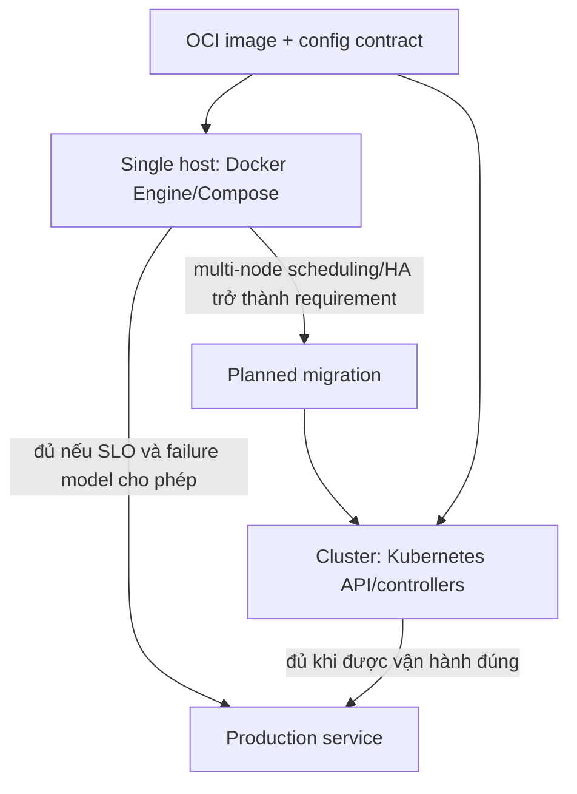

## Mental model: image, runtime, composition và orchestrator

Docker image là immutable-ish package gồm filesystem/config mặc định; container runtime tạo process cô lập bởi Linux namespaces/cgroups. Docker Engine vận hành container trên host. Compose mô tả nhiều service, network và volume, thường trên một Docker host. Kubernetes là cluster orchestrator: API lưu desired state; controller, scheduler, kubelet và networking/storage integrations liên tục reconcile workload trên nhiều node.

Vì vậy câu hỏi không phải “Docker **hay** Kubernetes” ở cùng tầng. Kubernetes vẫn chạy OCI-compatible container images qua container runtime; Docker/BuildKit có thể vẫn build image. Quyết định thật là: **đội ngũ cần single-host deployment đơn giản hay một cluster control plane có scheduling, reconciliation và ecosystem policy?**

## Bắt đầu từ SLO và failure model

Compose phù hợp với internal tool, edge appliance, development/staging hoặc service production nhỏ khi một host là failure domain chấp nhận được, traffic/capacity dự đoán được, deploy có maintenance window, và team có backup/restore/monitoring rõ. Ít moving parts giúp debug, patch và phục hồi dễ hơn. “Compose production” không có nghĩa chỉ chạy `docker compose up`: cần production override, restart policy, resource controls, secret handling, remote image registry, log rotation, host hardening, backup và tested replacement host.

Kubernetes đáng giá khi nhiều workload cần chia sẻ cluster, multi-node scheduling/self-healing, rolling rollout có capacity, service discovery, policy/RBAC, declarative automation hoặc một platform team cần interface chuẩn. Nó không tự tạo high availability: control plane, worker zones, load balancer, registry, DNS, CNI, CSI và dependency đều cần HA/operations. Một replica trên cluster vẫn là một replica; database gắn local volume vẫn có thể mất availability khi node hỏng.

Trước quyết định, trả lời bằng evidence:

| Dimension | Compose/single host có thể đủ khi | Kubernetes có lợi khi |
|---|---|---|
| Failure domain | Host outage và recovery time nằm trong SLO | Workload phải reschedule qua node/zone |
| Scale | Ít service/instance, capacity thay đổi chậm | Nhiều workload/team, bin-packing/autoscaling cần thiết |
| Rollout | Maintenance hoặc scripted replace chấp nhận | Cần rolling update, surge/unavailable policy, rollback signal |
| Isolation | Một trust boundary, host ownership rõ | Namespace/RBAC/policy/quotas cho nhiều tenant/team |
| State | External managed state hoặc host restore đơn giản | Cần CSI/operator nhưng team hiểu stateful failure |
| Skills/cost | Small team ưu tiên ít control plane | Có on-call/platform ownership và budget cluster |

Không đặt ngưỡng giả như “trên N microservice phải dùng Kubernetes”. Mười service stateful khó hơn một trăm stateless worker; SLO, churn, tenancy và operational capability quan trọng hơn số container.

## Contract portable trước platform

Một workload dễ chuyển nền tảng khi có các contract sau:

- image chạy non-root khi có thể, immutable và pin bằng digest ở release;
- config ngoài image; secret không bake vào layer hay Compose file;
- process xử lý `SIGTERM`, dừng nhận work và drain trong deadline;
- `/live` chỉ phản ánh deadlock/process, `/ready` phản ánh nhận traffic;
- stdout/stderr có structured logs và correlation; metrics/traces không phụ thuộc local file;
- data bền nằm trong managed service/volume có backup, restore và ownership;
- resource request/limit xuất phát từ load test, không copy tùy ý.

Các contract này có giá trị với cả Compose lẫn Kubernetes. Chuyển YAML không sửa được application shutdown, non-idempotent job hoặc filesystem assumption.

## Thiết kế Compose production có chủ đích

Dùng base Compose file cho invariant và production override cho image tag/digest, restart, logging, resource/config. Không bind-mount source code trong production. Chỉ publish port cần thiết; database ở internal network. Healthcheck không nên chứa credential nhạy cảm hay gọi toàn internet. Docker restart policy phục hồi process crash trên host còn sống, nhưng không reschedule qua host khác. Nếu host chết, runbook phải provision host thay thế, attach/restore data, pull verified images, start stack và validate.

Volume lifecycle tách container lifecycle; `docker compose down` và các option volume có hậu quả khác nhau, nên backup/restore phải test ngoài happy path. Default logging có thể làm đầy disk nếu không rotate/ship. Patch Docker host, kernel và base image là hai quy trình khác nhau. Một host mạnh vẫn có noisy neighbor; đặt CPU/memory limits và monitor cgroup/OOM.

## Kubernetes không miễn phí

Deployment controller hỗ trợ declarative rollout cho stateless ReplicaSet, nhưng readiness sai có thể đưa traffic vào pod chưa sẵn sàng; rolling policy thiếu surge capacity có thể stall. Self-healing thay Pod lỗi, không chữa corrupted data hay logical bug. Scheduler dựa trên requests/constraints, không biết business priority nếu chưa cấu hình. Limit quá thấp gây throttling/OOM; requests thấp gây overcommit.

Production cluster cần ít nhất: version/upgrade policy; API/RBAC/audit; network policy; admission/image policy; secret integration; requests/limits/quotas; PodDisruptionBudget và topology; ingress/gateway, DNS, CNI/CSI; observability; backup/restore cho cluster state **và** application data; runbook lost node/control plane. Managed Kubernetes chuyển một phần control-plane work cho provider, không chuyển ownership workload.

Chỉ dùng API/feature có trong minor đang chạy. Kubernetes docs current có thể mô tả feature mới hơn cluster; pin manifest schema/tooling, đọc deprecation guide và thử upgrade trên representative staging.

## Migration path và rollback

Migration an toàn theo capability gap:

1. Chuẩn hóa image/config/shutdown/health/telemetry trên Compose.
2. Đo baseline SLI, resource, dependency và restore time.
3. Chọn workload stateless, low-risk làm pilot; không mở đầu bằng database quan trọng.
4. Xây platform minimum: registry, ingress, secret, policy, GitOps/CI, observability và on-call.
5. Chạy song song/canary, kiểm chứng DNS, draining, autoscaling, node disruption.
6. Chỉ decommission đường cũ sau recovery drill và rollback window.

Rollback application không đồng nghĩa rollback schema. Database migration phải backward-compatible qua mixed versions: expand, backfill/observe, switch, rồi contract sau. Kubernetes rollback ReplicaSet không khôi phục external state.

## Failure scenarios và troubleshooting

- **Compose host reboot nhưng stack không trở lại:** restart policy/system service hoặc dependency order sai. Kiểm tra daemon, container exit, mount, port và secret; diễn tập restore sang host sạch.
- **Docker disk đầy:** image/layer, writable layer hoặc unrotated logs. Xác định consumer trước khi prune; retention/alert và immutable external log shipping.
- **Kubernetes Pending:** requests vượt allocatable, affinity/taint/PVC hoặc quota. Đọc scheduler events; không giảm requests mù.
- **Rollout Kubernetes treo:** readiness fail, image pull, insufficient surge capacity hoặc PDB. So Deployment condition, ReplicaSet, events và pod logs/probes.
- **Pod reschedule nhưng mất data:** workload đã ghi container filesystem/local path. Khôi phục từ backup và sửa storage contract; thêm replicas không thay durability.
- **Chi phí cluster tăng mà reliability không đổi:** control plane có nhưng single replica/dependency/zone vẫn là SPOF. Vẽ dependency/failure domain, đo SLO rồi đầu tư đúng bottleneck.

## Production checklist

- [ ] Decision record nêu SLO, failure domain, workload/state, team ownership và chi phí.
- [ ] Image digest, SBOM/provenance policy, non-root và patch cadence được quản lý.
- [ ] Config/secret/data/log không nằm trong ephemeral writable layer.
- [ ] Health, graceful termination, retry/idempotency và resource envelope đã load-test.
- [ ] Compose có host replacement + restore drill; Kubernetes có node/control-plane disruption drill.
- [ ] Rollout/rollback bao phủ app, config và database compatibility.
- [ ] Version/API compatibility được pin và kiểm tra trước upgrade.
- [ ] On-call có dashboard/runbook cho runtime, network, storage, DNS và dependency.

## Góc phỏng vấn

**Khi nào không chọn Kubernetes?** Khi một host/recovery đáp ứng SLO, ít workload, không có platform ownership và cluster complexity lớn hơn capability cần thiết. Tôi vẫn chuẩn hóa container contract để giữ migration path.

**Kubernetes self-healing bảo đảm gì?** Controller/kubelet có thể thay container/Pod hoặc reschedule theo desired state trong điều kiện control plane/node/resources hoạt động. Nó không bảo đảm application correctness, data durability hay zero downtime.

**Compose có dùng production được không?** Có trong phạm vi failure model phù hợp, với host hardening, backup/restore, resource/log/secret và automation. Nó không phải multi-node orchestrator.

## Key Takeaways

- Docker image/runtime và Kubernetes orchestration là các tầng khác nhau.
- Chọn platform từ SLO, state, failure domain, tenancy và năng lực on-call, không từ số service.
- Compose giảm complexity nhưng single-host recovery phải explicit; Kubernetes thêm capability lẫn operational surface.
- Portable application contract quan trọng hơn việc dịch YAML.
- Pilot, observe và recovery drill trước khi migration; rollback luôn xét cả external state/schema.
