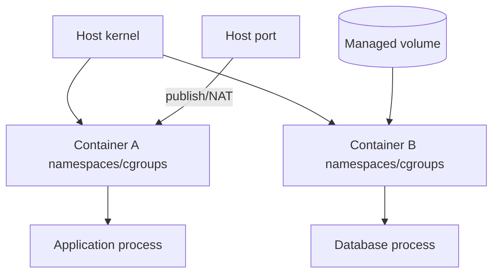

## Container không phải máy ảo nhỏ
Container là process trên host được cô lập bằng kernel primitives như namespaces, cgroups, capabilities và filesystem layers. Nó chia sẻ kernel host; isolation mạnh đến đâu phụ thuộc runtime, kernel, mount, capability và privilege configuration. “Chạy trong Docker” không tự động tạo security boundary ngang hypervisor.



## Networking: mỗi container có network view riêng
Container thấy interface, routing table, DNS và loopback của namespace nó. `localhost` bên trong API container là chính API container, không phải database container hay host. Để gọi service khác trên user-defined network, dùng DNS name/alias của service và container port; không hardcode container IP vì IP đổi khi recreate.

User-defined bridge cho container cùng Docker host, cung cấp name resolution và isolation với bridge khác. Default bridge có behavior legacy/kém rõ hơn. Overlay hoặc routing ngoài cần khi nhiều daemon/host; bridge không tự mở rộng cross-host.

`EXPOSE` trong Dockerfile chủ yếu là metadata/documentation. `--publish HOST:CONTAINER`/Compose `ports` mới làm port reachable qua host. Publish vào `0.0.0.0` có thể lộ ra mọi interface host; bind loopback khi chỉ cần local. Container cùng network gọi nhau trực tiếp bằng container port, không đi vòng host-published port.

```yaml title="compose-network-fragment.yml"
services:
  api:
    build: .
    ports:
      - "127.0.0.1:8080:8080"
    networks: [edge, data]
  database:
    image: postgres:18
    networks: [data]
    volumes:
      - db-data:/var/lib/postgresql/data

networks:
  edge: {}
  data:
    internal: true
volumes:
  db-data: {}
```

Đây là topology fragment, chưa phải production database config. API vào database qua hostname `database` và port database nội bộ; database không cần `ports`. Tag image mutable trong ví dụ học tập phải được thay bằng digest/version policy đã xác minh ở delivery pipeline.

DNS resolve được không chứng minh application healthy. Debug theo lớp: resolve name, connect TCP, TLS handshake, protocol/authentication. Ping có thể bị thiếu capability hoặc image không có tool; không kết luận network hỏng chỉ vì `ping` không chạy.

## Storage: writable layer không phải nơi giữ dữ liệu
Image layers read-only; container có writable layer riêng. Khi container bị remove, data trong layer đó mất. Copy-on-write layer phù hợp file tạm/log ngắn nhưng không phù hợp database/persistent user data và thường khó backup/di chuyển.

| Mount | Lifecycle/owner | Use case | Rủi ro |
|---|---|---|---|
| Named volume | Docker quản, độc lập container | Database/application data | Backup/permission vẫn phải thiết kế |
| Bind mount | Path host trực tiếp | Dev source/config, integration host | Coupling OS/path, host bị sửa |
| tmpfs | Memory host, ephemeral | Secret/temp nhạy cảm hoặc I/O tạm | Mất khi stop, tính vào memory |
| Writable layer | Cùng container | Cache/temp có thể bỏ | Mất khi recreate, CoW overhead |

Named volume tồn tại sau container lifecycle; xóa container không mặc định xóa named volume. Điều đó vừa bảo vệ data vừa có thể tạo orphan/cost. Label/owner/retention và backup inventory là cần thiết.

Bind mount có thể cho container sửa bất kỳ host path được mount. Mount read-only khi chỉ đọc; không mount Docker socket vào workload thường — socket gần như trao quyền điều khiển daemon/host. File permission dựa UID/GID nhìn qua namespace; “Permission denied” thường do owner/mode/SELinux/AppArmor, không nên chữa bằng `chmod 777`.

## Persistence không đồng nghĩa durability
Volume chỉ tách data khỏi container; nó không tự tạo replication, backup, consistent snapshot hay restore. Với database, filesystem copy khi process đang ghi có thể inconsistent. Dùng database-aware backup/snapshot protocol, kiểm tra checksum và diễn tập restore. RPO/RTO quyết định lịch backup/replication.

Không để nhiều database process cùng ghi một volume nếu engine không hỗ trợ coordination. Volume driver/network filesystem có consistency/locking/performance semantics riêng; benchmark đúng workload thay vì giả định volume nào cũng như local disk.

## Isolation và least privilege
Chạy process non-root trong image; nếu phải bind low port, cân nhắc port cao hoặc capability tối thiểu. Drop capabilities rồi add đúng cái cần. Giữ default seccomp thay vì `unconfined`; read-only root filesystem và writable mount chỉ ở path cần. Tránh `--privileged`, host PID/network và broad device mount.

```dockerfile title="Runtime hardening fragment"
FROM eclipse-temurin:21-jre
RUN useradd --system --uid 10001 appuser
WORKDIR /app
COPY --chown=appuser:appuser app.jar /app/app.jar
USER 10001
ENTRYPOINT ["java", "-jar", "/app/app.jar"]
```

Build stage/compiler nên tách khỏi runtime stage; example trên giả định `app.jar` đã được build/verify. Non-root không xóa mọi risk: kernel exploit, overly broad mount/capability và vulnerable app vẫn tồn tại.

Rootless Docker giảm privilege của daemon/container bằng user namespace nhưng có compatibility/network/storage trade-off. Nó là defense-in-depth, không thay patching, image provenance hay policy.

## Secret và configuration
Không bake secret vào image/layer hoặc commit Compose file. Environment variable tiện nhưng có thể lộ qua dump/debug/process tooling. File mount từ secret manager có permission hẹp và rotation contract thường tốt hơn; application phải reload/renew hoặc restart có kiểm soát. Không log config object toàn bộ.

Image cần immutable digest, minimal package, vulnerability policy và rebuild patch. Container runtime filesystem read-only không sửa được compromised dependency trong image; phải rebuild/redeploy.

## Troubleshooting flow
1. `docker inspect` xác nhận network, mount, user, health, restart/exit.
2. `docker logs` và process exit code; nhớ log driver/rotation.
3. Từ đúng network namespace, resolve service name và connect đúng container port.
4. Kiểm tra host binding/firewall nếu traffic từ ngoài.
5. Xác nhận mount source/target/read-only, UID/GID và disk/inode.
6. Kiểm tra cgroup memory/CPU, OOM và capability/seccomp denial.

Debug image production tối giản có thể không có shell/curl. Dùng toolbox container gắn cùng network namespace theo runbook thay vì cài tool vào image runtime và làm tăng attack surface.

:::warning Restart loop chỉ che triệu chứng
Restart policy hữu ích cho crash transient nhưng config sai/OOM sẽ loop. Giữ previous logs/exit reason, giới hạn retry và alert; sửa root cause thay vì tăng restart vô hạn.
:::

## Failure scenarios
- API gọi `localhost:5432`: đang gọi chính container API, không phải database.
- Database publish ra mọi host interface dù chỉ API cần truy cập: tăng exposure.
- Ghi upload vào writable layer: mất khi recreate.
- Bind mount source code read-write ở production: compromised app sửa host files.
- Container chạy root + privileged + Docker socket: breakout blast radius cực lớn.
- Backup volume raw lúc database đang ghi: restore không nhất quán.
- DNS name đúng nhưng application listen `127.0.0.1` trong container: peer không connect được; bind interface phù hợp.

## Production checklist
- User-defined network theo trust zone; chỉ publish port thật cần với host binding rõ.
- Service discovery bằng DNS name, không IP; timeout/TLS/auth được test riêng.
- Persistent data ở volume/storage có backup, restore drill, RPO/RTO.
- Bind mounts/read-write paths allowlist; UID/GID/MAC policy có test.
- Non-root, drop capability, default seccomp, no privileged/socket mount.
- Image digest/provenance/patch policy; secret ngoài image và không log.
- Debug runbook thu evidence trước restart/recreate.

## Góc phỏng vấn
Hãy nói container dùng shared host kernel với namespaces/cgroups, nên không mặc định như VM. Với network, giải thích localhost, bridge DNS và publish port. Với storage, phân biệt writable layer/volume/bind/tmpfs và nhắc backup semantics. Kết thúc bằng non-root, capabilities/seccomp, mount/socket risk và runbook evidence.

## Key Takeaways
- Network/mount/process đều nhìn qua namespace; debug phải đứng đúng boundary.
- Published port khác container port và Dockerfile `EXPOSE`.
- Volume tạo persistence, không tự tạo durability hay backup consistency.
- Least privilege container cần đồng thời user, capability, seccomp, mount và daemon boundary.
