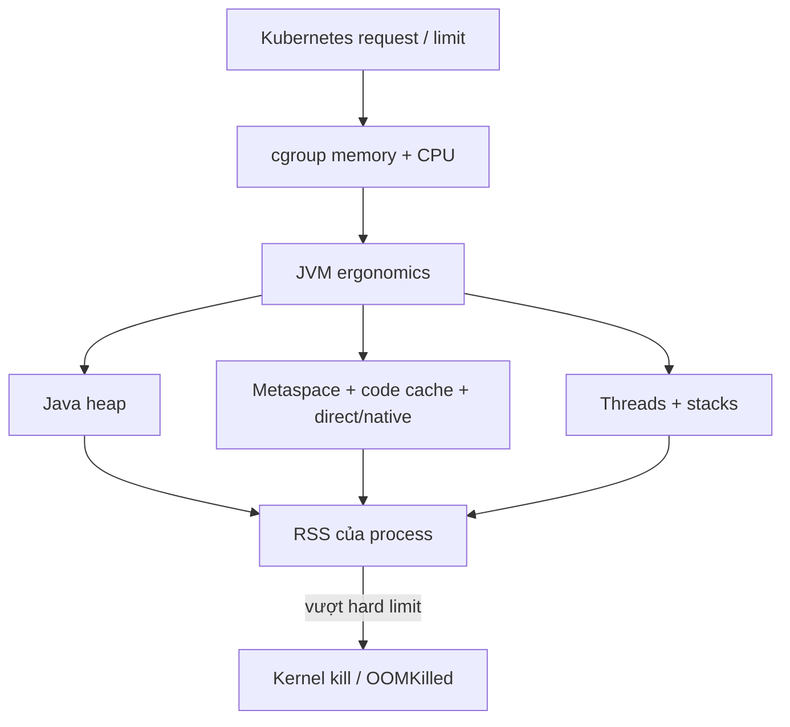

## Ba bộ điều khiển cùng tác động

JVM quyết định heap, collector, compiler và số worker từ tài nguyên nó quan sát được. Container runtime áp cgroup để giới hạn memory/CPU. Kubernetes scheduler và kubelet dùng `requests`, `limits` cùng QoS để đặt và bảo vệ Pod. Tuning chỉ một lớp dễ tạo cấu hình đúng cục bộ nhưng sai toàn hệ thống.



`-Xmx` chỉ giới hạn Java heap, không giới hạn Resident Set Size (RSS) của process. Ngoài heap còn có metaspace, code cache, GC structures, JIT, direct buffers, native libraries và stack của từng platform thread. Page cache và sidecar cũng tiêu thụ memory trong phạm vi Pod/node tùy cách đo. Vì vậy đặt `Xmx` bằng memory limit gần như loại bỏ safety margin.

## Memory budget có chủ đích

Một budget khởi đầu có thể được mô hình hóa:

```text
container limit
= max heap
+ metaspace/code cache
+ direct/native buffers
+ thread stacks
+ GC/JIT/native overhead
+ burst và diagnostic headroom
```

Không có tỷ lệ heap chung cho mọi ứng dụng. Netty/direct buffer, nhiều thread, agent quan sát, JNI hoặc workload compile-heavy có profile khác nhau. Chọn giả định ban đầu rồi đo RSS theo component dưới peak và degraded load. Nếu dùng percentage-based heap sizing, vẫn phải xác minh giá trị JVM tính ra trong chính image và limit production.

```text title="Kiểm tra runtime"
java -XshowSettings:system -XshowSettings:vm -version
jcmd <pid> VM.flags
jcmd <pid> GC.heap_info
jcmd <pid> VM.native_memory summary
```

Native Memory Tracking cần được bật trước khi dùng đầy đủ và có overhead; xem nó là diagnostic control, không phải phép đo miễn phí. Heap dump cũng cần disk/time và có thể gây pressure đúng lúc hệ thống đang thiếu tài nguyên. Kế hoạch incident phải xác định dump đi đâu và quota bao nhiêu.

:::production Budget thay vì “magic percentage”
Ghi trong runbook: container limit, Xmx/Xms, direct-memory policy, thread cap, sidecar budget, peak RSS quan sát được và headroom mục tiêu. Review lại khi đổi JDK, GC, agent hoặc traffic shape.
:::

## Java OOME khác OOMKilled

`java.lang.OutOfMemoryError` do JVM ném khi một vùng mà JVM quản lý không thể cấp phát, ví dụ heap, metaspace hoặc native thread. Process có thể còn sống đủ lâu để ghi log hay dump, nhưng không nên giả định nó phục hồi an toàn.

`OOMKilled` thường là kernel/cgroup chấm dứt process khi memory usage vượt giới hạn hoặc node chịu memory pressure. JVM có thể không kịp ném exception và application log có thể kết thúc đột ngột. Kubernetes status/exit code, kubelet events và cgroup/container metrics vì thế quan trọng hơn việc chỉ tìm stack trace Java.

| Dấu hiệu | Giả thuyết đầu tiên | Evidence cần lấy |
|---|---|---|
| Heap gần Xmx, full GC liên tục | live set/leak hoặc heap quá nhỏ | GC log, heap histogram/dump, allocation rate |
| RSS tăng nhưng heap ổn định | direct/native/thread/metaspace | native memory, thread count, direct buffer metrics |
| Container terminated, không có OOME | cgroup/node OOM | Pod last state, exit code, events, working set/RSS |
| Restart khi startup | heap ergonomics, probe hoặc limit | container args, JVM settings, startup memory curve, events |

## Requests, limits và QoS

Memory request giúp scheduler tìm node có capacity; memory limit là hard boundary được kernel/kubelet thực thi. CPU request ảnh hưởng scheduling và CPU share khi tranh chấp. CPU limit thường được thực thi bằng quota: process có thể bị throttled dù node còn thấy “CPU utilization” không quá cao trong cửa sổ quan sát.

QoS của Pod được suy ra từ requests/limits của containers. Nó ảnh hưởng thứ tự eviction khi node thiếu tài nguyên, nhưng không biến Pod thành bất tử. Một sidecar thiếu request hoặc limit cũng có thể thay đổi QoS và tổng budget.

```yaml title="deployment-resources.yaml"
resources:
  requests:
    cpu: "750m"
    memory: "1Gi"
  limits:
    cpu: "1500m"
    memory: "1536Mi"
```

Đây chỉ là syntax, không phải giá trị khuyến nghị. Giá trị phải đến từ load test và production telemetry. Memory là tài nguyên khó thu hồi: vượt limit có thể bị kill. CPU là compressible: quota thấp thường biểu hiện thành throttling và latency chứ không kill process.

## CPU quota thay đổi hành vi JVM

CPU throttling kéo dài stop-the-world work, request service time và queue wait. Nó cũng làm GC, JIT compilation và application threads tranh nhau một budget nhỏ. Tăng thread pool không tạo thêm CPU; nó có thể tăng context switching, allocation và queueing.

JVM hiện đại có container awareness, nhưng cần xác minh `availableProcessors`, heap ergonomics và collector trong môi trường chạy thật. Nếu quota thay đổi mà pool được hard-code theo số core của node hoặc build machine, runtime có thể oversubscribe. `-XX:ActiveProcessorCount` là một control mạnh; chỉ dùng khi hiểu vì sao detection/default không phù hợp và kiểm chứng tác động tới GC cùng common pools.

:::warning Misconception
CPU usage 100% của limit không nhất thiết là node hết CPU. Ngược lại, metric CPU trung bình thấp không loại trừ throttling theo period hoặc burst gây p99 cao. Luôn ghép usage với throttled time/periods, runnable threads và latency.
:::

## Thread, connection và memory là cùng một bài toán capacity

Mỗi platform thread có native stack và scheduling cost. Một request thread có thể giữ database connection, buffer và object graph. Nếu HTTP concurrency lớn hơn nhiều connection pool, request chỉ chuyển từ queue ở ingress sang queue chờ connection. Virtual threads giảm chi phí thread chờ nhưng không tăng connection hoặc downstream capacity.

Giới hạn cần nhất quán theo đường đi:

```text
admission / in-flight request
→ worker or virtual-thread task
→ connection pool
→ downstream concurrency
→ timeout budget
```

Unbounded queue che overload cho tới khi latency và memory cùng tăng. Ưu tiên bounded admission, deadline propagation và metric queue wait. Little's Law giúp kiểm tra tính hợp lý: khi throughput ổn mà response time tăng, số request in-flight/queued sẽ tăng tương ứng.

## Quy trình điều tra OOMKilled

1. Xác nhận thời điểm, container nào bị kill, `lastState`, exit reason/code và node events.
2. Ghép timeline deployment/config/traffic với memory working set, RSS, heap, GC, native/thread count.
3. Phân loại: heap live-set, allocation burst, off-heap/direct, thread explosion, metaspace/classloader, sidecar hay node pressure.
4. Kiểm tra limit/Xmx/flags thực tế trong Pod; không suy ra từ manifest template chưa render.
5. Tái hiện bằng workload đại diện và giới hạn giống production; thay đổi một biến.
6. Fix root cause hoặc budget, rồi soak test qua nhiều GC cycle và failure path.
7. Xác minh restart count, headroom, latency/throughput và alert trước khi rollout rộng.

Các “fix” nguy hiểm gồm tăng limit mà không kiểm tra node capacity, giảm Xmx đến mức GC thrash, thêm replica làm database quá tải, hoặc bật heap dump vào volume không đủ chỗ.

## Điều tra CPU throttling và p99

Tách service time khỏi queue time. Xem CPU throttled seconds/periods, runnable threads, GC pause/concurrent CPU, JIT activity, allocation và downstream wait trên cùng timeline. Chạy profile ngắn có kiểm soát; không kết luận “CPU-bound” chỉ từ CPU utilization.

Nếu limit là nguyên nhân, alternatives gồm tăng quota, giảm work/allocation, thay concurrency, autoscale bằng signal phù hợp hoặc bỏ CPU limit theo policy của tổ chức. Mỗi lựa chọn có trade-off về fairness và noisy neighbor. Sau thay đổi, so cùng load shape và kiểm tra cả p50 lẫn p99, throughput, error và cost.

## Trả lời phỏng vấn

:::interview Vì sao Pod bị OOMKilled dù heap chưa đầy?
Vì container limit áp lên memory của process/cgroup, còn Xmx chỉ là Java heap. Metaspace, code cache, direct buffers, native libraries, thread stacks, GC/JIT và sidecar vẫn dùng memory. Tôi kiểm tra Pod last state/events và RSS trước, rồi đối chiếu heap, native memory, thread count và flags thực tế để lập lại memory budget.
:::

Senior follow-up: CPU request khác limit thế nào; virtual threads ảnh hưởng native memory ra sao; tại sao tăng replica có thể làm outage nặng hơn; heap dump trong OOM path có rủi ro gì; làm sao phân biệt memory leak và working-set hợp lệ.

## Key Takeaways

- Container limit không đồng nghĩa heap limit; `Xmx == limit` thường thiếu headroom.
- Java OOME và kernel/cgroup OOMKilled có evidence path khác nhau.
- CPU throttling có thể làm p99/GC xấu mà không tạo crash.
- Pool, queue, thread và connection phải được budget như một flow.
- Mọi resource value cần được kiểm chứng bằng workload representative và telemetry trong đúng runtime.
