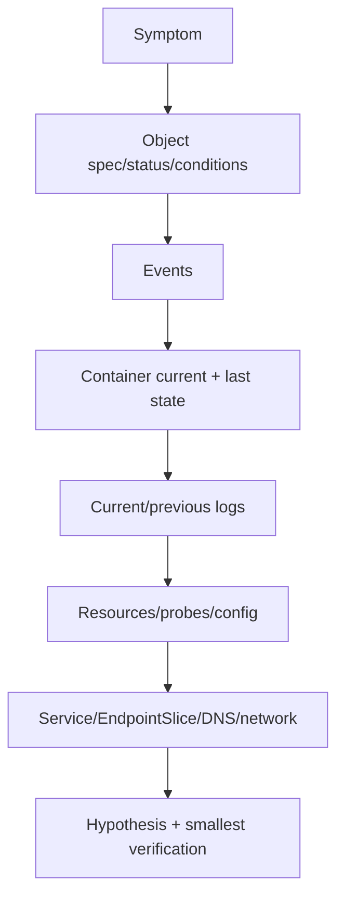

## Nguyên tắc: symptom → layer → evidence → hypothesis
`CrashLoopBackOff` không phải nguyên nhân; nó cho biết kubelet đang backoff giữa các lần restart container liên tục. “Service timeout” cũng có thể do application, readiness, selector, EndpointSlice, network policy, DNS hoặc upstream. Thu evidence trước khi delete Pod, vì restart có thể xóa state/log quan trọng và tạo outage rộng hơn.



## Đọc Pod đúng cấu trúc
Pod `phase` là summary thô. Mỗi container có state `Waiting`, `Running` hoặc `Terminated`, cùng `reason`, exit code, start/finish. Conditions như `PodScheduled`, `Initialized`, `ContainersReady`, `Ready` chỉ ra pha. Events cho scheduling, mount, pull, probe và kubelet action nhưng có retention; lấy sớm.

```powershell title="Evidence-first commands"
kubectl get pod api-7d9f -n learning -o wide
kubectl describe pod api-7d9f -n learning
kubectl logs api-7d9f -n learning -c api
kubectl logs api-7d9f -n learning -c api --previous
kubectl get pod api-7d9f -n learning -o yaml
kubectl get events -n learning --sort-by=.metadata.creationTimestamp
```

`--previous` rất quan trọng khi current container vừa restart và log hiện tại sạch. Multi-container Pod phải chỉ đúng `-c`; init container có status/log riêng. Timestamp/correlation/deployment revision giúp nối với rollout/config change.

## Pending và image/startup failures
Pod Pending: xem scheduler event trước. Nguyên nhân thường là request không fit allocatable, affinity/taint/PVC/quota, không phải application. Tăng node hoặc giảm request chỉ sau khi kiểm tra demand/capacity; ép request thấp có thể chuyển Pending thành OOM/latency.

`ImagePullBackOff`: kiểm tra image reference/digest, registry DNS/TLS/auth, pull secret scope và platform architecture. Đừng đổi thành `latest` để “thử”; làm mất reproducibility.

`CreateContainerConfigError`: thường thiếu ConfigMap/Secret key hoặc mount invalid. So manifest revision với object thực, nhưng không in raw Secret vào ticket/log.

## CrashLoopBackOff
Flow chẩn đoán:
1. `lastState.terminated.reason` và exit code.
2. Previous log; application stack trace/config validation.
3. Liveness/startup probe event.
4. Resource OOM/CPU/disk; dependency timeout.
5. Command/args, working directory, file permission, architecture.

Exit 0 nhưng restart có thể do workload dùng Deployment cho process chạy xong; dùng Job/CronJob nếu semantics là completion. Exit code 137 thường liên quan SIGKILL/OOM nhưng phải xác nhận `reason: OOMKilled`, không suy luận chỉ từ số.

Kubernetes backoff restart để tránh loop nóng. Delete Pod chỉ reset instance/backoff tạm thời; ReplicaSet tạo Pod cùng spec và lỗi lại.

## OOMKilled và resource
Container memory limit được kernel/cgroup enforce phản ứng bằng kill khi pressure. Memory gồm heap, native/direct buffer, thread stack, shared library và một phần filesystem/tmpfs/page cache theo runtime; heap max thấp hơn limit vẫn có thể OOMKill.

Phân biệt:
- Container `OOMKilled`: process vượt/pressure trong cgroup limit.
- Node pressure eviction: kubelet evict Pod do node thiếu resource; event/reason khác.
- Application `OutOfMemoryError`: runtime bắt/ghi lỗi, có thể exit trước kernel kill.

So usage/working set/limit trước crash, restart trend và workload correlation. Memory metric sau restart về thấp sẽ che peak; cần time series. Heap dump có thể chứa secret/PII và cần disk/permission/retention; không bật tùy tiện trong incident.

Fix có thể là leak/retention/buffer/concurrency, request/limit hoặc workload split. Tăng limit không chữa leak và có thể chuyển blast radius sang node.

## Probe failure
Readiness fail gỡ Pod khỏi EndpointSlice phục vụ; liveness fail restart; startup giữ hai probe kia chờ startup. Nếu cùng endpoint sâu gọi database, một DB incident có thể làm toàn fleet unready rồi restart.

Kiểm tra path/port/scheme, bind address, timeout/threshold/initial delay và response khi load. Thử từ network namespace phù hợp. Probe HTTP tới container không đi qua external ingress; external URL thành công/thất bại không trực tiếp chứng minh probe.

Readiness flapping tạo traffic oscillation: mỗi Pod fail làm tải dồn lên Pod còn lại, chúng tiếp tục fail. Điều chỉnh chỉ sau khi phân tích capacity/dependency; dùng startup probe cho warm-up thay vì nới liveness vô hạn.

## Service từ ngoài vào trong
Debug lần lượt, không nhảy thẳng CNI:
1. Service tồn tại, đúng namespace/type/ports/targetPort.
2. DNS name resolve từ một client Pod cùng policy.
3. EndpointSlice có ready endpoint; selector có match Pod label.
4. Kết nối thẳng Pod IP:targetPort từ client Pod.
5. Application listen đúng port và `0.0.0.0`/interface phù hợp, không chỉ loopback.
6. NetworkPolicy/service mesh/CNI/kube-proxy implementation.

```powershell title="Service path checks"
kubectl get service catalog -n learning -o yaml
kubectl get endpointslice -n learning -l kubernetes.io/service-name=catalog
kubectl get pod -n learning -l app=catalog --show-labels
kubectl describe networkpolicy -n learning
```

EndpointSlice rỗng thường là selector/label mismatch hoặc Pod không ready. Nếu endpoint có nhưng Service fail, thử Pod endpoint để chia đôi: application/Pod path hay Service routing.

## DNS
Tên ngắn phụ thuộc namespace/search domains và `ndots`; dùng FQDN `service.namespace.svc.cluster.local` để phân biệt search issue. Từ debug Pod, kiểm tra `/etc/resolv.conf`, `nslookup` tên ngắn/FQDN, DNS Service/EndpointSlice và CoreDNS logs. DNS lookup thành công nhưng TCP fail là lớp sau, không tiếp tục sửa CoreDNS.

DNS intermittent có thể do CoreDNS capacity, packet loss, upstream timeout, search amplification hoặc node-local config. Đo request rate, latency/rcode và phân bố node; restart CoreDNS không phải RCA.

:::warning Debug container và production image
Image tối giản có thể không có shell/curl/nslookup. Dùng ephemeral debug container theo quyền/runbook. Không biến production image thành toolbox root và không attach vào Pod nhạy cảm thiếu audit.
:::

## Configuration và rollout correlation
So Pod template hash, image digest, ConfigMap/Secret version và rollout time. Environment variable từ ConfigMap/Secret không tự đổi trong process khi object cập nhật; volume update/reload behavior khác và application phải hỗ trợ. Immutable config/versioned name giúp biết Pod nào chạy cấu hình nào.

Nếu chỉ revision mới lỗi, pause rollout và so old/new. Rollback image không undo DB migration/config external. Giữ old image/chunk/schema compatibility như kế hoạch delivery.

## Incident hygiene
- Ghi timestamp/timezone, cluster/context/namespace và command output liên quan.
- Không paste token, secret, full env hoặc customer payload.
- Thay đổi một biến, quan sát; annotate manual action.
- Đặt time bound cho hypothesis; escalate đúng owner (app/platform/network).
- Sau phục hồi, lưu timeline/root cause/fix/guardrail, không chỉ “restart resolved”.

## Failure scenarios
- Delete Pod trước lấy previous log: mất evidence, lỗi lặp.
- Tăng liveness timeout chữa DB outage: chỉ trì hoãn symptom.
- Service selector typo: Pod Running nhưng EndpointSlice rỗng.
- App listen localhost trong container: probe kiểu exec có thể pass, peer connection fail.
- Memory graph bình thường sau restart: bỏ lỡ peak OOM trước đó.
- DNS short name fail cross-namespace: dùng đúng namespace/FQDN, không hardcode ClusterIP.
- Debug nhầm cluster/context: mọi evidence và mutation vô nghĩa/nguy hiểm.

## Production checklist
- Dashboard giữ restart/last termination/OOM/probe/event/rollout revision.
- Log aggregation giữ previous instance với correlation và redaction.
- Runbook theo object→event→container→resource→service→DNS/network.
- Debug tooling/ephemeral container có RBAC và audit.
- Probe semantics, resource sizing và graceful shutdown được failure-test.
- Config/image/schema revision trace được tới từng Pod.
- Post-incident action thêm detection/test/limit, không chỉ tài liệu.

## Góc phỏng vấn
Khi được hỏi CrashLoopBackOff, nói ngay đó là backoff symptom. Đọc last terminated reason/exit, previous log, events, probes và OOM/resource. Với Service timeout, đi Service→DNS→EndpointSlice→Pod endpoint→policy/CNI. Câu trả lời tốt bảo toàn evidence trước restart và phân biệt app/platform layers.

## Key Takeaways
- Status summary không phải root cause; container last state/event/previous log mới là evidence.
- OOM, probe và dependency failure có action khác nhau.
- Debug Service/DNS theo từng hop để chia đôi failure domain.
- Restart phục hồi tạm thời không được ghi thành nguyên nhân.
