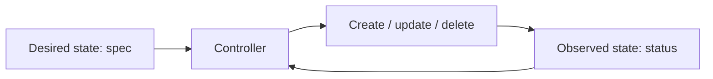

## Desired và observed state
Kubernetes object là record of intent. spec mô tả desired state; status phản ánh observed state. Controller liên tục quan sát chênh lệch và hành động để hội tụ. kubectl chỉ là client gọi API, không phải bản chất hệ thống.

## Workload và networking
Pod là scheduling unit ngắn hạn. Deployment quản lý ReplicaSet/rolling update cho stateless workload; StatefulSet thêm stable identity/ordered behavior nhưng không tự vận hành database an toàn. Service tạo stable discovery/virtual endpoint cho Pod thay đổi.

## Requests, limits, probes
Scheduler dùng requests để placement; CPU limit throttles, memory limit có thể OOMKill. Request quá thấp gây overcommit, quá cao lãng phí/không schedule. Readiness bỏ Pod khỏi traffic; liveness restart. Probe sai có thể tạo cascading restart.

:::warning Secret object
Tên “Secret” không mặc định đồng nghĩa dữ liệu được mã hóa end-to-end. Cần encryption at rest, RBAC, workload identity/external secret manager và tránh expose qua log/env dump.
:::

## Troubleshooting flow
1. kubectl get/describe: phase, condition, event, scheduling.
2. logs của container hiện tại và previous.
3. requests/limits, probe, config/secret mount.
4. Service selector, EndpointSlice, NetworkPolicy, DNS.
5. Node pressure, rollout history và control-plane signal.

## Key Takeaways
- Controller hội tụ, không thực thi một lần.
- Pod là disposable; Service cho endpoint ổn định.
- Resource/probe config là behavior production.
- Autoscaling không sửa dependency bottleneck.
