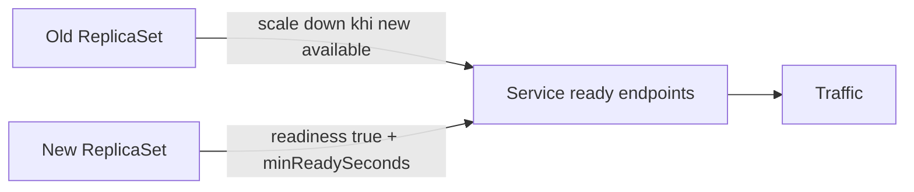

## “RollingUpdate” chưa đồng nghĩa zero downtime
Deployment tạo ReplicaSet mới, tăng Pod mới và giảm Pod cũ theo `maxSurge`/`maxUnavailable`. Traffic chỉ an toàn khi Pod mới thật sự sẵn sàng, Pod cũ ngừng nhận request rồi hoàn tất in-flight work, hai version tương thích đồng thời và cluster còn capacity cho surge.

Ví dụ 10 replica, `maxUnavailable: 0`, `maxSurge: 2` yêu cầu có chỗ chạy tối đa 12 Pod trong rollout. Nếu node hết CPU/memory, Pod mới Pending và rollout đứng. `maxUnavailable: 1` cho phép capacity phục vụ giảm còn 9; nếu peak cần đủ 10 thì latency/error tăng dù controller hoạt động đúng.



## Ba probe, ba câu hỏi
| Probe | Câu hỏi | Failure action |
|---|---|---|
| Startup | Process đã khởi động xong chưa? | Giữ liveness/readiness chưa chạy |
| Readiness | Pod có nên nhận traffic lúc này? | Gỡ endpoint khỏi Service |
| Liveness | Process có kẹt và cần restart không? | Kubelet restart container |

Readiness có thể kiểm tra dependency thiết yếu để phục vụ request, nhưng nếu mọi Pod cùng mark unready khi một downstream chung chập chờn, toàn service biến mất khỏi routing và cascade nặng hơn. Liveness phải kiểm tra process deadlock/không hồi phục, không phụ thuộc database/internet; restart không chữa outage dependency.

Startup probe cho app warm-up lâu mà không phải đặt liveness threshold khổng lồ suốt lifetime. Probe endpoint phải nhẹ, bounded, không mutate state và không tạo log spam.

```yaml title="deployment-fragment.yaml"
strategy:
  type: RollingUpdate
  rollingUpdate:
    maxUnavailable: 0
    maxSurge: 1
minReadySeconds: 15
progressDeadlineSeconds: 600
template:
  spec:
    terminationGracePeriodSeconds: 45
    containers:
      - name: api
        ports:
          - name: http
            containerPort: 8080
        startupProbe:
          httpGet: { path: /health/startup, port: http }
          periodSeconds: 5
          failureThreshold: 24
        readinessProbe:
          httpGet: { path: /health/ready, port: http }
          periodSeconds: 5
          failureThreshold: 2
        livenessProbe:
          httpGet: { path: /health/live, port: http }
          periodSeconds: 10
          failureThreshold: 3
        resources:
          requests: { cpu: 250m, memory: 384Mi }
          limits: { memory: 512Mi }
```

Đây là fragment tập trung vào rollout/probe/resource nên cố ý lược `image` và metadata bắt buộc của manifest đầy đủ. Giá trị probe/resource phải đến từ measurement workload; copy cấu hình này nguyên xi có thể sai.

## Graceful termination
Khi Pod bị terminate, application phải chuyển unready, ngừng nhận work mới, xử lý/cancel in-flight trong deadline rồi đóng connection. `preStop` có thể hỗ trợ khoảng propagation nhưng sleep cố định không chứng minh traffic đã drain. Load balancer, EndpointSlice, service mesh và client keep-alive có thời gian hội tụ riêng.

Application bắt SIGTERM, dừng consumer polling trước, commit/checkpoint work an toàn, flush telemetry có giới hạn và exit trước `terminationGracePeriodSeconds`. Nếu request/job dài hơn grace period, redesign thành async/checkpoint thay vì tăng grace vô hạn.

## Request, limit và capacity
Scheduler dùng request để placement. CPU request ảnh hưởng share khi contention; CPU limit có thể throttle. Memory limit vượt quá thường dẫn tới OOM kill; memory không thể throttled như CPU. Request quá thấp cho phép overcommit và eviction/latency; quá cao làm Pod Pending/lãng phí.

Đặt request từ distribution quan sát được và load test, gồm startup peak, GC/native memory và sidecar. Autoscaler cần metric phản ánh demand và request hợp lý; HPA theo CPU percentage trên request sẽ sai nếu request tùy tiện. Limit không thay admission control/backpressure trong application.

## Compatibility trong rollout
Trong rolling deployment, old và new version chạy đồng thời. API/event/schema phải tương thích ít nhất trong cửa sổ rollout và rollback. Database migration dùng expand-contract:
1. Thêm column/table/index tương thích, chưa xóa/rename.
2. Deploy code đọc/ghi được cả shape cần thiết; backfill có throttle/checkpoint.
3. Chuyển read path, quan sát và giữ rollback window.
4. Chỉ contract/xóa sau khi không còn binary cũ và consumer cũ.

Rollback image không rollback database mutation hay external side effect. Migration destructive chạy trước deploy có thể làm old Pods lỗi ngay, phá chính cơ chế rolling update.

## PDB và availability domain
PodDisruptionBudget giới hạn voluntary eviction như node drain qua Eviction API; nó không chặn mọi delete, involuntary node failure, và Deployment rolling update được điều khiển bằng strategy riêng. Replica nên spread qua node/zone failure domain. Ba replica trên một node không tạo high availability.

:::warning Readiness flapping
Threshold quá nhạy khiến Pod liên tục vào/ra endpoint, tăng retry và tải lên Pod còn lại. Theo dõi probe latency/failure reason; dùng hysteresis/threshold hợp lý và sửa root cause thay vì chỉ tăng timeout.
:::

## Release gates và quan sát
CI chỉ nên đánh dấu rollout thành công khi Deployment progressing/available, error rate/latency/saturation không xấu và business smoke test qua. `progressDeadlineSeconds` chỉ surfacing condition; controller không tự rollback ứng dụng theo business metric. Pipeline/operator phải quyết định pause/rollback.

Canary giảm blast radius bằng một phần traffic/replica và so sánh metric với baseline. Deployment thuần rolling không cung cấp traffic split chính xác theo phần trăm; cần routing/controller phù hợp nếu đó là requirement.

## Failure scenarios
- Pod ready trước khi cache/model warm: `minReadySeconds` và readiness phản ánh khả năng phục vụ thực.
- Liveness gọi database, DB outage restart toàn fleet: tách liveness khỏi dependency.
- Surge Pod Pending: kiểm tra requests, quota, affinity, capacity trước khi sửa probe.
- SIGTERM nhưng consumer tiếp tục nhận message: dừng intake trước, checkpoint/idempotency cho redelivery.
- Rollback binary nhưng schema đã drop: expand-contract và rollback rehearsal.
- PDB chặn node drain do app không healthy: runbook phân biệt bảo vệ availability với deadlock vận hành.

## Production checklist
- Tính min available/surge capacity từ peak load và failure budget.
- Startup/readiness/liveness kiểm tra đúng câu hỏi, có timeout và metric.
- Graceful shutdown được test với keep-alive, long request và message consumer.
- Request/limit dựa measurement; dashboard có throttle, OOM, eviction, Pending.
- Old/new API, event và schema tương thích qua rollout/rollback window.
- Pipeline kiểm tra rollout condition + SLI; có pause/rollback owner/runbook.

## Góc phỏng vấn
Câu trả lời senior về zero downtime phải có bốn lớp: Deployment surge/unavailable và capacity; probe đúng semantics; graceful drain; compatibility của schema/API/event. Nhắc rằng PDB không kiểm soát rolling update và rollback image không undo migration dữ liệu. Đó là khác biệt giữa thuộc YAML và hiểu release behavior.

## Key Takeaways
- Controller chỉ hội tụ desired state; application quyết định khi nào thực sự ready.
- Resource request/limit ảnh hưởng trực tiếp scheduling, throttling và OOM.
- Zero downtime cần capacity, drain và backward compatibility, không chỉ replica > 1.
- Rollout an toàn được chứng minh bằng SLI và failure drill.
