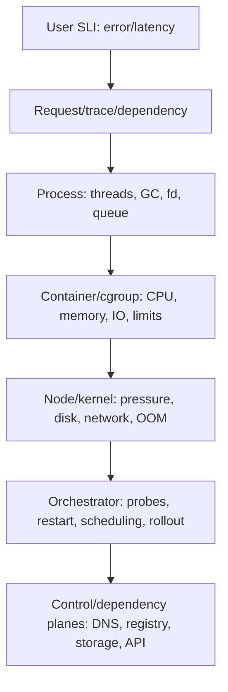

## Mental model: theo request rồi đi xuống các lớp

Container không phải máy ảo nhỏ. Application vẫn là Linux process trên kernel node, chỉ nhìn filesystem/network/PID namespace và bị cgroup giới hạn resource. Một symptom “API chậm” có thể nằm ở code/lock, runtime GC, CPU quota, memory reclaim, disk, conntrack/DNS, node pressure, proxy hoặc downstream. Debug hiệu quả bắt đầu từ impact/timeline và lần theo evidence, không chạy một danh sách lệnh ngẫu nhiên.



Trước thay đổi, ghi incident window, affected cohort/version/node/zone, request ID và recent deploy/config. Bảo toàn logs/events/core/profile khi policy cho phép. Restart có thể phục hồi service nhưng xóa evidence; nếu phải restart vì SLO, snapshot những dữ liệu rẻ và ghi rõ giới hạn điều tra.

## Bốn signal và giới hạn

**Metrics** trả lời mức độ/phạm vi: rate, error, duration, saturation, restarts, throttle, memory/IO. Aggregate che tail và cohort; luôn cắt theo version/node/zone nhưng tránh cardinality không kiểm soát. **Logs** cho discrete event/context; stdout/stderr cần structured fields, rotation và external shipping. Docker cảnh báo default logging behavior/driver cần cấu hình; log file đầy disk có thể trở thành outage.

**Traces** nối request qua service, nhưng sampling có thể bỏ rare failure; propagate context qua async boundary và log trace ID. **Profiles/dumps** cho CPU allocation/thread/heap sâu nhưng có overhead và dữ liệu nhạy cảm. Dùng sampling/bounded duration, quyền hạn và storage retention. Không “bật debug log toàn fleet” vô hạn.

Health probe chỉ là control signal. Startup probe ngăn liveness/readiness chạy trước khi app khởi động xong; readiness rút Pod khỏi Service; liveness restart container. Liveness gọi dependency bên ngoài có thể restart cả fleet khi dependency lỗi. Probe 200 không chứng minh business path tốt, và probe quá nặng tự tạo tải.

## CPU: utilization khác throttling

CPU host còn rảnh nhưng container vẫn chậm nếu cgroup quota đã hết trong period. Đọc container CPU usage cùng throttled periods/time, request concurrency, run queue và application profile. Kubernetes CPU request ảnh hưởng scheduling; limit có thể tạo CFS throttling tùy runtime/platform. Đừng kết luận chỉ từ `docker stats` một snapshot—lấy time series và so với latency.

```bash
docker stats --no-stream <container>
docker inspect <container>
kubectl top pod -n <ns> <pod> --containers
kubectl describe pod -n <ns> <pod>
```

Nếu CPU usage cao: tách useful work, retry loop, serialization, GC hay crypto; lấy profile có giới hạn. Nếu usage thấp nhưng latency cao: xem throttling, blocked IO/lock, downstream và connection pool. Tăng limit trước khi hiểu workload có thể chỉ chuyển bottleneck hoặc gây noisy neighbor. Với multi-thread runtime, kiểm tra nó có nhận biết container CPU/memory và version đang dùng.

## Memory: working set, limit và OOM

RSS, cache, heap, native/direct memory và mapped files khác nhau. `docker stats` CLI có cách trình bày memory/cache phụ thuộc platform; dashboard phải ghi rõ metric. Container `OOMKilled` thường nghĩa cgroup/node đã kill process khi memory pressure/limit, nhưng cần xem Pod `lastState`, exit code/reason, node events/kernel evidence và timeline. Application-level `OutOfMemoryError` có thể xảy ra trước hoặc không trùng cgroup OOM.

Runbook:

1. xác nhận restart count, reason và thời điểm;
2. so working set/RSS/limit, allocation/GC và traffic;
3. kiểm tra node `MemoryPressure`, eviction và pod cùng node;
4. tách heap, native, thread stack, direct buffer/page cache;
5. lấy heap/native evidence có kiểm soát trước restart nếu đủ headroom;
6. sửa leak/unbounded queue hoặc sizing; load-test lại.

Không tăng memory limit mù: leak chỉ mất lâu hơn để nổ và có thể kéo node vào pressure. Không đặt limit sát steady heap; tính peak, native overhead và graceful degradation. Admission/backpressure bảo vệ memory tốt hơn một queue vô hạn.

## Disk, filesystem và file descriptors

Writable container layer là ephemeral và copy-on-write có thể đắt; logs/temp/cache lớn nên có quota/retention và volume phù hợp. Kiểm tra bytes **và inode**, filesystem read-only, volume mount, storage latency, node ephemeral-storage pressure. `No space left on device` có thể là hết inode dù còn GB. Deleted file vẫn giữ space nếu process còn open descriptor.

File descriptor/socket leak biểu hiện `too many open files`, connect fail hoặc latency. So process FD count/limit, connection states, client pool và timeout/close semantics. Không nâng `ulimit` như fix duy nhất. Image filesystem nên immutable; debug artifact đẩy ra external storage theo policy, không cài tool trực tiếp làm drift.

## Network và DNS theo từng hop

Tách: name resolution → route/policy → TCP connect → TLS → HTTP/gRPC → dependency queue. Kiểm tra từ cùng network namespace vì node shell có path khác Pod. DNS lỗi có thể do CoreDNS/service/endpoints, resolver search/`ndots`, stale cache hoặc blocked UDP/TCP. Connect timeout khác connection refused; TLS hostname/CA/clock khác HTTP 5xx.

```bash
kubectl get pod -n <ns> <pod> -o wide
kubectl get svc,endpointslice -n <ns>
kubectl logs -n <ns> <pod> -c <container> --previous
kubectl debug -n <ns> -it <pod> --image=<approved-debug-image> --target=<container>
```

`--previous` hữu ích khi container restart. Ephemeral container dành cho troubleshooting khi image distroless thiếu shell/tool; nó không được thêm bằng cách sửa Pod spec thông thường và có lifecycle/resource constraints được Kubernetes tài liệu hóa. Debug image phải pin/scan/approve, không chứa credential mặc định. RBAC cho `pods/ephemeralcontainers` là quyền mạnh; audit mọi session. Process namespace visibility phụ thuộc target/runtime configuration, nên không giả định luôn thấy process cần debug.

Packet capture, `/proc`, environment và memory dump có thể lộ token/PII. Giới hạn namespace, thời gian, filter, output destination và người đọc; xóa artifact theo retention. Không paste toàn bộ environment vào ticket/chat.

## Orchestrator evidence và failure scenarios

**CrashLoopBackOff:** đây là backoff symptom. Xem `lastState`, exit code/signal, `--previous` logs, events, command/config/secret/mount, startup/liveness và node. Fix probe chỉ khi probe sai; đừng kéo delay để che app crash.

**Latency chỉ ở một node:** group metrics/traces theo node; kiểm tra CPU steal/throttle, memory/disk pressure, CNI/conntrack/DNS, daemonset và hardware. Cordon/drain có thể giảm impact nhưng cần giữ evidence và tôn trọng PDB/state.

**Logs biến mất sau restart:** logging driver/rotation/shipper hoặc multiline parsing sai. Dùng external durable sink, test rotation/backpressure; logging pipeline hỏng không nên block application vô hạn trừ compliance contract rõ.

**Readiness flapping:** threshold quá nhạy, endpoint probe phụ thuộc shared dependency hoặc thread pool chung đang nghẽn. So probe latency/error với app saturation; thêm hysteresis, lightweight local readiness và degraded mode.

**CPU “100%” nhưng node rảnh:** chuẩn hóa denominator (core, quota hay node), xem throttling counters và limit. Một core fully used có thể hiển thị khác giữa tools.

**OOM không có app log:** kernel kill không cho process flush. Dựa vào termination reason/node/kernel telemetry, pre-OOM memory profile và bounded dump policy.

## Production checklist

- [ ] SLI/trace/log liên kết version, pod/container, node, zone và dependency mà không bùng cardinality.
- [ ] CPU usage đi cùng quota/throttle; memory metric ghi rõ working set/RSS/cache và limit.
- [ ] Logs có rotation, external shipping, redaction và behavior khi sink chậm.
- [ ] Startup/readiness/liveness có semantics riêng, timeout/threshold và không cascade dependency outage.
- [ ] Debug image pin digest, scan, RBAC/audit; ephemeral session có TTL và data-handling policy.
- [ ] Dashboard/runbook bao phủ OOM, disk/inode, fd, DNS, TLS, node pressure và previous logs.
- [ ] Resource sizing dựa load/soak test; queues/pools có bound và overload behavior.
- [ ] Incident drill giữ evidence trước restart nhưng ưu tiên SLO và an toàn dữ liệu.

## Góc phỏng vấn

**Container CPU thấp nhưng p99 cao, xem gì?** Queue/downstream trước, rồi cgroup throttling, lock/IO, connection pool và per-node cohort. Average CPU không loại trừ short bursts hoặc một hot thread.

**Distroless container không có shell thì debug sao?** Dùng logs/metrics/traces trước; nếu cần, `kubectl debug` với approved ephemeral container/target namespace, RBAC/audit và không mutate production image.

**Liveness khác readiness?** Liveness quyết định restart process; readiness quyết định nhận traffic. Sai liveness gây restart loop, sai readiness gây traffic tới app chưa sẵn sàng hoặc rút hết capacity.

## Key Takeaways

- Debug theo timeline và layer từ user request tới process, cgroup, node, orchestrator, dependency.
- Host headroom không phủ định cgroup throttling/OOM; hiểu denominator và metric semantics.
- Logs, metrics, traces và profiles bổ sung nhau, không signal nào đủ một mình.
- Ephemeral debug container hỗ trợ image tối giản nhưng là privileged operational workflow cần kiểm soát.
- Probe, logging và observability cũng có thể gây outage; đặt bound, retention và failure behavior rõ.
