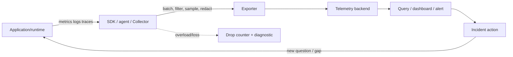

## Mental model: observability là khả năng trả lời câu hỏi mới

Monitoring kiểm các conditions đã biết; observability tốt cho phép suy luận trạng thái nội tại từ outputs ngay cả khi câu hỏi chưa được viết thành dashboard. Nó không đồng nghĩa “thu thật nhiều log”. Hệ thống observable nối user impact với request, version, dependency và resource đủ để quyết định hành động trong thời gian incident.

Telemetry có lifecycle: application/runtime **instrument** → SDK/agent thu thập và enrich resource/context → Collector/agent nhận, batch/filter/sample → exporter vận chuyển → backend index/aggregate/store → query/dashboard/alert → người hoặc automation hành động. Mỗi hop có queue, quota, retry, loss, version và security boundary riêng.

## Ba signal chính và cách correlate

**Metrics** là measurements được aggregate theo thời gian, phù hợp trend, capacity và alert. **Traces** mô tả path của một request/workflow bằng spans có parent/child/link. **Logs** là event records, tốt cho chi tiết discrete và forensic. OpenTelemetry còn mô tả baggage/context và profile maturity riêng; không giả định mọi signal/language SDK có cùng stability—pin SDK/exporter và đọc status của version dùng.

Correlation cần resource identity nhất quán: `service.name`, environment, version, instance/pod, region/zone. Log có `trace_id`/`span_id` khi active context; metric exemplar có thể dẫn tới trace nếu backend hỗ trợ. Context propagation qua HTTP, messaging và async executor phải explicit; bài `otel-context-propagation` đi sâu boundary và trust. Correlation ID tự tạo không thay trace parent semantics nhưng vẫn hữu ích cho workflow không có distributed trace.

Không biến mọi identifier thành metric label. `user_id`, request ID, full URL, SQL text hoặc error message có cardinality gần vô hạn. Đưa dữ liệu chi tiết vào sampled trace/log có access control; metric giữ bounded route template, status class, operation, region. Mỗi unique label set là một time series tiêu thụ memory, CPU, network và storage.

## Metric internals: instrument, aggregation và percentile

Counter tăng rồi reset khi process restart, phù hợp request/error/bytes total; query dùng rate/increase trên window. Gauge lên/xuống biểu diễn queue depth, in-progress hoặc temperature; không lấy rate gauge như counter. Histogram phân phối observations vào buckets và cho aggregate percentile/threshold across instances; summary/quantile client-side có merge/trade-off khác tùy system.

Tên metric có quantity/unit rõ và không trộn đơn vị. Route label dùng `/users/{id}` thay raw path. Histogram buckets phải bao quanh threshold/SLO; buckets quá dày tăng series, quá thưa mất thông tin. Không average percentiles từ các instance.

Instrument online service với rate, errors, duration và saturation/queue; worker thêm processed/failed, backlog/age và retry/DLQ; batch job có last success, duration và records. Business metric như successful checkout bổ sung technical 2xx vì response thành công chưa chắc invariant hoàn tất. Không xuất time-since-event bằng updater dễ chết; thường xuất timestamp event rồi tính age khi query nếu backend model phù hợp.

## Logs và traces có schema, không phải text dump

Structured log nghĩa là schema/typed fields ổn định, không chỉ JSON hợp lệ. Tối thiểu: timestamp UTC, severity, event name, service/version, trace/request context, safe resource identity và error classification. Log một exception ở owner boundary, tránh mỗi layer log cùng stack tạo noise. Không log health success mỗi giây hoặc payload lớn mặc định. Error message dành người; machine decision dùng code/category ổn định.

Span đặt quanh inbound request, outbound dependency, database/messaging và business boundary cần timing/status. Span name dùng low-cardinality operation, attributes theo semantic conventions; event ghi mốc như retry/cache miss. Không tạo span cho mọi function/loop. Status/error phải phản ánh protocol và business semantics; HTTP 200 chứa error body không thể được auto-instrumentation hiểu nếu application không bổ sung.

Head sampling rẻ nhưng có thể bỏ rare error; tail sampling giàu context hơn nhưng cần buffer/Collector capacity. Chọn theo investigation/SLO/compliance, đo accepted/dropped/export failed và không suy luận count mà bỏ qua sampling rate.

## Collector pipeline và telemetry failure

Collector tách application khỏi vendor/export protocol, cho batch, retry, redaction, routing và sampling tập trung. Nó không phải queue vô hạn. Backend chậm làm exporter queue đầy; nếu SDK synchronous/block request, telemetry outage có thể thành application outage. Thường telemetry phải bounded và fail-open có visible drop metrics, trừ audit stream có compliance contract riêng; audit security quan trọng nên thiết kế durable path độc lập thay vì trông chờ debug logs.

Batch giảm network overhead nhưng tăng delay và mất dữ liệu khi process crash. Retry cần backoff/jitter/budget; retry vô hạn giữ memory. Collector placement sidecar, daemonset hay gateway có failure/cost/isolation khác. Gateway tập trung policy nhưng là bottleneck; agent gần workload giữ local context nhưng tăng fleet operations. Load-test pipeline và diễn tập backend unavailable.

Schema drift phá dashboard: service đổi metric name/unit/label hay semantic convention version. Quản telemetry như API: review, test query/alert, version dashboard, ghi migration và giữ overlap khi cần.

## SLI, alert và incident workflow

SLI đo outcome người dùng quan tâm; SLO đặt objective/window; error budget kết nối reliability với release decision. Foundation này chỉ thiết lập mối liên hệ; bài `sli-slo-alert-design` trình bày burn-rate và alert design sâu hơn. Resource alert như disk sắp đầy vẫn hữu ích khi có action/runbook, nhưng CPU spike ngắn không nên page nếu không đe dọa user/SLO.

Incident loop:

1. xác nhận impact bằng SLI và affected cohort;
2. khoanh time, version, region/zone, route/customer class an toàn;
3. từ metric/exemplar sang representative trace;
4. dùng span xác định dependency/layer rồi query logs có context;
5. mitigate: rollback, shed load, disable feature hoặc fail over;
6. giữ timeline/evidence, sau đó bổ sung instrumentation/alert/runbook gap.

Dashboard có owner và câu hỏi: “user có lỗi không?”, “ở đâu?”, “capacity nào cạn?”, “deploy nào liên quan?”. Panel không dẫn tới quyết định là vanity hoặc nên chuyển sang drill-down. Alert có severity, owner, runbook, dependency/silence policy và behavior khi query thiếu data.

## Failure scenarios và troubleshooting telemetry

- **Không có metrics:** process chết hay scrape/export hỏng? Kiểm target/collector/export queue và synthetic liveness riêng; absence phải có semantics.
- **Metric bill/cardinality tăng:** tìm label/value count và deployment tạo raw ID; drop/relabel có kiểm soát rồi sửa instrumentation.
- **Trace đứt giữa services:** kiểm propagator/header, proxy, async context, sampling và trust boundary; không chấp nhận inbound baggage mù.
- **Log search không thấy incident:** clock/timezone, ingestion delay, rotation/drop, wrong service/version hoặc sampling/filter. So local collector counters và known test event.
- **Alert flapping:** window/pending/scrape interval hoặc missing-data policy sai; xem raw query và SLI impact trước khi chỉ tăng threshold.
- **Telemetry làm app chậm:** profile SDK exporter, synchronous logging, payload, queue và backend timeout; bound, batch/sample rồi đo lại.

## Security, trade-offs và khi không instrument

Telemetry thường rời application trust boundary. Redact token, cookie, password, authorization header, raw body và PII tại source/collector; encryption in transit/at rest, tenant isolation, RBAC, audit, retention/deletion. Baggage truyền downstream có thể bị giả mạo hoặc lộ sang third party, nên không dùng cho authorization.

Thêm signal tăng khả năng điều tra nhưng tăng latency/cost/privacy/cardinality. Không log mọi request body, không span inner loop, không metric-label raw ID. Với high-risk audit, dùng append/durable security event pipeline; với debug tạm thời, feature-gated sampling có TTL. Instrument trước hết ở user journey và failure boundary, rồi thêm evidence theo incident/question thật.

## Production checklist

- [ ] Service/resource/version identity nhất quán trên metrics, logs và traces.
- [ ] Metric name/unit/type/labels/buckets có contract và cardinality budget.
- [ ] Logs structured, deduplicated, redacted; retention/access đáp ứng privacy.
- [ ] Spans bao critical boundaries; context propagation và sampling được test.
- [ ] SDK/Collector queues, retry, drop và exporter failures được quan sát/load-test.
- [ ] SLI/dashboard/alert có owner, action, runbook và missing-data behavior.
- [ ] Telemetry schema/version change có review và migration dashboard/query.
- [ ] Backend outage, sampling change và collector overload được failure-drill.

## Góc phỏng vấn

**Metrics, logs hay traces quan trọng nhất?** Không có signal thắng tuyệt đối: metrics phát hiện/phạm vi, traces theo path, logs giải thích event. Correlation và câu hỏi quyết định tổ hợp.

**Vì sao không đặt user ID vào label?** Mỗi giá trị tạo series, gây cardinality/cost và privacy risk. Dùng bounded cohort ở metric, chi tiết trong controlled trace/log.

**Nếu telemetry backend chết, app có nên chết theo?** Thường không; buffer/retry phải bounded và có drop signal. Audit compliance có durability contract riêng, không dùng chung assumption với debug telemetry.

## Key Takeaways

- Observability là vòng từ instrumentation tới quyết định, không phải số lượng dashboard.
- Metrics aggregate, traces theo request, logs ghi event; resource/context nối chúng.
- Cardinality, sampling, queue và retention là production constraints hạng nhất.
- Telemetry pipeline cũng thất bại và phải bounded, observable, load/failure-tested.
- Thu thập tối thiểu đủ trả lời user impact và boundary; bảo vệ secret/PII từ source.
