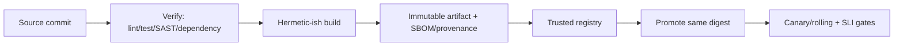

## Pipeline là privileged production code
CI/CD đọc source, chạy code từ dependency/PR, giữ token, ký artifact và thay đổi production. Một workflow bị compromise có thể nguy hiểm hơn một bug application. Vì vậy pipeline cần review, least privilege, isolation và audit như bất kỳ control plane nào.

Mental model end-to-end:



## Build once, promote many
Build riêng cho staging và production có thể tạo hai artifact khác nhau dù cùng commit: dependency/tag/base image thay đổi hoặc build không deterministic. Tạo artifact một lần trong trusted job, gắn source revision/build metadata, scan/sign/attest theo policy rồi promote **cùng digest** qua môi trường. Configuration nằm ngoài image và được version/audit.

Tag như `latest` hoặc `v1` có thể di chuyển; deployment pin digest để biết byte nào đang chạy. Docker multi-stage build loại compiler/cache khỏi runtime image, `.dockerignore` giảm context, non-root/minimal base giảm attack surface. Rebuild định kỳ để nhận patch nhưng phải tạo digest mới và đi lại verification gates.

Không đưa secret vào build argument/layer. Xóa file secret ở layer sau không xóa nó khỏi layer trước. Dùng build secret mechanism khi thật cần và bảo đảm artifact/log không chứa secret.

## Threat model của workflow
Untrusted pull request có thể thay test script, dependency install hook hoặc output dùng trong shell. Không chạy code PR không tin cậy trong context có production secret/write token. Đặc biệt cẩn trọng event có quyền của base repository. Tách “verify untrusted code” khỏi “publish/deploy trusted revision”.

Third-party action/workflow là dependency thực thi code. GitHub khuyến nghị pin action bằng full-length commit SHA để có immutable reference; tag thuận tiện nhưng có thể di chuyển. Review owner/source, giới hạn action được phép và cập nhật có kiểm soát. Không đưa một SHA giả vào template — pipeline thật phải lấy revision đã xác minh của upstream.

```yaml title="permissions-fragment.yml"
permissions:
  contents: read

jobs:
  verify:
    permissions:
      contents: read
    steps:
      - run: npm ci --ignore-scripts
      - run: npm test

  deploy:
    environment: production
    permissions:
      contents: read
      id-token: write
    steps:
      - run: ./deploy-verified-digest.ps1
```

Đây là fragment mô tả permission boundary; workflow thực tế vẫn cần checkout/artifact transfer được pin và kiểm tra digest.

## OIDC thay long-lived cloud secret
Workflow có thể xin OIDC token ngắn hạn rồi exchange ở cloud/provider. `id-token: write` chỉ cho phép yêu cầu token; cloud trust policy mới quyết định token nào được nhận role. Policy cần bind issuer, audience và subject/claim cụ thể như organization/repository/environment/ref hoặc reusable workflow đáng tin.

Nếu trust condition quá rộng, bất kỳ branch/job nào cũng có thể deploy. Mỗi environment/role có quyền tối thiểu và session ngắn; production dùng protected environment/approval theo risk. Không log OIDC token hay cloud credential; redaction không phải đảm bảo tuyệt đối.

## Gates theo failure class
| Gate | Bắt loại lỗi | Giới hạn |
|---|---|---|
| Format/lint/type | Defect tĩnh nhanh | Không chứng minh runtime |
| Unit/component | Business rule, branch | Mock có thể lệch integration |
| Integration/contract | DB/broker/API compatibility | Môi trường vẫn khác production |
| Dependency/image scan | Known vulnerability/policy | Có false positive và zero-day |
| Smoke/canary SLI | Wiring/runtime regression | Cần traffic/evidence đủ đại diện |

Gate phải có owner, SLA xử lý và exception có expiry. Chặn mọi CVE không phân context làm team bỏ qua scanner; bỏ qua tất cả vì “false positive” lại mất defense. Triage theo reachability, exploitability, exposure và asset criticality; emergency override có audit và remediation deadline.

## Artifact integrity và provenance
Lưu checksum/digest, SBOM, dependency lockfile và provenance liên kết artifact với source/workflow/runner. Người deploy verify artifact từ trusted builder, không chỉ tin tên file. Registry permission tách push khỏi deploy; retention giữ artifact đủ cho rollback/forensics.

Self-hosted runner có network/credential lâu dài và có thể giữ residue giữa job; cần ephemeral isolation hoặc cleanup/segmentation mạnh. Hosted runner cũng không miễn dependency confusion và exfiltration từ build script. Egress policy, package registry proxy và lockfile giảm bề mặt.

## Release và rollback
Deploy là một state machine, không phải `kubectl apply` xong là thành công. Pipeline theo dõi rollout status, error/latency/saturation và business smoke test. Canary/rolling chia blast radius; auto rollback chỉ dùng metric đủ tin cậy và rollback thật sự an toàn.

Database dùng expand-contract; migration có lock/time estimate, timeout, backup/restore plan và tương thích old/new binary. Rollback application không undo data mutation. Feature flag tách release khỏi enable nhưng flag cũng cần owner, default, telemetry và ngày dọn.

:::production Dừng đúng chỗ
Nếu provenance/digest mismatch, migration không tương thích hoặc SLI canary xấu, pipeline phải dừng trước khi mở rộng traffic. “Deploy succeeded” chỉ vì command exit 0 là tín hiệu quá yếu.
:::

## Failure scenarios
- Malicious PR đọc production secret: verify untrusted code ở job/context không có secret/write permission.
- Action tag bị đổi: pin verified full commit SHA và policy allowlist.
- Artifact staging khác production: promote cùng digest; config bên ngoài.
- Cloud secret lâu dài bị log: OIDC short-lived + restrictive trust policy.
- Scanner outage chặn hotfix: documented break-glass có approval/audit/expiry.
- Rollback image sau schema destructive: expand-contract, backup và forward-fix/manual plan.

## Production checklist
- Workflow CODEOWNERS/review; untrusted input không vào privileged job.
- Default token permission read-only; quyền nâng ở job cần thiết.
- Third-party action/workflow pin immutable revision đã xác minh.
- Build once; artifact có digest, SBOM/provenance và registry retention.
- OIDC trust bind repo/ref/environment/audience; không giữ cloud key dài hạn nếu tránh được.
- Release gate dựa rollout condition + SLI + smoke; có canary/pause/rollback owner.
- Exception security và feature flag đều có owner, lý do và expiry.

## Góc phỏng vấn
Khi hỏi thiết kế CI/CD production, hãy bắt đầu từ threat model và build-once promote-same-digest. Nêu untrusted PR isolation, least-privilege token, pin third-party action, OIDC short-lived credential, provenance/SBOM và canary SLI gate. Sau đó thừa nhận rollback không đảo database và trình bày expand-contract.

## Key Takeaways
- Pipeline là control plane đặc quyền, cần threat model và audit.
- Artifact identity là digest/provenance, không phải tag thuận tiện.
- OIDC giảm long-lived secret nhưng trust policy phải đủ hẹp.
- Release thành công được xác nhận bằng runtime SLI và compatibility, không chỉ exit code.
