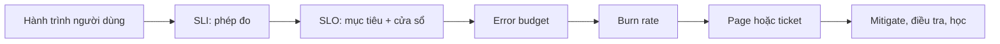

## Mental model: từ lời hứa đến hành động

Observability chỉ có giá trị vận hành khi nó trả lời được ba câu hỏi nối tiếp nhau:

1. Người dùng đang nhận được mức dịch vụ nào?
2. Mức đó có vi phạm lời hứa nội bộ hay bên ngoài không?
3. Ai cần làm gì, trong bao lâu, với bằng chứng nào?

**Service Level Indicator (SLI)** là phép đo một khía cạnh dịch vụ, chẳng hạn tỷ lệ request thành công hoặc tỷ lệ kết quả tìm kiếm được trả trong 300 ms. **Service Level Objective (SLO)** là mục tiêu cho SLI trong một cửa sổ, chẳng hạn 99,9% request hợp lệ thành công trong 30 ngày trượt. **Error budget** là phần không hoàn hảo được chấp nhận. Alert là cơ chế biến tốc độ tiêu thụ budget thành một hành động có owner; nó không phải danh sách mọi metric vượt ngưỡng.



SLI, SLO và alert là ba artifact khác nhau. Đổi metric không nên âm thầm đổi lời hứa; đổi SLO không tự động làm telemetry đúng; alert chạy được không chứng minh SLI phản ánh trải nghiệm thật.

## Thiết kế SLI bằng good events và valid events

Một SLI dạng tỷ lệ nên bắt đầu bằng hai tập hợp được mô tả bằng lời trước khi viết PromQL:

- **Valid events**: tất cả sự kiện đủ điều kiện để đánh giá dịch vụ.
- **Good events**: tập con của valid events đáp ứng tiêu chí thành công.

$$SLI = \frac{good\ events}{valid\ events}$$

Với API đặt hàng, valid event có thể là request đã tới ingress của dịch vụ, trừ endpoint health check và request bị từ chối trước xác thực vì token sai. Good event có thể là response thuộc nhóm thành công nghiệp vụ đã định nghĩa và không vượt ngưỡng latency. Không được loại `5xx` khỏi mẫu số chỉ vì đó là lỗi server; làm vậy khiến outage trông như hệ thống khỏe. Ngược lại, đưa bot health check có tần suất cao vào mẫu số có thể che giấu lỗi của người dùng thật.

Các SLI thường gặp:

| Nhu cầu | Valid event | Good event |
|---|---|---|
| Availability | Request đủ điều kiện tại biên phục vụ | Hoàn thành với kết quả được đặc tả là thành công |
| Latency | Request đủ điều kiện | Hoàn thành không quá ngưỡng, ví dụ 300 ms |
| Freshness | Bản ghi cần được đồng bộ | Có độ trễ dữ liệu không quá ngưỡng |
| Correctness | Tác vụ có kết quả kiểm chứng được | Kết quả vượt qua invariant hoặc đối soát |
| Durability | Object đã được xác nhận lưu | Object còn đọc và kiểm tra checksum thành công |

“Thành công” phải theo semantics sản phẩm. `404` khi tìm một mã không tồn tại có thể là phản hồi đúng; `200` chứa dữ liệu rỗng vì dependency lỗi có thể là thất bại. HTTP status một mình không luôn đủ. Khi client hủy request, đội ngũ phải có policy nhất quán: nếu server chậm làm client timeout thì không nên loại bỏ; nếu bot chủ động hủy ngay thì có thể không phải trách nhiệm của dịch vụ. Policy đó cần được version hóa và review như code.

Nên đo gần biên mà người dùng trải nghiệm nhưng vẫn đủ ngữ cảnh để phân loại. Load balancer thấy kết nối và status, application hiểu kết quả nghiệp vụ, synthetic probe kiểm tra hành trình từ ngoài. Một SLO quan trọng có thể dùng hai nguồn để phát hiện blind spot, nhưng phải chỉ định nguồn chính thức nhằm tránh tranh cãi trong incident.

## SLO và error budget

Một SLO hoàn chỉnh gồm: đối tượng dịch vụ, population, chỉ báo, mục tiêu, cửa sổ và chính sách loại trừ. Ví dụ: “Trong 30 ngày trượt, 99,9% request tạo đơn hợp lệ tại khu vực `ap-southeast` trả kết quả được chấp nhận trong 800 ms.” Cửa sổ trượt phản ứng liên tục; cửa sổ lịch thuận tiện cho báo cáo nhưng có hiệu ứng reset đầu kỳ. Chọn loại nào phải phù hợp cách ra quyết định.

Nếu mục tiêu là `T`, tỷ lệ lỗi cho phép là `1 - T`. Với `T = 99,9%`, error budget theo tỷ lệ là `0,1%`. Trong một cửa sổ có 2.000.000 valid events, budget lý thuyết là 2.000 bad events. Đây chỉ là phép tính minh họa, không phải khuyến nghị mục tiêu cho mọi sản phẩm.

$$budget_{events} = valid\ events \times (1 - target)$$

Budget tạo ngôn ngữ chung giữa reliability và delivery. Khi budget còn nhiều, đội có thể chấp nhận rollout nhanh hơn trong guardrail. Khi budget gần cạn, ưu tiên sửa nguồn lỗi, giảm blast radius hoặc tạm dừng thay đổi rủi ro. Error budget không phải giấy phép cố tình gây lỗi, cũng không nên biến thành KPI để phạt cá nhân; nếu vậy dữ liệu sẽ bị tối ưu sai.

Với SLI theo event, **burn rate** là:

$$burn\ rate = \frac{observed\ bad\ event\ ratio}{1 - target}$$

Burn rate `1` nghĩa là đang tiêu budget đúng tốc độ trung bình để dùng hết trong cửa sổ. Burn rate `10` nghĩa là tiêu nhanh gấp mười. Nếu SLO 99,9%, tỷ lệ bad event 1% tương ứng burn rate 10. Burn rate diễn đạt cùng một mức khẩn cấp qua các SLO khác nhau tốt hơn alert cố định kiểu “error rate > 1%”.

## Multi-window burn-rate alert

Một cửa sổ ngắn phát hiện nhanh nhưng dễ nhiễu; cửa sổ dài ổn định nhưng phát hiện chậm. Multi-window alert yêu cầu cả hai cùng vượt một ngưỡng: cửa sổ dài chứng minh budget bị ảnh hưởng đáng kể, cửa sổ ngắn xác nhận sự cố vẫn đang xảy ra. Có thể xây hai tầng:

- Fast burn: page khi cửa sổ dài 1 giờ và cửa sổ ngắn 5 phút đều vượt ngưỡng cao.
- Slow burn: tạo ticket hoặc page mức thấp hơn khi 6 giờ và 30 phút cùng vượt ngưỡng vừa phải.

Các cửa sổ và ngưỡng dưới đây chỉ minh họa cơ chế. Đội vận hành phải tính chúng từ SLO window, phần budget muốn tiêu trước khi cảnh báo, traffic và thời gian phản ứng thực tế.

```yaml title="prometheus-slo-rules.yml"
groups:
  - name: checkout-slo
    rules:
      - alert: CheckoutAvailabilityFastBurn
        expr: |
          (
            sum(rate(http_server_requests_total{
              service="checkout",slo_eligible="true",outcome="bad"
            }[1h]))
            /
            sum(rate(http_server_requests_total{
              service="checkout",slo_eligible="true"
            }[1h]))
          ) / 0.001 > 14.4
          and
          (
            sum(rate(http_server_requests_total{
              service="checkout",slo_eligible="true",outcome="bad"
            }[5m]))
            /
            sum(rate(http_server_requests_total{
              service="checkout",slo_eligible="true"
            }[5m]))
          ) / 0.001 > 14.4
        for: 2m
        keep_firing_for: 5m
        labels:
          severity: page
          service: checkout
          slo: availability
        annotations:
          summary: "Checkout đang tiêu error budget availability quá nhanh"
          runbook_path: "/runbooks/checkout/slo-fast-burn"
```

`0.001` là error ratio cho SLO 99,9%. `for` yêu cầu expression đúng liên tục trước khi firing, giúp tránh xung ngắn; `keep_firing_for` có thể giảm flapping khi dữ liệu dao động quanh ngưỡng. Không dùng các thuộc tính này để trì hoãn một page cần phản ứng tức thời. `runbook_path` biểu diễn đường dẫn nội bộ do nền tảng alert routing ghép với host thật của tổ chức.

Alert tốt có severity, service/SLO owner, tác động, dashboard và runbook. Page phải dựa trên triệu chứng ảnh hưởng người dùng hoặc budget đang cháy nhanh và có hành động ngay. CPU cao, queue sâu hay pod restart thường là tín hiệu chẩn đoán; chỉ page riêng khi nó trực tiếp gắn với hậu quả cần xử lý tức thì. Cảnh báo nguyên nhân cùng lúc với SLO alert thường tạo bão notification mà không tăng thông tin.

## Instrument bằng OpenTelemetry

OpenTelemetry cung cấp metric instruments có semantics khác nhau; chọn sai làm truy vấn khó diễn giải:

- **Counter** ghi tổng đơn điệu của sự kiện, phù hợp đếm request, lỗi, byte đã xử lý. Backend có thể tính rate trên cửa sổ. Không dùng Counter cho số job hiện đang chờ.
- **Gauge** biểu diễn giá trị tại một thời điểm, phù hợp queue depth, số connection đang mở hoặc nhiệt độ. Gauge có thể tăng và giảm, nhưng một lần scrape bị mất có thể che giấu đỉnh ngắn.
- **Histogram** ghi phân phối phép đo như request duration hoặc payload size. Histogram cho phép aggregate và ước lượng quantile theo bucket; bucket phải bao quanh ngưỡng SLO quan trọng. Chỉ ghi average sẽ giấu tail latency.

Để tính availability SLI, có thể dùng một Counter với thuộc tính bounded như `service`, `operation`, `outcome=good|bad` và `region`. Để tính latency SLI, Histogram phải có unit rõ ràng và boundary quanh 100 ms, 300 ms, 800 ms nếu đó là các ngưỡng sản phẩm. Tên metric, unit, thuộc tính và tiêu chí eligibility là contract; thay đổi chúng cần migration dashboard/rule, không phải rename tùy hứng.

:::warning Cardinality explosion
Không đưa `user_id`, `request_id`, raw URL, email, object ID hoặc stack trace vào metric label. Mỗi tổ hợp label tạo thêm time series, tiêu tốn bộ nhớ và làm truy vấn chậm. Dùng route template như `/orders/{id}` thay cho path thật; đưa định danh chi tiết vào trace/log có retention và kiểm soát truy cập phù hợp.
:::

## Low traffic, dữ liệu thiếu và planned maintenance

Với traffic thấp, một lỗi có thể tạo tỷ lệ rất lớn; khi không có request, phép chia có mẫu số bằng 0 trả dữ liệu vắng hoặc không xác định. Không nên ép mẫu số về một giá trị khiến dashboard trông khỏe giả. Có ba lớp xử lý:

1. Hiển thị rõ “không đủ dữ liệu”, không đổi thành 100% availability.
2. Kết hợp burn-rate alert với điều kiện số valid events tối thiểu, nhưng giữ một alert riêng cho bad-event tuyệt đối hoặc synthetic journey quan trọng.
3. Dùng cửa sổ dài hơn cho dịch vụ ít traffic và kiểm thử cảnh báo bằng replay dữ liệu đại diện.

Nếu telemetry pipeline ngừng gửi, SLI có thể trông như không có lỗi. Vì vậy cần meta-monitoring cho scrape/collection/export, recording rule và freshness của dữ liệu. “No data” phải có trạng thái riêng, không tự động coi là “OK”.

Planned maintenance cũng là quyết định sản phẩm. Loại toàn bộ khoảng bảo trì sau khi outage xảy ra làm SLO mất tính đáng tin. Hãy viết trước: maintenance nào được loại, người phê duyệt, thời gian tối đa, cách gắn marker và cách công bố. Với dịch vụ đã hứa availability liên tục cho khách hàng, planned downtime vẫn có thể phải tiêu budget.

## Quy trình troubleshooting một SLO alert

Khi alert firing, điều tra theo evidence thay vì đoán nguyên nhân:

1. Xác nhận alert expression, SLO target, window và timestamp; kiểm tra đây là firing thật hay rule vừa đổi.
2. Kiểm tra cả bad numerator và valid denominator. Denominator tụt đột ngột có thể là routing hoặc telemetry failure, không phải dịch vụ tốt lên.
3. Phân đoạn theo dimension bounded: region, operation, cluster, status class và deployment version. Không thêm dimension vô hạn trong lúc hoảng loạn.
4. So sánh timeline với rollout, feature flag, dependency incident và traffic shift.
5. Mitigate theo runbook: rollback, tắt feature, giới hạn admission, chuyển traffic hoặc degrade có kiểm soát.
6. Dùng trace exemplar/correlation ID để tìm request đại diện, rồi đọc structured log; tránh log token, secret hoặc dữ liệu nhạy cảm.
7. Sau khi ổn định, xác nhận burn rate giảm ở cả cửa sổ ngắn và dài. Cửa sổ dài có thể còn cao dù sự cố đã dừng; đó là hành vi toán học, không nhất thiết là relapse.

Nếu dashboard và trải nghiệm thực tế mâu thuẫn, kiểm tra clock skew, reset Counter, duplicate ingestion, label rename, sampling, route exclusion và recording rule trước khi kết luận. SLI code cũng có bug và cần unit test, fixture, review như logic sản phẩm.

## Failure scenarios thường gặp

- **Mẫu số bị làm đẹp:** query chỉ đếm request có response nên request timeout trước instrumentation biến mất. Đo tại boundary hoặc ghi completion/cancellation nhất quán.
- **Average latency vẫn đẹp:** một nhóm nhỏ request cực chậm phá trải nghiệm nhưng average bị traffic nhanh lấn át. Dùng threshold SLI/histogram và xem tail distribution.
- **Page theo CPU:** autoscaling hoặc batch hợp lệ làm CPU cao nhưng người dùng không bị ảnh hưởng. Page theo burn rate; dùng CPU cho chẩn đoán/capacity alert có owner phù hợp.
- **Alert flapping:** window quá ngắn, `for` không phù hợp hoặc traffic quá thấp. Kiểm tra event count, dùng multi-window và hysteresis có chủ đích.
- **Cardinality tăng sau release:** label mới chứa tenant/request path làm time-series bùng nổ. Drop/transform attribute tại collector, rollback instrumentation và thêm policy lint.
- **SLO đạt nhưng người dùng phàn nàn:** population hoặc success semantics sai, chẳng hạn bỏ mobile traffic hay coi fallback rỗng là good. Quay lại user journey và sửa contract SLI có version.
- **Planned maintenance bị loại tùy ý:** báo cáo đẹp nhưng budget không còn tạo trách nhiệm. Áp dụng policy được duyệt trước và audit mọi exclusion.
- **Alert không hành động được:** người trực chỉ thấy tên metric, không có service owner/runbook. Bổ sung impact, scope, dashboard, hành động an toàn và escalation path.

## Production checklist

- [ ] SLI được mô tả bằng good events, valid events, nguồn đo và tiêu chí loại trừ.
- [ ] SLO có target, rolling/calendar window, owner và policy maintenance rõ ràng.
- [ ] Error budget và burn rate được tính từ cùng một SLI, không trộn denominator.
- [ ] Fast/slow burn dùng cặp cửa sổ; ngưỡng được tính và kiểm thử trên traffic đại diện.
- [ ] Page phản ánh user impact và có hành động; diagnostic alert không làm nhiễu on-call.
- [ ] Rule có severity, service, SLO, summary, dashboard/runbook và escalation owner.
- [ ] Counter/Gauge/Histogram đúng semantics, có unit và lifecycle schema.
- [ ] Metric label bounded; không chứa ID, raw path, PII hoặc secret.
- [ ] Dashboard hiển thị numerator, denominator, event volume, budget còn lại và no-data.
- [ ] Có meta-monitoring cho collector, scrape, rule evaluation và freshness.
- [ ] Low-traffic behavior, Counter reset, missing series và alert flapping đã được test.
- [ ] Sau incident có review SLI validity, mitigation time và budget policy, không chỉ review hạ tầng.

## Góc phỏng vấn

Khi được hỏi “thiết kế monitoring cho một API”, câu trả lời senior không bắt đầu bằng danh sách Grafana panel. Hãy bắt đầu từ hành trình người dùng, định nghĩa valid/good events, chọn biên đo, đặt SLO và window dựa trên nhu cầu sản phẩm. Sau đó tính allowed error ratio, giải thích burn rate và dùng multi-window để cân bằng tốc độ phát hiện với độ nhiễu. Cuối cùng mới nói đến OpenTelemetry instrument, Prometheus rule, runbook và quy trình incident.

Nếu interviewer hỏi “vì sao không alert error rate > 1%?”, hãy chỉ ra rằng cùng 1% có ý nghĩa khác nhau với SLO 99% và 99,99%; burn rate chuẩn hóa theo budget. Nếu hỏi “SLO đạt có nghĩa hệ thống tốt không?”, câu trả lời là không chắc: SLI có thể chọn sai population, loại lỗi khỏi denominator hoặc bỏ sót một user journey quan trọng. Reliability engineering bao gồm kiểm chứng phép đo, không chỉ vận hành công cụ.

## Key Takeaways

- SLI tốt bắt đầu từ semantics của good/valid events và trải nghiệm người dùng, không bắt đầu từ metric có sẵn.
- SLO biến reliability thành mục tiêu có cửa sổ; error budget hỗ trợ quyết định rủi ro và ưu tiên kỹ thuật.
- Burn rate đa cửa sổ phát hiện budget bị tiêu nhanh với ít nhiễu hơn một threshold đơn.
- Counter, Gauge và Histogram có vai trò khác nhau; schema và cardinality là constraint production.
- Alert chỉ đáng page khi có tác động và hành động rõ; dữ liệu thiếu, low traffic và policy maintenance phải được thiết kế trước incident.
