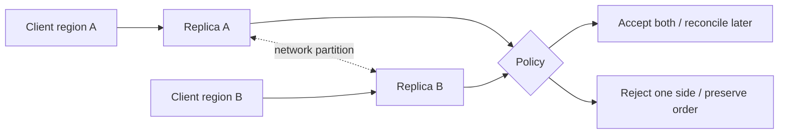

## CAP: câu hỏi chỉ trở nên bắt buộc khi partition
CAP nói rằng khi network partition chia các node không liên lạc tin cậy, hệ thống không thể đồng thời bảo đảm linearizable consistency và mọi request tới node còn sống đều nhận response thành công. Partition tolerance không phải checkbox tùy ý của distributed system thực tế; network có thể mất packet, delay hoặc tách vùng.

“CP” thường từ chối/timeout một số operation để không trả state mâu thuẫn. “AP” tiếp tục nhận/phục vụ ở nhiều phía và chấp nhận có thể diverge, sau đó reconcile. Ngoài partition, hệ thống vẫn tối ưu latency, consistency và availability theo nhiều mức; khẩu hiệu “chọn hai trong ba” che mất phần thiết kế quan trọng.



Trước khi chọn, viết invariant: “một seat không bán cho hai người” khác “profile photo có thể cũ vài giây”. Consistency không nên là thuộc tính chung chung cho cả database; mỗi operation có requirement khác.

## Replication: durability, availability và freshness
Leader–follower replication gửi thay đổi từ primary tới replica. Synchronous acknowledgment chờ một hay nhiều replica, tăng durability/consistency nhưng write latency và khả năng block tăng. Asynchronous replication giảm latency nhưng replica lag; khi leader mất có thể mất acknowledged write chưa replicate hoặc promote follower thiếu dữ liệu.

Multi-leader/leaderless tăng write availability ở nhiều nơi nhưng conflict trở thành phần data model. Last-write-wins đơn giản nhưng clock skew có thể làm mất update hợp lệ. Các domain như counter/set có thể merge; money transfer hoặc unique username cần coordination/ownership rõ hơn.

| Read policy | Lợi ích | Failure cần xử lý |
|---|---|---|
| Read leader | Fresh hơn | Leader bottleneck/region latency |
| Read replica | Scale/near user | Stale read, session regression |
| Read-your-writes token | UX nhất quán theo session | Routing/version tracking phức tạp |
| Quorum read/write | Có thể tăng overlap | Tail latency, sloppy quorum và repair |

Replication lag phải đo bằng time và log position/version, không chỉ “replica up”. Sau write, client có thể mang version; gateway route query tới replica đã catch up hoặc tạm đọc leader. Cache và search index là các replica dẫn xuất nên cũng cần freshness contract.

## Failover không miễn phí
Health check phải phân biệt node chậm với partition. Promote hai leader tạo split brain; fence leader cũ bằng lease/term/epoch trước khi nhận write. DNS TTL, connection pool và client retry làm failover thực tế lâu hơn thời gian database promote. Sau failover cần kiểm tra data loss window, rebuild replica và re-enable traffic theo bước.

Backup không phải replica: corruption hoặc delete có thể replicate ngay. Cần point-in-time recovery, restore drill và retention độc lập.

## Sharding: partition data có chủ đích
Sharding chia dataset/write load giữa nhiều ownership unit. Hash key phân phối thường đều nhưng range scan khó; range key hỗ trợ scan nhưng dễ hot range; directory-based linh hoạt nhưng directory là dependency cần HA. Shard key tốt có cardinality cao, distribution ổn định và nằm trong query phổ biến.

Ví dụ `tenantId` giúp tenant-local query và isolation, nhưng một “whale tenant” có thể nóng một shard. `hash(tenantId, orderId)` phân phối tốt hơn nhưng query toàn tenant phải scatter-gather. Không có key hoàn hảo; phải dùng traffic/data distribution thật và dự báo growth.

```text title="Capacity sketch, không phải benchmark"
peak writes per second = observed peak × safety factor
largest key share      = max writes for one candidate shard key / total writes
shard target           = min(storage headroom, sustained write/read capacity)
initial shards         = ceil(total peak / per-shard target)
```

Con số `per-shard target` phải lấy từ benchmark workload và platform limit hiện hành, không copy một “magic number”. Đo cả p95/p99, item size, secondary index amplification và background migration.

## Resharding và global operations
Consistent hashing giảm số key phải di chuyển khi thêm node nhưng không tự giải quyết hotspot hay transaction xuyên key. Range split/merge cần routing metadata có version. Online reshard thường gồm dual routing, copy historical data, catch-up change log, verify checksum/count, cut over và giữ rollback window.

Global unique constraint, transaction nhiều shard và pagination toàn cục đắt. Có thể cấp namespace theo shard, dùng coordinator, hoặc thay requirement. Scatter-gather latency bị chi phối bởi shard chậm nhất và xác suất lỗi tăng theo fan-out; read model/secondary index theo access pattern thường tốt hơn query mọi shard.

:::warning Shard sớm cũng có chi phí
Sharding trước khi một node/replica thật sự là bottleneck làm migration, transaction và operations phức tạp ngay lập tức. Trước hết tối ưu query/index, archive, vertical/replica scaling; shard khi có evidence về capacity hoặc isolation.
:::

## Failure scenarios
- Replica trả dữ liệu trước write vừa commit: dùng version-aware/read-your-writes policy cho flow cần thiết.
- Async primary failover mất vài write: reconciliation với external ledger/event và RPO công khai.
- Network partition promote hai phía: epoch/fencing chặn leader cũ khi mạng hồi.
- Celebrity/whale key tạo hotspot dù tổng capacity còn nhiều: split key, dedicated shard hoặc admission control.
- Reshard copy xong nhưng miss concurrent update: change capture + checkpoint + verification.
- Cross-shard retry thực thi một nửa: saga/idempotency thay vì giả định transaction local.

## Production checklist
- Invariant được phân loại: cần linearizable, read-your-writes, monotonic read hay eventual.
- RPO/RTO, replication mode, failover authority và fencing được test bằng drill.
- Dashboard có lag, stale-read indicator, conflict, hotspot và shard size/growth.
- Shard key được đánh giá bằng histogram production-like, không chỉ average.
- Có online reshard/rebalance runbook, checksum và rollback window.
- Backup restore được diễn tập độc lập với replica failover.

## Góc phỏng vấn
Khi hỏi CAP, hãy đặt network partition cụ thể và nói invariant nào khiến bạn reject một phía hay accept rồi merge. Tiếp theo nối lựa chọn với replication/read policy và UX. Với sharding, nêu access pattern, hotspot, cross-shard operation và resharding; đừng chỉ nói “hash user ID để scale ngang”.

## Key Takeaways
- CAP là trade-off trong partition, không phải nhãn marketing cố định cho database.
- Replication policy quyết định latency, freshness, data-loss window và failover behavior.
- Shard key là quyết định data ownership và query topology.
- Failover, conflict repair và resharding phải được thiết kế, đo và diễn tập trước incident.
