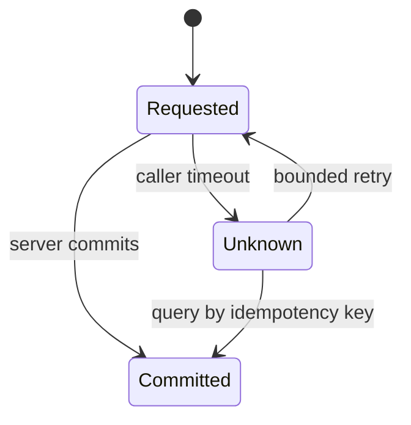

## Partial failure
Trong một process, function trả về hoặc throw thường cho trạng thái rõ hơn. Qua network, caller timeout trong khi server có thể chưa nhận, đang xử lý hoặc đã commit nhưng response mất. Kết quả là unknown, không đơn giản là failed.

## Timeout, retry, idempotency
Mọi remote call cần timeout theo latency budget. Retry thêm tải đúng lúc hệ thống đang yếu, nên cần giới hạn attempt, exponential backoff, jitter và retry budget. Operation tạo side effect cần idempotency key lưu cùng kết quả để retry không nhân đôi.

## CAP và PACELC
Khi network partition xảy ra, hệ thống phải trade availability với strong consistency cho operation liên quan. CAP không nói database luôn chỉ có hai trong ba ở mọi thời điểm. PACELC nhắc thêm trade latency/consistency ngay cả khi không partition.

:::warning Clock và order
Timestamp từ nhiều machine không tạo total order đáng tin tuyệt đối. Dùng sequence/version theo aggregate, logical clock hoặc consensus service khi requirement thật sự cần order mạnh.
:::

## Reconciliation
Eventual consistency không có nghĩa “chờ rồi tự đúng”. Cần invariant monitor, retry queue, dead-letter/quarantine, audit trail và job reconciliation so sánh desired với observed state rồi sửa sai lệch.

## Trả lời phỏng vấn
Tôi bắt đầu từ failure model: timeout tạo trạng thái unknown, retry có thể duplicate. Tôi đặt deadline, bounded retry với jitter, idempotency key và reconciliation. Consistency level là quyết định theo invariant nghiệp vụ, không theo khẩu hiệu CAP.

## Key Takeaways
- Timeout không chứng minh server chưa commit.
- Retry phải có budget và idempotency.
- Eventual consistency cần repair loop.
- Chọn consistency theo invariant và hậu quả sai lệch.
