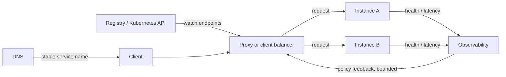

## Mental model: directory, policy và forwarding

Service discovery trả lời “instance nào hiện có thể nhận request?”. Load balancing trả lời “request này nên đi tới instance nào?”. Một hệ thống production thường có:

- **Control plane** quan sát registration, readiness/topology và xuất tập endpoint cùng metadata.
- **Data plane** tại client, sidecar, node proxy hoặc external load balancer chọn endpoint và forward traffic.
- **Feedback plane** cung cấp health, latency, outstanding requests, error/overload để policy thích ứng.

Không tách ba phần này dễ dẫn đến kết luận sai: DNS resolve đúng không có nghĩa backend ready; Service object tồn tại không có nghĩa EndpointSlice có endpoint; proxy phân phối đều số connection không có nghĩa work phân phối đều.

## Discovery patterns và consistency window

**Client-side discovery** cho client chọn endpoint trực tiếp. Nó tránh proxy hop và có thể dùng per-request state, nhưng mỗi language/runtime cần library, policy và rollout tương thích. **Server-side discovery** cho client gọi stable VIP/proxy/load balancer; vận hành tập trung hơn nhưng proxy là capacity/failure domain cần scale và redundancy. Service mesh thêm sidecar/node proxy và control plane; nó không xóa timeout, retries hay application semantics.

Kubernetes Service cung cấp stable virtual abstraction cho một tập Pod. EndpointSlice biểu diễn backend theo slice để discovery scale tốt hơn một Endpoints object lớn. DNS tạo service name, nhưng DNS record/TTL, application resolver cache, connection pool và HTTP/2 connection lifetime tạo nhiều lớp staleness. Một client có thể resolve endpoint mới nhưng vẫn reuse socket tới endpoint cũ.

Headless Service cho client thấy endpoint records thay vì ClusterIP, phù hợp stateful/client-aware discovery nhưng đẩy trách nhiệm balancing/failover sang client. Pod DNS record không nên được dùng như durable identity nếu workload không có identity contract. ExternalName chỉ ánh xạ DNS CNAME; Kubernetes không health-check đích và protocol có thể gặp hostname/TLS mismatch.

Discovery là eventually consistent control path. Khi Pod chuyển unready, cần thời gian cho readiness update, EndpointSlice propagation, proxy programming và connection drain. Thiết kế graceful shutdown phải bao phủ cửa sổ đó:

1. báo not-ready/ngừng nhận work mới;
2. cho control plane propagate;
3. drain keep-alive/in-flight trong deadline;
4. checkpoint/finish hoặc cancel an toàn;
5. process exit trước platform hard-kill.

`preStop` sleep cố định chỉ che timing và làm rollout chậm; dùng readiness, application drain state, load-balancer deregistration delay và termination budget có đo lường.

## L4, L7 và thuật toán chọn backend

L4 balancer quyết định dựa trên connection/transport tuple, ít hiểu HTTP và thường nhẹ. L7 hiểu host/path/header, TLS termination, HTTP request và có thể route/canary chi tiết; đổi lại thêm parsing, config và failure surface. Với HTTP/2/gRPC, một connection có thể mang nhiều concurrent streams, nên round-robin theo connection tạo hotspot dù connection count “đều”. Cần proxy/client hiểu request hoặc channel pool phù hợp.

Thuật toán là hypothesis theo workload:

- **Round robin** đơn giản khi instance/request tương đối đồng đều.
- **Least outstanding requests/connections** phản ứng với work kéo dài, nhưng metric connection có thể không đại diện CPU và feedback trễ gây dao động.
- **Weighted random/round robin** dùng khi capacity khác nhau hoặc canary; weight sai có thể overload nhóm nhỏ.
- **Consistent/rendezvous hashing** tăng affinity/cache locality và giảm remap khi membership đổi, nhưng hot key vẫn tạo hotspot.
- **Power of two choices** lấy mẫu ít backend rồi chọn backend nhẹ hơn; giảm coordination so với global least-load nhưng vẫn cần load signal hữu ích.

AWS ALB, chẳng hạn, tài liệu hóa các lựa chọn như round robin, least outstanding requests và weighted random cho target group; không nên suy rộng thuật toán/feature đó sang mọi load balancer. Sticky session có thể cần cho legacy state nhưng làm scale/drain/failover xấu hơn. Ưu tiên externalize session hoặc token có integrity; nếu buộc affinity, đặt TTL và fallback rõ.

Topology-aware routing có thể giảm cross-zone latency/cost, nhưng chỉ khi endpoint phân bố đủ và traffic tương đối cân đối. Dồn mọi request vào zone local thiếu capacity gây overload. Hard locality cần fallback khi zone mất; soft preference thường an toàn hơn. Đọc feature state/heuristic của đúng Kubernetes version trước khi bật.

## Health không chỉ là HTTP 200

Liveness trả lời process có cần restart; readiness trả lời instance có nên nhận traffic mới. Readiness nên phản ánh khả năng phục vụ request cốt lõi nhưng không phụ thuộc đồng loạt vào mọi downstream không thiết yếu, nếu không một dependency lỗi sẽ làm toàn bộ fleet unready và tạo outage khuếch đại. Passive health quan sát connect reset/timeout/5xx thực; active probe kiểm tra định kỳ. Kết hợp cả hai với threshold/hysteresis để tránh flapping.

Load balancer cần **outlier detection/ejection** có giới hạn. Eject quá nhiều backend làm backend còn lại quá tải; vì vậy có minimum healthy capacity, max ejection và recovery probe. Circuit breaker bảo vệ từng caller/dependency; admission control/load shedding bảo vệ backend. Retry phải có deadline, jitter và budget ở một layer chủ trì. Ba tầng proxy cùng retry biến một lỗi nhỏ thành request storm.

## Failure scenarios và troubleshooting

**Service resolve nhưng connection refused:** kiểm tra EndpointSlice `addresses`, `conditions.ready`, target port/name, container listen address, NetworkPolicy và proxy programming. `nslookup` thành công chỉ kiểm chứng DNS.

**Endpoint đã xóa vẫn nhận traffic:** tìm resolver/SDK cache, keep-alive/HTTP2 channel, external LB deregistration và termination sequence. So timeline Pod readiness, EndpointSlice update, proxy sync và connection close.

**Một pod nóng, các pod khác rảnh:** kiểm tra long-lived connection, sticky cookie, hot partition/key, unequal resource limit và slow request mix. Request count không đủ; so concurrent work, queue time, CPU throttling và latency per endpoint.

**Rollout tạo 502/503:** readiness báo sớm, application chưa warm; hoặc shutdown quá nhanh. Tách startup/readiness, warm cache có bound, readiness gate nếu integration yêu cầu, và drain đúng thời gian. Không làm probe gọi dependency chậm mỗi giây.

**Cross-zone traffic tăng bất ngờ:** xem endpoint distribution, topology hints, zone capacity và client source; xác minh feature/config ở đúng cluster version trước khi quy lỗi cho DNS.

Troubleshooting theo từng hop: client DNS/cache → socket/TLS → VIP/proxy route → EndpointSlice/target registration → network policy/security group → application queue/dependency. Gắn request ID/trace với selected endpoint, retry attempt và route rule. Metric cần có request/connections/outstanding per endpoint, discovery update age, healthy target count, ejection, retry, queue, rejection và tail latency.

## Production checklist

- [ ] Discovery owner, source of truth, propagation SLO và stale-cache policy được ghi rõ.
- [ ] L4/L7 và client/server-side pattern khớp protocol, routing và team ownership.
- [ ] Readiness, active/passive health, outlier policy có hysteresis và capacity floor.
- [ ] Thuật toán được load-test với request cost, long-lived connection và hot key thật.
- [ ] Retry chỉ ở layer chủ trì, có deadline/budget/idempotency; overload dùng admission/load shedding.
- [ ] Shutdown thực hiện unready → propagation → drain → exit; rollout test với traffic.
- [ ] Topology preference có capacity/failure fallback; session affinity có TTL và escape path.
- [ ] Dashboard nhìn thấy endpoint-level distribution, discovery staleness và proxy/app latency riêng.

## Góc phỏng vấn

**DNS có phải load balancer không?** DNS có thể trả nhiều address nhưng không quan sát từng request, client caching/connection reuse làm phân phối lệch và failover chậm. Nó thường là một lớp discovery, không thay toàn bộ data-plane balancing.

**Round robin vì sao vẫn hotspot?** Request khác chi phí, instance khác capacity, sticky/HTTP2 connection và hot key. Chọn signal theo outstanding work/capacity hoặc shard affinity, rồi kiểm soát overload.

**Readiness có nên fail khi database lỗi?** Nếu mọi request cốt lõi không thể phục vụ thì có thể, nhưng đánh rớt toàn fleet không tạo database mới và còn gây cascade. Thiết kế degraded mode, dependency-specific circuit breaker và capacity floor theo semantics.

## Key Takeaways

- Discovery là control-plane state có độ trễ; balancing là quyết định data plane trên mỗi connection/request.
- DNS, EndpointSlice, proxy và connection pool đều có cache/lifecycle riêng cần quan sát.
- Thuật toán chỉ tốt khi signal đại diện work; “đều request” không đồng nghĩa “đều tải”.
- Health, draining, retry và overload control phải được thiết kế như một chuỗi thống nhất.
- Topology/affinity tối ưu locality nhưng cần fallback và capacity guard để không biến tối ưu thành outage.
