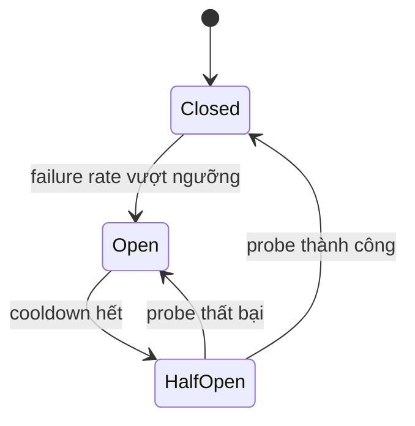

## Mental model: retry là một request mới trong thế giới không chắc chắn
Khi caller timeout, nó chỉ biết **không nhận được kết quả**; server có thể chưa xử lý, đang xử lý hoặc đã commit nhưng response bị mất. Retry vì vậy không tự động “an toàn”. Nó tăng xác suất thành công với lỗi transient, đồng thời tăng load và có thể lặp side effect.

Ba cơ chế giải ba vấn đề khác nhau:
- Timeout/deadline giới hạn thời gian chờ và giải phóng resource.
- Retry xử lý một số lỗi transient trong budget hữu hạn.
- Circuit breaker ngừng gọi dependency đang lỗi để tránh cascade và cho nó hồi phục.

Idempotency bảo đảm nhiều lần thực thi cùng một logical operation có effect tương đương một lần. Nó là điều kiện correctness cho retry mutation, không chỉ là optimization.



## HTTP semantics không thay implementation
Theo HTTP semantics, GET/HEAD/OPTIONS/TRACE là safe; PUT, DELETE và safe methods là idempotent về **intended effect**. POST không mặc định idempotent. Tuy vậy, một endpoint PUT viết audit row mới mỗi lần hoặc gửi email mỗi lần vẫn có side effect quan sát được cần kiểm soát. Method là contract cho intermediary/caller, không miễn server khỏi thiết kế đúng.

Lỗi retry được thường gồm mất kết nối, timeout được xác định transient, 429 hoặc 503 khi server cho phép. Validation 4xx, authentication/authorization failure và invariant conflict thường phải fail fast. 500 không mặc định transient: retry cùng input vào bug deterministic chỉ làm outage nặng hơn.

## Idempotency key end-to-end
Client tạo key ngẫu nhiên ổn định cho **một logical command** và giữ nguyên qua retry. Server lưu key cùng actor/tenant, operation type, request fingerprint, status và response tối thiểu. Insert idempotency record và business effect phải atomic.

```sql title="Atomic idempotency sketch"
BEGIN;

INSERT INTO idempotency_record(
  tenant_id, operation, idempotency_key, request_hash, status
) VALUES (:tenant, 'CREATE_PAYMENT', :key, :hash, 'PROCESSING')
ON CONFLICT DO NOTHING;

-- Nếu key đã tồn tại: so request_hash; trả response đã lưu hoặc trạng thái đang xử lý.
-- Nếu insert thắng: tạo payment trong cùng transaction.

INSERT INTO payment(id, order_id, amount, status)
VALUES (:paymentId, :orderId, :amount, 'ACCEPTED');

UPDATE idempotency_record
SET status = 'COMPLETED', resource_id = :paymentId, response_code = 202
WHERE tenant_id = :tenant AND idempotency_key = :key;

COMMIT;
```

Unique key phải bao gồm security scope; key của tenant A không được đọc response tenant B. Cùng key nhưng khác fingerprint là client bug hoặc abuse và phải trả conflict. TTL phải dài hơn retry window/business reconciliation; xóa quá sớm có thể cho duplicate sống lại. Với work async, response lặp có thể trả cùng operation ID để caller poll.

## Deadline, backoff và jitter
Mỗi request cần end-to-end deadline. Mỗi attempt chỉ được dùng phần còn lại, bao gồm DNS/connect/TLS/read. Nếu ba tầng đều retry ba lần, dependency cuối có thể nhận tới `3 × 3 × 3 = 27` attempt cho một request gốc. Thường retry ở một layer có đủ context, và truyền deadline/cancellation xuống dưới.

Exponential backoff giãn attempt; jitter phá đồng bộ khi hàng nghìn client cùng hồi phục. Phải có max attempts, max elapsed time và retryable predicate. Tôn trọng `Retry-After` nếu contract có. Retry không được làm tổng thời gian vượt user/SLO budget.

```text title="Full-jitter pseudo code"
deadline = now + 2s
for attempt in 0..2:
  timeout = min(perAttemptTimeout, deadline - now)
  result = call(timeout)
  if success or not retryable(result): return result
  sleep(random(0, min(cap, base * 2^attempt)))
return timeout_or_last_error
```

## Circuit breaker đúng cách
Breaker đo outcome trong rolling window. Khi tỷ lệ lỗi/slow call vượt ngưỡng với đủ sample, nó mở và fail fast. Sau cooldown, chỉ cho ít probe half-open; thành công thì đóng, thất bại thì mở lại. Breaker phải tách theo dependency/endpoint hoặc failure domain hợp lý. Một global breaker cho mọi API khiến một endpoint lỗi chặn cả endpoint khỏe.

Circuit breaker không thay capacity planning, timeout hay backpressure. Fallback chỉ hợp lệ nếu có nghĩa nghiệp vụ: trả cache hơi stale có nhãn có thể chấp nhận; trả “payment thành công” giả là vi phạm correctness. Bulkhead giới hạn concurrency/resource riêng để dependency chậm không chiếm toàn thread/connection pool.

:::warning Retry storm khi hồi phục
Breaker mở rồi cùng lúc cho mọi request qua sẽ tạo thundering herd. Half-open phải giới hạn probe; retry có jitter; queue có bound; autoscaling không nên là tuyến phòng thủ duy nhất.
:::

## Failure scenarios
- Server commit nhưng response mất: idempotency record trả lại cùng resource/result.
- Process crash sau external side effect nhưng trước khi lưu completed: cần provider idempotency hoặc reconciliation; local record một mình chưa đủ.
- Key bị reuse với amount khác: fingerprint mismatch, reject thay vì trả payment cũ.
- Dependency 400 liên tục: không retry, ghi metric client-contract error.
- Breaker state đặt trong một process: mỗi instance có quyết định riêng; điều này thường chấp nhận được nhưng threshold/capacity phải tính theo fleet.
- Fallback cache quá cũ: freshness metadata và business limit quyết định có được phục vụ hay không.

## Production checklist
- Mỗi outbound call có timeout/deadline và cancellation propagation.
- Retry predicate, max attempts, max elapsed, backoff+jitter được cấu hình và test.
- Mutation retry có idempotency contract end-to-end, scope và retention rõ.
- Circuit breaker metric tách open/rejected/half-open/failure; alert không chỉ nhìn 5xx.
- Concurrency/queue có bound; fallback không bịa correctness.
- Load test bao gồm dependency slow, timeout sau commit và recovery herd.

## Góc phỏng vấn
Khi hỏi “service B timeout thì làm gì?”, đừng trả lời ngay “retry ba lần”. Hãy hỏi operation có idempotent không, deadline còn bao nhiêu và lỗi có transient không. Sau đó mô tả idempotency key atomic với effect, capped exponential backoff + jitter, breaker/bulkhead và observability. Điểm senior nằm ở việc kiểm soát amplification và ambiguity sau timeout.

## Key Takeaways
- Timeout không chứng minh server chưa commit.
- Retry chỉ an toàn khi lỗi transient, còn budget và operation idempotent.
- Idempotency key cần atomicity, fingerprint, security scope và retention.
- Circuit breaker fail fast để cô lập lỗi; nó không tạo capacity hay correctness.
