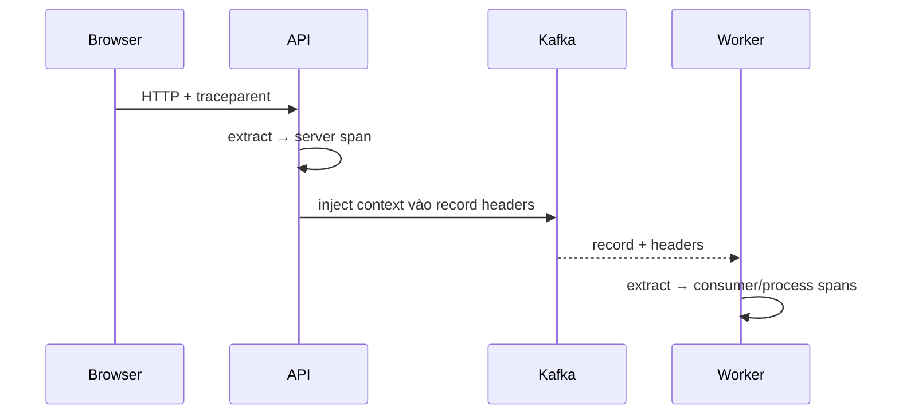

## Trace không tự nối chỉ vì mọi service có SDK

Metric cho biết xu hướng, log giữ event chi tiết, trace mô tả một execution path phân tán. Để các span của cùng request nằm trong một trace, context phải được lấy ra khỏi carrier đến, đặt vào execution context hiện tại, rồi inject sang carrier đi. Carrier có thể là HTTP headers, Kafka record headers hoặc metadata của RPC.



W3C Trace Context chuẩn hóa `traceparent` và `tracestate` để các vendor có thể tương tác. `traceparent` mang trace-id, parent-id và flags; nó không phải authentication credential và không chứng minh caller đáng tin. Service vẫn phải validate identity/authorization qua cơ chế riêng.

## Context, span và baggage

Context là container bất biến theo execution flow; span hiện tại chỉ là một phần trong đó. Propagator chịu trách nhiệm serialize/deserialize context qua process boundary. Auto-instrumentation thường xử lý framework HTTP/client phổ biến, nhưng custom executor, callback, scheduler hoặc message wrapper có thể làm mất context.

Baggage là key/value được truyền cùng context để correlation hoặc routing observability có kiểm soát. Nó đi qua nhiều hop, tăng kích thước header và có thể lộ thông tin. Không đặt password, token, email hay dữ liệu cá nhân vào baggage. Với dimension có cardinality lớn như user ID hoặc order ID, span attribute có thể hữu ích cho trace cụ thể nhưng không nên biến thành metric label.

:::warning Correlation không phải authorization
Không tin tenant/user từ baggage hoặc trace header để ra quyết định bảo mật. Header do client gửi có thể bị giả mạo; identity phải đến từ security context đã được xác thực.
:::

## HTTP propagation

Inbound middleware extract headers trước khi tạo server span. Outbound instrumented client tạo client span rồi inject context vào request. Nếu code tạo request ở thread khác mà không wrap context, parent có thể mất. Nếu proxy/gateway xóa hoặc đổi header, trace bị chia đôi.

Một policy thực tế cần quyết định:

- Có tiếp nhận trace-id bên ngoài hay tạo trace mới tại trust boundary.
- Header nào được proxy/load balancer forward.
- Giới hạn kích thước và baggage allowlist.
- Cách ghi correlation ID cho log mà không nhân bản dữ liệu nhạy cảm.
- Propagator thống nhất giữa service; migration hỗ trợ format cũ trong thời gian hữu hạn.

Không nên tự ghép chuỗi `traceparent` nếu SDK/propagator chuẩn đã có. Format sai length/hex/flags có thể bị implementation từ chối, còn tự quản lifecycle dễ tạo span chưa đóng.

## Async task và thread boundary

Thread-local context không tự động đi qua mọi executor. Khi submit task, cần capture context tại điểm submit và restore trong thời gian task chạy. Với reactive pipeline, execution có thể đổi thread nhiều lần; dựa vào `ThreadLocal` thuần sẽ sai. Dùng instrumentation/context mechanism của framework và test bằng trace thật.

```java title="Ý tưởng context wrapping.java"
Context captured = Context.current();
executor.execute(captured.wrap(() -> {
  // span hiện tại được khôi phục trong scope của task
  process(command);
}));
```

Đoạn code minh họa boundary, không phải lý do để wrap thủ công mọi task. Instrumentation trùng lớp có thể tạo duplicate span; inventory agent, starter, SDK và framework integration trước khi thêm custom instrumentation.

## Messaging: send, receive hay process?

Producer inject context vào message headers. Consumer extract context nhưng cần mô hình span phù hợp với semantics: thời gian record nằm trong broker không giống một synchronous network call. Thường cần phân biệt receive/poll khỏi process, đặc biệt khi một poll trả batch và từng record được xử lý song song.

Retry topic hoặc dead-letter topic tạo execution mới có quan hệ với lần trước. Parent-child dài xuyên nhiều giờ có thể khó hiểu; span links thường biểu diễn causal relationship tốt hơn cho batch, fan-out hoặc retry. Không sửa payload business chỉ để nhét trace nếu broker có header và contract cho phép.

Với outbox, transaction tạo event và publisher chạy sau commit. Trace context lưu trong outbox có thể giúp nối causal flow, nhưng retention/privacy và sampling phải được thiết kế. Event ID vẫn là business idempotency/correlation key; trace ID không thay nó vì trace có thể không được sample hoặc bị rotate.

## Sampling là quyết định về dữ liệu, không phải hiệu năng đơn thuần

Head sampling quyết định sớm, rẻ hơn nhưng có thể bỏ trace chứa lỗi xảy ra cuối flow. Tail sampling quyết định sau khi thu spans, cho phép giữ error/slow trace nhưng đòi collector buffer và capacity. Parent-based sampling giúp một trace nhất quán qua service nhưng cần trust policy cho flags từ external caller.

Nếu chỉ xem sampled trace để tính error rate hoặc latency distribution, kết quả có thể bias. Metric aggregation nên là nguồn SLI chính; trace giúp giải thích exemplar/path. Luôn ghi sampling policy, rate theo traffic class và behavior khi collector/exporter quá tải.

## Semantic conventions và schema stability

Semantic conventions cho tên span, attribute và resource để query nhất quán. Tự đặt `http.url`, `url`, `request_url` ở từng team phá khả năng aggregate. Tuy nhiên conventions có thể evolve; pin version của instrumentation, test dashboard/query khi upgrade và tránh rename hàng loạt không có migration.

Resource attributes mô tả entity phát telemetry như service name, version, deployment environment. Nếu mọi Pod dùng tên ngẫu nhiên làm service name, service map phân mảnh. Pod/instance ID nên ở attribute đúng cấp, không thay logical service identity.

## Cardinality và telemetry backpressure

Metric label cardinality tăng theo tích các giá trị. Label `user_id`, URL nguyên bản hoặc exception message có thể tạo hàng triệu time series. Trace attributes cũng tốn storage/index, nhưng impact khác metric. Log mọi payload để “debug dễ” vừa đắt vừa có rủi ro bảo mật.

Collector/exporter là một distributed dependency. Khi backend telemetry chậm, application không được block critical request vô hạn. Dùng bounded queue, batch, timeout và drop policy quan sát được. Alert trên dropped spans/logs và exporter failure, nhưng tránh retry storm cạnh tranh network/CPU với business traffic.

## Quy trình chẩn đoán broken trace

1. Chọn một request có timestamp, endpoint và business correlation ID cụ thể.
2. Xác định hop cuối cùng còn cùng trace-id; kiểm tra raw carrier ở hai phía boundary có kiểm soát.
3. So inventory instrumentation và propagator ở producer/consumer; tìm proxy/header policy.
4. Kiểm tra async boundary, task wrapping và lifecycle span.
5. Loại trừ sampling/export/drop bằng SDK/collector metrics.
6. Tạo integration test qua chính protocol boundary; không chỉ unit test propagator.
7. Sau fix, xác minh parent/link topology và không có duplicate spans.

| Triệu chứng | Khả năng | Check |
|---|---|---|
| Mỗi service là trace riêng | header không inject/extract hoặc proxy strip | carrier, propagator config |
| Thiếu ngẫu nhiên ở tải cao | queue/exporter drop hoặc tail buffer thiếu | collector/export metrics |
| Parent sai trong async task | context không capture/restore | executor/reactive instrumentation |
| Hai span giống nhau | auto + manual instrumentation trùng | instrumentation inventory |
| Storage tăng đột biến | attribute/baggage cardinality hoặc sampling đổi | top keys, series/index growth |

## Security và failure scenarios

- External caller gửi trace flags để ép sample mọi request: áp trust/sampling policy tại ingress.
- Baggage chứa PII đi sang third party: allowlist, redaction và egress filter.
- Collector outage làm đầy application queue: bounded buffer và non-blocking failure policy.
- Trace header quá lớn: giới hạn baggage/header, tránh copy payload.
- Log correlation bị injection: structured logging và encode output.
- Clock skew làm timeline khó đọc: trace ordering không thay business sequencing; đồng bộ clock và dùng causal fields.

## Trả lời phỏng vấn

:::interview Làm sao nối trace qua Kafka?
Producer lấy context hiện tại và inject bằng propagator vào record headers. Consumer extract context rồi tạo span cho receive/process theo semantics, xử lý batch/fan-out bằng parent hoặc span links phù hợp. Tôi giữ event ID riêng cho idempotency, kiểm soát baggage/PII, và theo dõi sampling cùng exporter drops vì có header không đảm bảo span đã được lưu.
:::

Senior follow-up: parent-child khác span link thế nào; head và tail sampling trade-off gì; tại sao trace ID không phải idempotency key; metric label cardinality khác span attribute ra sao; xử lý untrusted trace header thế nào.

## Key Takeaways

- Distributed trace cần context propagation qua từng protocol và async boundary.
- Trace header không xác thực caller và baggage không phải nơi chứa secret/PII.
- Event ID phục vụ business correctness; trace ID phục vụ observability.
- Sampling và exporter drop quyết định dữ liệu nhìn thấy, nên phải observable.
- Semantic conventions, cardinality budget và instrumentation ownership quan trọng ngang việc cài SDK.
