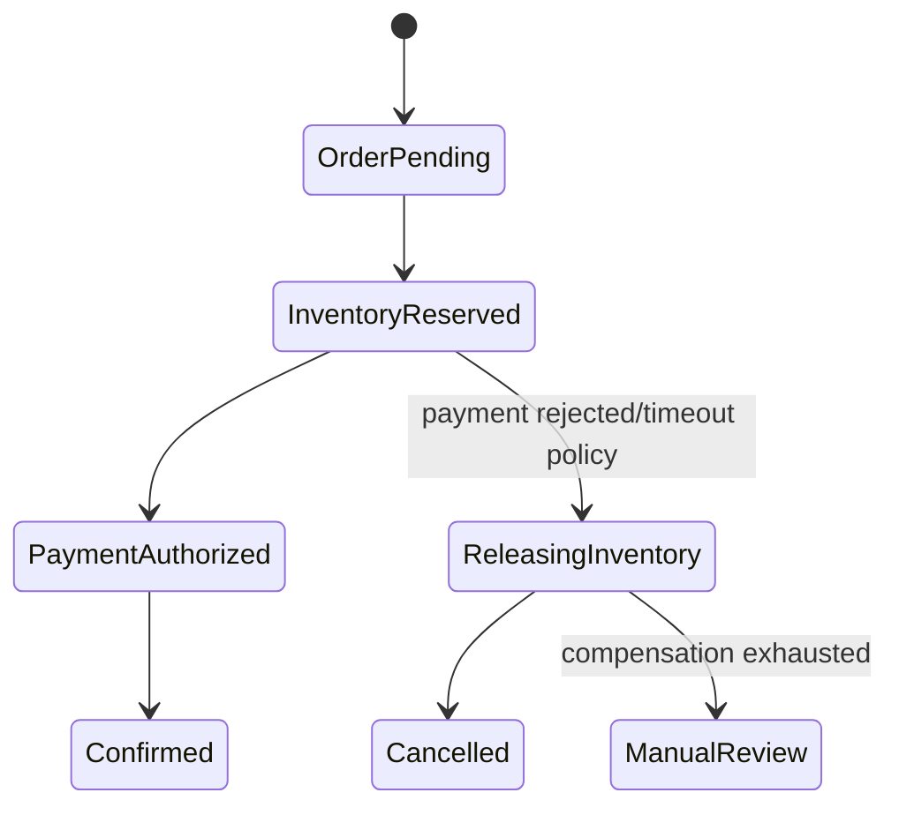

## Mental model: saga không phải ACID kéo dài
Saga là chuỗi local transaction. Mỗi bước commit dữ liệu của một participant rồi kích hoạt bước kế tiếp. Khi không thể tiến, workflow chạy compensating action để đạt một business state chấp nhận được. Không có isolation/rollback toàn cục như một database transaction; trong khoảng giữa, người khác có thể quan sát state tạm.

Ví dụ đặt hàng gồm: tạo order `PENDING`, reserve inventory, authorize payment, confirm order. Nếu payment từ chối, release inventory và cancel order. “Compensation” không tua ngược thời gian: email đã gửi không thể thu hồi, shipment đã giao không thể ungiao. Nó là hành động nghiệp vụ mới với audit riêng.



## Choreography hay orchestration
Choreography để participant phản ứng với event: OrderCreated → InventoryReserved → PaymentAuthorized. Nó ít coordinator và hợp workflow ngắn, reaction độc lập. Khi chuỗi dài, logic điều phối bị rải trong nhiều service; khó trả lời saga đang ở đâu, timeout nào kích hoạt compensation và event nào còn thiếu.

Orchestration có coordinator durable gửi command, nhận result/event và chuyển state. Nó tăng một component quan trọng nhưng làm workflow, deadline, retry và audit nhìn thấy được. Orchestrator không được sở hữu business invariant của participant hay truy cập database của họ; nó sở hữu **process state**.

| Tiêu chí | Choreography | Orchestration |
|---|---|---|
| Số bước/nhánh | Ít, tuyến tính | Nhiều, có timeout/compensation |
| Quan sát trạng thái | Tổng hợp từ event | Có state machine trung tâm |
| Coupling | Schema/event chain | Command contract + orchestrator |
| Thay đổi flow | Chạm nhiều consumer | Tập trung hơn, vẫn version contract |

## Durable saga state
State tối thiểu gồm `sagaId`, business key, current state, workflow version, participant command IDs, deadlines, retry count và last error. Transition dùng optimistic locking để hai message trùng không chuyển state hai lần.

```sql title="Saga state sketch"
UPDATE order_saga
SET state = 'PAYMENT_AUTHORIZED', version = version + 1,
    payment_command_id = :commandId, updated_at = CURRENT_TIMESTAMP
WHERE saga_id = :sagaId
  AND state = 'INVENTORY_RESERVED'
  AND version = :expectedVersion;
```

Nếu row count bằng 0, message có thể duplicate, stale hoặc saga đã chuyển nhánh; handler phải đọc state và quyết định no-op/quarantine, không thực thi mù. Ghi transition và outbox command/event trong cùng local transaction để crash không làm mất bước kế tiếp.

Mỗi command gửi participant có ID ổn định. Participant deduplicate command và trả cùng outcome khi nhận lại. Event/result chứa `sagaId`, causation ID, correlation ID và schema version để trace toàn workflow.

## Forward recovery và backward recovery
Lỗi transient có thể forward retry; lỗi business như hết hàng thường chuyển nhánh/compensate ngay. Một bước retry mãi giữ reservation và làm nghẽn capacity. Mỗi state cần deadline, max attempts và hành động khi hết budget.

Compensation phải:
- Idempotent vì chính compensation cũng có thể duplicate.
- Dựa trên reference của effect gốc, không “đoán” dữ liệu hiện tại.
- Tôn trọng thay đổi xảy ra sau đó; release đúng reservation, không cộng tồn kho chung mù quáng.
- Có thể retry và có đường manual repair nếu thất bại lâu dài.

Đặt **pivot transaction** — bước sau đó saga ưu tiên complete tiến tới thay vì rollback — sau các bước dễ bù và trước effect khó đảo. Ví dụ có thể reserve trước, nhưng sau khi shipment được hãng vận chuyển nhận thì xử lý hoàn/return là workflow khác, không còn rollback kỹ thuật.

## Isolation anomaly và mitigation
Vì local transaction commit từng bước, có thể xảy ra lost update, dirty business read hoặc oversell. Dùng semantic lock/status như `PENDING_PAYMENT`, reservation có expiry, version check và commutative update. Consumer/query phải hiểu state tạm; đừng lọc mọi trạng thái saga khỏi báo cáo rồi kết luận dữ liệu “mất”.

Reservation expiry và orchestrator timeout có race: payment thành công đúng lúc inventory tự release. Transition có expected version/deadline, và reconciliation so sánh nguồn sự thật của payment/inventory để đưa order về state đúng hoặc manual review.

:::warning Không dùng compensation giả
Xóa order row sau thất bại không tương đương “chưa từng có order”: audit, số thứ tự, event đã phát và external side effect vẫn tồn tại. Giữ terminal state `CANCELLED` cùng lý do và lịch sử transition.
:::

## Observability và operations
Metric theo state/age quan trọng hơn chỉ đếm error: số saga pending quá deadline, compensation in progress, manual review, transition retry và completion latency percentile. Trace context đi qua message headers; log mỗi transition có saga ID/business ID nhưng không chứa token/PII nhạy cảm.

Operator cần UI/runbook để xem timeline, retry bước idempotent, trigger compensation hoặc xác nhận manual resolution. Không sửa database trực tiếp thiếu audit. Workflow definition thay đổi phải version: saga đang chạy tiếp tục bằng logic cũ hoặc có migration explicit.

## Failure scenarios
- Event bước trước publish hai lần: participant deduplicate theo command ID.
- Participant commit nhưng reply mất: orchestrator retry cùng ID, nhận lại outcome.
- Orchestrator crash sau transition: outbox giữ command kế tiếp.
- Compensation thất bại: retry có budget rồi manual review; không đánh dấu cancelled giả.
- Deploy workflow mới khi saga cũ đang chạy: route theo workflow version.
- Message đến sai thứ tự: expected state/version ngăn transition bất hợp lệ.

## Production checklist
- Workflow state diagram ghi cả success, timeout, compensation và manual terminal state.
- Mỗi step/compensation có idempotency key, owner, deadline và retry classification.
- Transition + outgoing message atomic bằng outbox/change feed.
- Reservation/semantic lock giảm isolation anomaly và có expiry/reconciliation.
- Dashboard đo saga age theo state; runbook repair có audit.
- Contract và workflow được version cho instance chạy dài.

## Góc phỏng vấn
Hãy nói saga là sequence of local transactions, không phải distributed ACID. So sánh choreography với orchestration theo số bước và khả năng quan sát. Dùng order example để nêu idempotent command, outbox, compensation semantic, timeout và manual recovery. Điểm quan trọng nhất: thừa nhận có intermediate state và thiết kế reconciliation, thay vì hứa rollback hoàn hảo.

## Key Takeaways
- Saga đạt business consistency qua continuation/compensation, không có global rollback.
- Orchestrator sở hữu process state; participant vẫn sở hữu invariant và dữ liệu.
- Transition, command và compensation đều cần idempotency/version/deadline.
- Manual recovery và reconciliation là phần thiết kế, không phải thất bại ngoài dự kiến.
