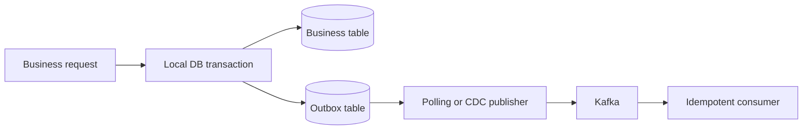

## Dual-write failure
Update database và publish Kafka là hai hệ thống transaction khác nhau. Publish trước rồi DB rollback tạo event ma; commit DB trước rồi process crash tạo state không có event. Đảo thứ tự không làm hai operation atomic.

```sql title="Unsafe dual write"
BEGIN;
INSERT INTO orders(id, status) VALUES ('o-101', 'CREATED');
-- publish Kafka ở đây không thuộc DB transaction
COMMIT;
```

## Outbox architecture
Business row và outbox row được ghi trong cùng local database transaction. Sau commit, publisher độc lập chuyển outbox event tới broker. Điều này bảo đảm nếu business state tồn tại thì durable intent to publish cũng tồn tại.



## Polling publisher vs CDC
Polling đơn giản, kiểm soát trong application nhưng thêm query load/latency và cần claim rows an toàn giữa workers. CDC đọc transaction log, latency thấp và không poll table nhưng thêm connector/platform skill, schema evolution và vận hành offset.

## Duplicate vẫn tồn tại
Publisher có thể gửi thành công rồi crash trước khi mark published. Vì vậy outbox thường đạt at-least-once, không phải magically exactly-once. Event có eventId ổn định; consumer ghi inbox/dedup hoặc dùng unique business constraint trong cùng transaction với side effect.

:::production Ordering
Nếu cần order theo aggregate, lưu aggregateId và aggregateVersion, partition theo aggregateId, và consumer phát hiện gap/duplicate. Global order thường không cần và làm giảm scale.
:::

## Schema và cleanup
Outbox nên chứa event id, aggregate type/id, version, event type, occurredAt, payload/schema version. Cleanup chỉ sau khi publisher checkpoint an toàn; partition/retention giúp delete không tạo table bloat. Giám sát oldest unpublished age, throughput, retry và poison records.

## Failure scenarios
- DB commit thành công, publisher down: backlog tăng nhưng intent còn durable.
- Broker nhận, mark-published thất bại: duplicate; consumer idempotent.
- Payload không tương thích: quarantine + alert, không retry nóng vô hạn.
- CDC connector lag: business vẫn chạy nhưng downstream stale; SLO/alert riêng.

## Trả lời phỏng vấn
Outbox biến dual write thành một local transaction ghi business state và publish intent. Publisher polling hoặc CDC gửi sau commit. Nó tránh lost event nhưng thường tạo at-least-once, nên cần idempotent consumer, ordering theo aggregate, retry, monitoring và cleanup.

## Key Takeaways
- Không có atomicity tự nhiên giữa DB transaction và broker publish.
- Outbox bảo đảm durable intent, không loại duplicate.
- Polling và CDC có trade-off vận hành khác nhau.
- Lag và oldest unpublished event là chỉ số quan trọng.
