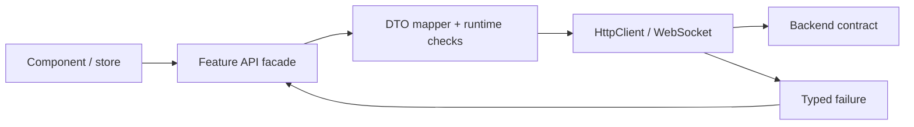

## API client là anti-corruption boundary

Component không nên biết base URL, raw status code hay JSON shape của mọi endpoint. Một API boundary chuyển transport DTO thành model mà feature hiểu, phân loại lỗi và đặt policy về timeout/cancellation. Điều này không đòi một “generic repository” cho tất cả; service nên phản ánh capability cụ thể.



TypeScript type bị xóa ở runtime. `http.get<User>(url)` nói với compiler cách ta kỳ vọng dữ liệu, không kiểm tra server thật sự gửi `User`. Với boundary quan trọng hoặc external API, validate các field quyết định an toàn/correctness rồi map. Không nhất thiết parse mọi byte bằng schema framework; mức validation theo rủi ro.

```ts title="users-api.ts"
type UserDto = { id: string; displayName: string; version: number };
type User = Readonly<{ id: string; name: string; version: number }>;

function toUser(value: unknown): User {
  if (!value || typeof value !== 'object') throw new Error('Invalid user payload');
  const dto = value as Partial<UserDto>;
  if (typeof dto.id !== 'string' || typeof dto.displayName !== 'string' ||
      typeof dto.version !== 'number') throw new Error('Invalid user fields');
  return { id: dto.id, name: dto.displayName, version: dto.version };
}
```

## Contract không chỉ là JSON schema

Contract còn gồm method, URI, status semantics, headers, idempotency, pagination, ordering, time zone, nullability, authorization và backward compatibility. `200` với `{ success:false }` làm proxy/monitor/retry khó hiểu; ngược lại, không phải mọi business rejection đều là `500`.

Một error taxonomy phía client có thể tách:

| Nhóm | Ví dụ | UI/policy phù hợp |
|---|---|---|
| Validation/business | 400/409/422 theo contract | Hiển thị field/global message an toàn, không retry tự động |
| Authentication | 401 | Refresh/re-auth có single-flight và giới hạn |
| Authorization | 403 | Không retry; giải thích quyền nếu policy cho phép |
| Missing/stale | 404/409/412 | Refresh state hoặc conflict workflow |
| Rate/temporary | 429/502/503 | Tôn trọng `Retry-After`, backoff có budget |
| Network/timeout | không có HTTP response | Cho retry theo idempotency và user intent |
| Contract violation | payload không hợp lệ | Fail closed ở boundary, telemetry không lộ payload nhạy cảm |

Backend message không nên render thẳng như HTML. Angular escaping template binding giảm XSS, nhưng bypass sanitizer hoặc dựng DOM tùy ý phá trust boundary. Log lỗi cần redaction token, cookie và PII.

## Cancellation phải theo user intent

Search-as-you-type cần kết quả của query mới nhất; `switchMap` hủy subscription/request trước và tránh response cũ ghi đè state mới. Submit thanh toán không được coi như search: client cancel không chứng minh server đã rollback side effect. Cần idempotency key hoặc status lookup nếu outcome không rõ.

```ts title="search.store.ts"
readonly results = toSignal(
  this.query.pipe(
    debounceTime(250),
    distinctUntilChanged(),
    switchMap(q => this.api.search(q).pipe(
      catchError(error => this.mapSearchFailure(error))
    ))
  ),
  { initialValue: [] }
);
```

`switchMap`, `concatMap`, `mergeMap`, `exhaustMap` là concurrency policy:

- `switchMap`: latest wins; hợp search/navigation state.
- `concatMap`: serialize và giữ order; có nguy cơ backlog.
- `mergeMap`: concurrency; cần giới hạn/đảm bảo out-of-order an toàn.
- `exhaustMap`: bỏ trigger mới khi đang chạy; hữu ích chống double-submit ở UI nhưng server vẫn cần idempotency.

## Authentication, cookie, CORS và CSRF

CORS là browser policy về cross-origin response, không phải API authentication. Non-browser client không bị CORS chặn. Nếu dùng cookie, browser gửi theo domain/path/SameSite/credentials policy; state-changing endpoint phải có CSRF defense phù hợp. Nếu dùng bearer token, tránh log và giảm lifetime/exposure; refresh concurrency cần single-flight để không tạo nhiều refresh race.

HTTP interceptor phù hợp cho concern xuyên suốt như auth header, correlation và normalized transport error. Nó không nên nuốt mọi lỗi hoặc tự retry mọi request. Retry `POST` mù có thể lặp side effect; retry chỉ khi method/operation idempotent hoặc có idempotency contract.

:::warning 401 loop
Nếu interceptor thấy 401 rồi refresh, chính request refresh cũng có thể bị intercept. Cần bypass/guard, một refresh in-flight, giới hạn attempt và đường logout rõ. Không để hàng trăm request chờ vô hạn.
:::

## Cache HTTP phía frontend

Cache observable bằng `shareReplay` không tự trở thành cache đúng. Cần key, TTL/invalidation, error behavior và lifecycle. Nếu observable giữ mãi, user/tenant cũ có thể rò state sang session mới. Browser HTTP cache với `Cache-Control`, validator `ETag`/`If-None-Match` đôi khi đơn giản và đúng semantics hơn custom memory cache.

Khi mutation thành công, chọn refresh query, update optimistic có rollback hoặc invalidate cache. Không cập nhật mười component-local arrays thủ công. Với optimistic concurrency, version/ETag giúp backend từ chối stale write; UI phải có conflict workflow thay vì overwrite âm thầm.

## WebSocket: connection không phải state

Kết nối WebSocket thành công không đảm bảo client có đầy đủ business state. Mobile sleep, proxy timeout hoặc deploy có thể cắt connection; message trong gap có thể mất. Protocol ứng dụng cần heartbeat, reconnect backoff có jitter, authorization, sequence/cursor và resync.

```text
connect → authenticate/subscribe → receive(sequence=N)
disconnect → backoff+jitter → reconnect(lastSeen=N)
server: replay delta hoặc yêu cầu full snapshot
```

Browser WebSocket API không cung cấp backpressure tự động cho application nếu producer nhanh hơn consumer. Client cần bounded buffer/coalescing/drop policy theo semantics. Ví dụ presence update có thể latest-wins; transaction event không được drop tùy ý.

Angular state update từ socket phải có lifecycle rõ: đóng connection khi feature/session kết thúc, tránh nhiều subscription trùng sau reconnect, và không biến mỗi message thành global change-detection storm. Batch/coalesce update khi UI không cần render từng event.

## Generated client hay handwritten client?

OpenAPI-generated client giảm drift về path/type và tốt cho API lớn, nhưng generated type vẫn không xác thực runtime và có thể đưa transport model vào toàn UI. Đặt generated code sau facade/mapper; pin generator/version và review diff. Handwritten client phù hợp boundary nhỏ nhưng cần contract test và discipline.

Decision criteria gồm số endpoint, tốc độ thay đổi, ownership schema, backward compatibility và customization. Không chỉnh trực tiếp generated file; thay template/config hoặc bọc ở layer ổn định.

## Testing theo boundary

1. Unit test mapper với missing/null/wrong-type và backward-compatible extra fields.
2. HTTP test xác minh method, URL, headers, params và typed error mapping.
3. Contract test ở producer/consumer cho schema và semantics quan trọng.
4. Integration test authentication refresh, cancellation và retry/idempotency.
5. Realtime test disconnect, out-of-order, duplicate, gap/resync và slow consumer.

Mock trả đúng interface TypeScript mọi lúc sẽ che contract violation. Ít nhất một test phải dùng payload raw giống wire và kiểm tra runtime boundary.

## Troubleshooting stale hoặc duplicate UI

Đi theo timeline: user intent → request/subscription ID → network → backend correlation → state write → render. Kiểm tra request cũ có bị cancel nhưng side effect vẫn chạy, subscription có nhân đôi sau reconnect, response có out-of-order, cache key có thiếu tenant/filter, hoặc optimistic update bị server rejection.

Fix xong phải tái hiện bằng network delay, duplicate/gap và rapid navigation. “Thêm debounce” có thể giảm triệu chứng nhưng không sửa ordering hay idempotency.

## Trả lời phỏng vấn

:::interview TypeScript generic trên HttpClient có bảo đảm response đúng không?
Không. Generic chỉ kiểm tra compile time và bị xóa ở runtime. Tôi coi network là untrusted boundary, validate/map field quan trọng, phân loại error theo contract và test bằng raw payload. Mức validation theo rủi ro; DTO không lan trực tiếp thành domain/UI state.
:::

Senior follow-up: cancel HTTP có rollback server không; chọn RxJS flattening operator theo semantics nào; xử lý refresh-token race; WebSocket reconnect làm sao không mất/nhân đôi state; khi nào dùng ETag và generated client.

## Key Takeaways

- API boundary gồm semantics, failure và compatibility, không chỉ interface TypeScript.
- RxJS operator là quyết định concurrency/order; chọn theo user intent.
- CORS không phải authentication; cookie flow cần CSRF reasoning.
- Realtime client cần cursor/resync, idempotency và bounded buffering.
- Contract test và runtime checks bảo vệ đúng nơi compile-time type không thể bảo vệ.
