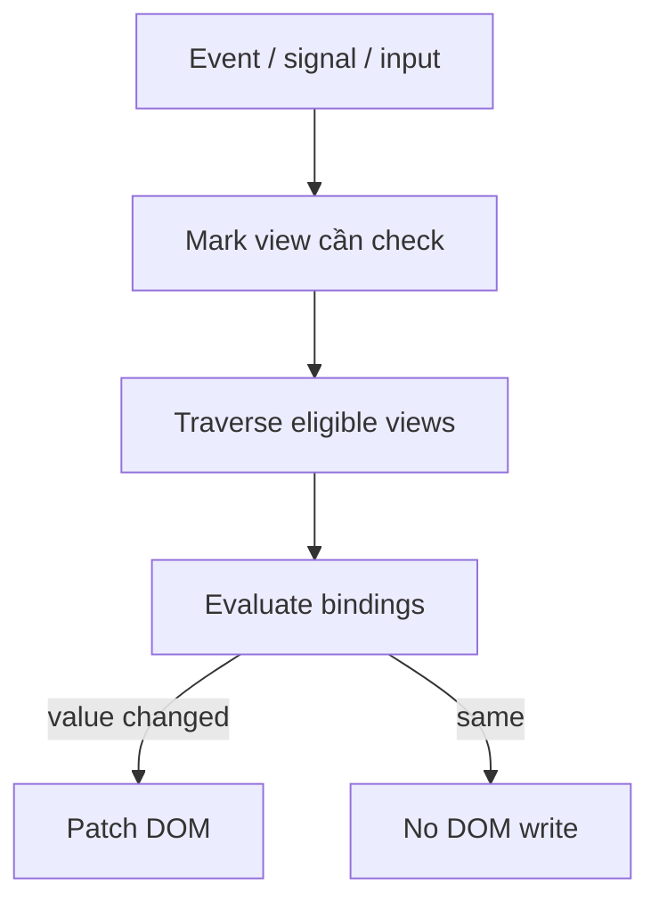

## Mental model: check binding khác render DOM
Change detection đi qua view tree, đánh giá binding cần check và cập nhật DOM khi giá trị khác. Một cycle không nhất thiết rebuild toàn DOM, nhưng computation trong template/hook vẫn có chi phí. Tối ưu có hai hướng: giảm số subtree phải check và giảm công việc trong mỗi check.

Trong Angular 21 của dự án, khai báo `ChangeDetectionStrategy.OnPush` rõ ràng cho component muốn áp dụng. Tài liệu current-major có thể thay default, vì vậy không dựa vào default ngầm khi viết library hoặc tài liệu đa version.



## Trigger của OnPush
Angular có thể check một OnPush subtree khi root nhận input mới qua template binding, khi Angular xử lý event trong subtree, hoặc khi reactive primitive/framework API đánh dấu view. Signal được đọc trong template tạo dependency; khi signal đổi, Angular biết view liên quan cần update. `AsyncPipe` cũng tích hợp lifecycle/marking.

Event ở descendant khiến ancestors cần thiết được đi qua; OnPush không phải “component chỉ render một lần”. Nó là chiến lược bỏ qua subtree không có lý do cập nhật.

```typescript title="order-card.ts"
@Component({
  selector: 'app-order-card',
  changeDetection: ChangeDetectionStrategy.OnPush,
  template: `
    <h3>{{ order().code }}</h3>
    <strong>{{ formattedTotal() }}</strong>
  `,
})
export class OrderCard {
  readonly order = input.required<OrderView>();
  readonly formattedTotal = computed(() => formatMoney(this.order().total));
}
```

Nếu parent mutate `order.total` trên cùng object reference, input identity không đổi và UI có thể không được đánh dấu như kỳ vọng. Immutable update (`{...order, total}`) làm thay đổi explicit. Nhưng clone sâu mọi object cũng tốn CPU/memory; model state theo boundary nhỏ thay vì truyền graph khổng lồ.

## Signals không xóa nhu cầu thiết kế
`computed` memoize derived state và chỉ tính lại khi dependency đã đọc thay đổi. Đưa filter/sort thuần vào computed tốt hơn gọi method từ template mỗi check. `effect` dành cho side effect biên, không dùng để copy signal A sang B; copy tạo hai nguồn sự thật và render thừa.

Signal equality tùy chỉnh sâu có thể giảm notification nhưng chuyển chi phí sang comparison và có nguy cơ bỏ update. Hãy profile trước, ưu tiên dữ liệu immutable/normalized và computed nhỏ.

## Identity trong danh sách
`@for` cần `track` theo identity ổn định. Khi reorder/filter, key giúp Angular giữ đúng DOM/component instance. Track theo index chỉ an toàn cho danh sách thực sự tĩnh; danh sách insert/delete sẽ tái sử dụng sai row state, focus hoặc animation.

```html title="order-list.html"
@for (order of visibleOrders(); track order.id) {
  <app-order-card [order]="order" />
} @empty {
  <p>Không có đơn hàng phù hợp.</p>
}
```

Key trùng là data bug. Sinh UUID mới ngay trong `track` cũng vô hiệu vì mỗi check mọi identity đổi, khiến DOM bị phá/tạo lại.

## Initial load và interaction là hai bài toán
| Triệu chứng | Evidence | Hướng xử lý |
|---|---|---|
| JS tải/parse lâu | Network, bundle stats, performance trace | Lazy route, `@defer`, bỏ dependency nặng |
| Click/typing lag | Long task, Angular profiler | Giảm computation/check, debounce, worker khi phù hợp |
| List scroll chậm | DOM node/layout/paint | Pagination/virtualization, stable track, CSS/layout |
| Network waterfall | DevTools request initiator | Parallel/caching/prefetch theo evidence |

`@defer` tách dependency trong block ra chunk và tải theo trigger. Placeholder/loading/error cần dimension ổn định để tránh layout shift. Deferred content above-the-fold có thể làm UX chậm hơn; interaction trigger có thể khiến click đầu chờ chunk. Chọn `on idle`, `on viewport`, `on interaction` hoặc prefetch theo hành vi thật.

```html title="analytics-panel.html"
@defer (on viewport; prefetch on idle) {
  <app-heavy-analytics [report]="report()" />
} @placeholder (minimum 300ms) {
  <div class="chart-skeleton" aria-label="Đang tải biểu đồ"></div>
} @error {
  <p role="alert">Không tải được mô-đun biểu đồ.</p>
}
```

## Computation và layout
Angular chạy template computation tuần tự trong một check. Sort array, parse date phức tạp hoặc format hàng nghìn item bằng function template sẽ lặp. Precompute bằng `computed`, cache theo input hoặc chuyển CPU-heavy pure work sang Web Worker nếu measurement chứng minh main thread nghẽn.

Memoization không giúp nếu mỗi call nhận object mới không cần thiết. Ngược lại, giữ reference bằng mutation có thể sai correctness. Thiết kế state chuẩn trước rồi tối ưu allocation có evidence.

Manual `detectChanges`, `markForCheck` hoặc detach view là công cụ hẹp. Dùng chúng để chữa state update ngoài model thường tạo bug khó đoán, nhất là nested views. Trước hết đưa update qua signal/input/observable API Angular hiểu.

## Tần suất event và work budget

Một handler `pointermove`, `scroll`, resize hoặc websocket burst có thể cập nhật state hàng trăm lần trong một user journey. OnPush không cứu được khi chính subtree liên tục nhận trigger hợp lệ. Hãy hỏi UI thật sự cần phản ánh mỗi event hay chỉ cần giá trị mới nhất ở mỗi frame/window. Coalesce theo business semantics, dùng debounce cho truy vấn sau khi người dùng dừng gõ, throttle/sample cho telemetry hoặc vị trí liên tục, và giữ queue có giới hạn. Không debounce action cần phản hồi tức thì như submit rồi vô tình cho phép double-click.

Mỗi lần update cũng phải có budget: số item được map, số binding bị đánh giá, số DOM node thay đổi và layout/paint phát sinh. Chia state để thay đổi cursor không làm lại report aggregation; tách component theo ownership/update frequency, không theo mục tiêu “càng nhiều component càng nhanh”. Boundary quá vụn tăng DI/view/event overhead và làm data flow khó theo dõi.

Với animation, gom DOM read trước DOM write và phối hợp theo frame để tránh forced synchronous layout. CSS transform/opacity thường ít layout hơn thay đổi kích thước/vị trí, nhưng phải xác nhận bằng Performance trace. Virtual scrolling hữu ích khi DOM list lớn; pagination hữu ích khi cả network/data set lớn. Đây là hai bottleneck khác nhau.

## Debug UI stale hoặc render quá nhiều

Khi UI không cập nhật, đi theo chuỗi bằng chứng:

1. State nguồn có thật sự đổi và đổi đúng instance/reference không?
2. Template đã đọc signal/observable/input nào, ở view nào?
3. Update xảy ra trong callback/lifecycle nào và framework có nhận notification không?
4. `track` có giữ nhầm row instance hoặc key bị trùng không?
5. DOM đã đổi nhưng CSS/layout/cache làm người dùng chưa thấy hay không?

Khi render quá nhiều, bật profiler/trace rồi tìm trigger và subtree trước khi thêm memoization. Kiểm tra parent có tạo object/array mới trong mỗi binding, computed có dependency rộng, observable có emit giá trị tương đương, hoặc event handler có cập nhật global state không liên quan. Ghi lại số lần và duration bằng tooling; `console.log` trong template vừa làm sai timing vừa tạo nhiễu.

Memory cũng là phần của render performance. Row/component bị destroy nhưng listener, timer hoặc subscription ngoài lifecycle còn sống sẽ giữ object graph và khiến lần điều hướng sau chậm dần. Test vòng mount–interact–navigate-away nhiều lần, lấy heap evidence khi nghi leak, và ưu tiên API cleanup gắn với lifecycle thay vì danh sách unsubscribe thủ công dễ sót.

## Profile loop
1. Định nghĩa user journey và metric: load, INP-like interaction, render duration, dropped frame.
2. Ghi trace trên build production với data/thiết bị đại diện.
3. Tìm long task, component/hook/computation nóng và DOM/layout cost.
4. Thay đổi một giả thuyết; đo lại cùng kịch bản.
5. Thêm budget/regression check phù hợp, không tuyên bố nhanh từ cảm giác.

:::warning Optimization theater
Đổi mọi component sang OnPush không sửa request waterfall, bundle nặng, DOM 20.000 row hay synchronous JSON transform. OnPush chỉ giảm eligible checks; bottleneck phải được đo.
:::

## Failure scenarios
- Mutate input object với OnPush: child không thấy identity mới.
- Template gọi `items.sort()`: vừa mutate state vừa chạy lại nhiều lần.
- `track $index` trong editable rows: reorder giữ input/focus sai row.
- `@defer` cho nội dung thiết yếu: người dùng thấy shell nhanh nhưng task hoàn tất chậm hơn.
- Deep equality trên collection lớn: thời gian comparison vượt render tiết kiệm.
- Global timer/third-party callback tạo update dày: throttle/batch và tích hợp notification đúng.

## Production checklist
- Component boundary có OnPush explicit cho Angular 21 và input immutable có chủ đích.
- Derived state dùng computed/pure mapping, không computation nặng trong template/hook.
- Mọi list động track stable unique domain ID.
- Deferred chunk có placeholder/error/prefetch và được đo trên network chậm.
- Profile production build trước/sau; lưu trace hoặc metric regression.
- Tách network, CPU, change detection, layout/paint và memory bottleneck.

## Góc phỏng vấn
Hãy nói OnPush cho phép skip subtree khi không có trigger, chứ không tắt change detection. Nêu input identity, event trong subtree, signal template dependency và AsyncPipe. Sau đó mở rộng sang `track`, computed, `@defer` và profiling. Một câu trả lời tốt luôn hỏi bottleneck là initial load, interaction CPU hay DOM/layout.

## Key Takeaways
- Change detection check binding; DOM chỉ đổi khi binding đổi.
- OnPush cần state identity/reactive notification đúng, không phải cờ “tăng tốc”.
- Stable key bảo toàn DOM/component identity khi danh sách thay đổi.
- Tối ưu phải bắt đầu và kết thúc bằng measurement cùng user journey.
